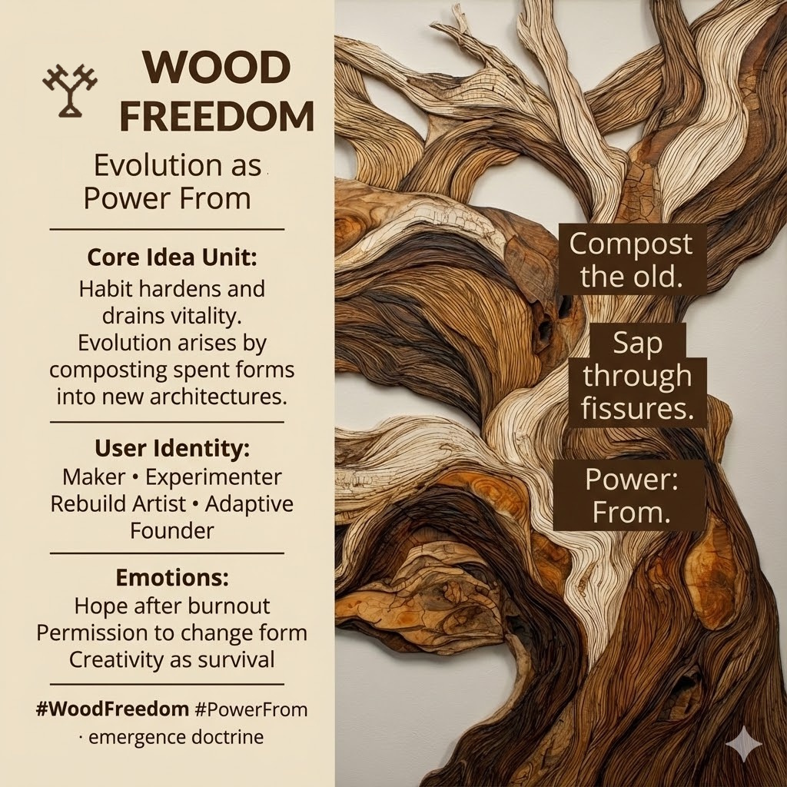

# Wood Freedom: Evolution Through Regeneration

Created at 2025/12/14 12:47 PM

## **Wood Freedom: Evolution as Power From** 𐂷

***

## 🧠 Core Idea Unit

When habits harden, vitality drains and systems stagnate. **Wood Freedom reframes evolution as regeneration** — the capacity to compost spent forms into new architectures, letting necessity become the engine of novelty.

**Resolution frame:** Growth does not come from preserving form. It comes from **feeding on what no longer works**.

**Mental shift provoked:** From *“How do I fix this?”* → *“What wants to grow from what’s failing?”*

***

## 🎭 Identity Play & Roles

**Cast the viewer as:**

- **Maker** — iterating through material, not ideals
- **Experimenter** — learning by branching
- **Rebuild Artist** — shaping from remnants
- **Adaptive Founder** — evolving form without losing essence

**Repositioning:** The self becomes a **regenerative process**, not a finished structure.

***

## 💥 Emotional Hooks & Cognitive Levers

- 🌱 **Hope After Burnout** — decay as nutrient, not verdict
- 🪵 **Permission to Change Form** — continuity without rigidity
- 🎨 **Creativity as Survival** — invention driven by constraint

This meme restores momentum by **sanctifying change**.

***

## 📡 Spread Mechanics

**Distribution Vectors**

- Innovation and startup culture (post-hype)
- Recovery and reinvention narratives
- Design thinking reframed as ecology
- Creative and regenerative systems discourse

**Propagation Style**

- Organic metaphors (growth, compost, branching)
- Process-first language
- Validation of unfinishedness

***

## 🛡️ Defense Reflexes

- **Anti-Perfectionism Shield:** Growth requires imperfection
- **Anti-Churn Guard:** Evolution ≠ random pivoting
- **Anti-Nostalgia Lock:** Loyalty to life over form

Critique must explain **how rigid optimization outperforms adaptive regeneration** over time.

***

## 🧬 Memeplex Anchor Points

- Emergence doctrine
- Regenerative design
- Anti-perfectionism ethics
- Evolutionary creativity
- IF-Prime elemental Wood (𐂷)

***

## 🧠 Sticky Symbols / Quotes

- 𐂷 **WOOD**
- 🌳 *Branching paths*
- 🍂 *Humus / compost*
- 🪴 *Sap through fissures*
- 🔄 **Power: From**

***

## 🏷️ Tags

#WoodFreedom · #Evolution · #PowerFrom · #RegenerativeInnovation · #Emergence · #IFPrime

***

**Reflection anchor:** This meme doesn’t ask you to return to form. It asks **what new structure is already feeding on the cracks.**

## Resources
- https://object.me.bot/front-img/users/send/img/1765745227475_c4zhf/unnamed_%2832%29.jpg

## Insight

* The core idea highlights a transformative perspective on evolution, advocating for a regenerative approach that embraces impermanence. The concept encourages us to view decay not as a failure but as a foundational element for growth, paralleling natural processes like composting, which enrich soil and facilitate new life. This aligns with ecological theories that value the cyclical nature of ecosystems.

* The user identities presented—Maker, Experimenter, Rebuild Artist, and Adaptive Founder—invite individuals to see themselves as active participants in their growth journey. By reframing challenges as opportunities for reinvention, this approach emphasizes the importance of creative adaptation, similar to how startups must pivot and restructure in response to market changes.

* Emotional hooks such as "hope after burnout" and "creativity as survival" resonate deeply in contemporary contexts where burnout is prevalent. This connection underscores the need for resilience and the ability to extract value from failure, reminiscent of narratives in design thinking which stress iteration and learning from mistakes—a principle celebrated in human-centered design.

* The propagation mechanics suggest a deliberate use of organic metaphors and process-first language to challenge traditional narratives. By validating unfinishedness and imperfection, the discourse encourages a culture of experimentation where the process itself, rather than just the outcome, is valued. This notion aligns with philosophies found in agile methodologies.

* Defense reflexes, such as the anti-perfectionism shield, serve to critique societal norms that prize rigidity and idealism over adaptability. The argument against nostalgia emphasizes the need to prioritize evolving vitality and relevance over clinging to outdated forms—something seen in various fields, from technology to overall personal growth.

* The sticky symbols and quotes serve as vital anchors for memory and understanding, prompting individuals to engage with the essence of change actively. Concepts like "branching paths" and "sap through fissures" poetically capture the beauty of resilience, mirroring the natural world where life finds a way to flourish amidst adversity.

* The overall message of “What wants to grow from what’s failing?” challenges conventional problem-solving approaches. It invites a shift towards curiosity and exploration, cultivating a mindset that embraces uncertainty as a fertile ground for innovation—an essential characteristic of successful leaders and thinkers in today’s dynamic environment.
