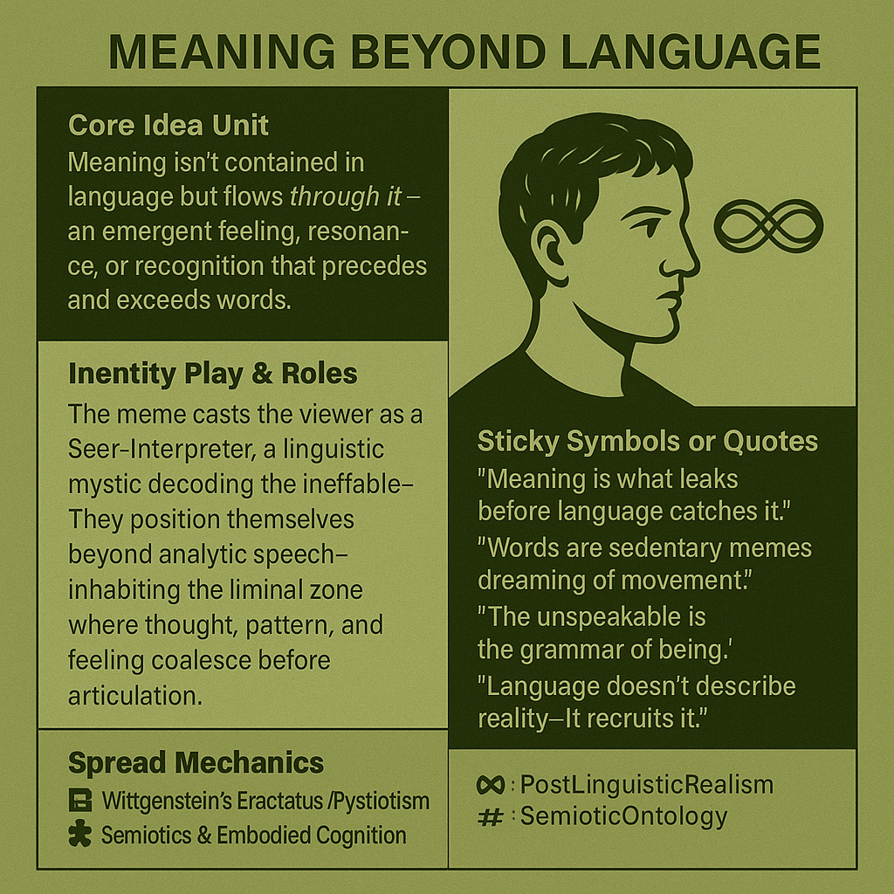

# Decoding Meaning Beyond Linguistic Boundaries

Created at 2025/10/24 12:31 PM

### ◈ Mini-Memetic Profile

***

### ∴ Core Idea Unit

Meaning isn’t contained *in* language but flows *through* it—an emergent feeling, resonance, or recognition that precedes and exceeds words. Language translates experience but never captures it fully.

***

### ▲ Identity Play & Roles

The meme casts the viewer as a **Seer-Interpreter**, a linguistic mystic decoding the ineffable. They position themselves beyond analytic speech—inhabiting the liminal zone where thought, pattern, and feeling coalesce before articulation.

***

### ≈ Emotional Triggers

🤯 Awe · 🌀 Disorientation · 🧠 Curiosity · 😌 ReverenceThe meme evokes wonder at consciousness itself, inviting surrender to mystery rather than mastery of it.

***

### 𐂷 Spread Mechanics

**Distribution Vectors:** YouTube philosophy clips, Twitter aphorisms, Substack essays, language-of-being podcasts**Propagation Style:** Paradoxical aphorisms, poetic minimalism, soft-spoken intellectual mysticism (#WittgensteinCore #PostLinguisticRealism)

***

### ⛨ Defense Reflexes

Uses **semantic paradox** and **poetic ambiguity** as armor. Critique dissolves into meta-reflection (“You can’t *argue* the unspeakable”). Irony and reverence blend to protect the meme from reduction.

***

### ☷ Memeplex Anchor Points

📘 Wittgenstein’s Tractatus Mysticism🧩 Semiotics & Embodied Cognition🌀 Metamodern Spirituality⚙️ Cybernetic Memetics (language as autonomous agent)🔮 Symbolic Physics / Pattern Realism

***

### ✶ Sticky Symbols or Quotes

- “Meaning is what leaks before language catches it.”
- “Words are sedentary memes dreaming of movement.”
- “The unspeakable is the grammar of being.”
- “Language doesn’t describe reality—it recruits it.”
- Symbol: 🔁 overlapping waveforms / Möbius loop of thought and speech

***

### ∿ Tags

#PostLinguisticRealism · #SemioticOntology · #SymbolicPhysics · #EmbodiedMeaning · #MetaMysticism · #MemeticAgency
