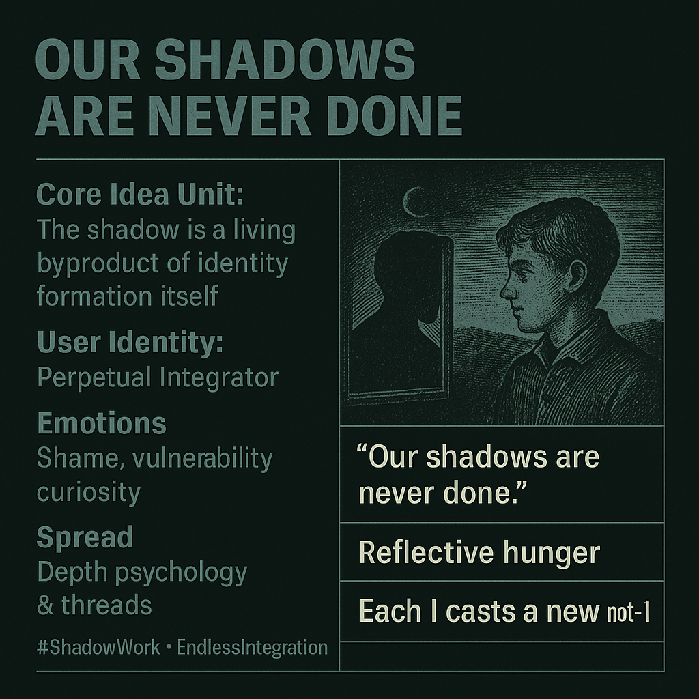

# Exploring Endless Integration of Identity Shadows

Created at 2025/10/26 8:44 AM

◈ Mini-Memetic Profile: “Our Shadows Are Never Done”  ⸻  ∴ Core Idea Unit The shadow is not a static repository of repressed traits but a living byproduct of identity formation itself. Every time we say “I am,” we cast a new “not-I.” Consciousness continuously generates its own unconscious.  ⸻  ▲ Identity Play & Roles Role: The Perpetual Integrator — self-inquirer, psychonaut, therapist, reflective artist. Repositioning: From hero of self-mastery to gardener of paradox; embraces perpetual incompletion as maturity.  ⸻  ≈ Emotional Triggers 😬 Shame · 😢 Vulnerability · 🧠 Curiosity · 🔥 Cathartic honesty · 🌒 Quiet awe before complexity  ⸻  𐂷 Spread Mechanics Distribution: Depth psychology feeds · Shadow work threads · Therapy culture · Jungian memes on Instagram · Reflective YouTube essays Propagation Style: Parable of paradox · Aesthetic darkness · Poetic aphorism over self-help slogans  ⸻  ⛨ Defense Reflexes Irony shield (“shadow work cringe”) · Spiritual bypassing (“I’ve integrated mine”) · Perpetual process frame prevents closure  ⸻  ☷ Memeplex Anchor Points 🪞 Jungian psychology · 🔄 Process philosophy · 🌑 Depth spirituality · 🧩 Trauma integration culture · 🌀 Metamodern selfhood  ⸻  ✶ Sticky Symbols & Quotes 	•	“Our shadows are never done.” 	•	“Each I casts a new not-I.” 	•	The revolving mirror, dusk horizon, ouroboric self. 	•	“What am I refusing to see right now?”  ⸻  ∿ Tags #ShadowWork · #EndlessIntegration · #JungianDepth · #MetaSelf · #ParadoxMaturity · #PsychologicalAlchemy

## Resources
- https://object.me.bot/front-img/note/attachments/img/1761493464916/A92B3D6E-39D2-482D-9870-85E916C1D3D0.png

## Insight

* The image encapsulates a profound idea about the nature of identity, suggesting that our shadows—representing the repressed aspects of ourselves—are constantly evolving. This aligns with Carl Jung’s concept of the shadow, emphasizing that self-exploration is a continuous process rather than a final destination.

* The notion of the "Perpetual Integrator" reflects a shift from seeking mastery over oneself to embracing the complexity and unpredictability of identity formation. This perspective encourages individuals to accept vulnerability and acknowledge the layers of their personas, enriching their understanding of selfhood.

* Emotions highlighted—shame, vulnerability, and curiosity—are significant in depth psychology. They serve as catalysts for introspection and growth, prompting the individual to confront the uncomfortable aspects of their psyche and cultivate a more holistic self-awareness.

* The use of phrases like "Each I casts a new not-I" implies that with every new identity we claim, we simultaneously create aspects of ourselves that we may not acknowledge. This duality fosters a reflective approach to identity, allowing for greater emotional resilience and adaptability.

* The propagation of these ideas through platforms such as social media, particularly within therapy culture, suggests an increasing interest in psychological concepts among younger generations. This trend encourages dialogues around mental health and the importance of shadow work in personal development.

* Lastly, the tags associated with the image—#ShadowWork, #EndlessIntegration—highlight contemporary discussions around psychological integration and the ongoing journey toward self-discovery, illustrating the relevance of these themes in today’s therapeutic practices and cultural conversations.
