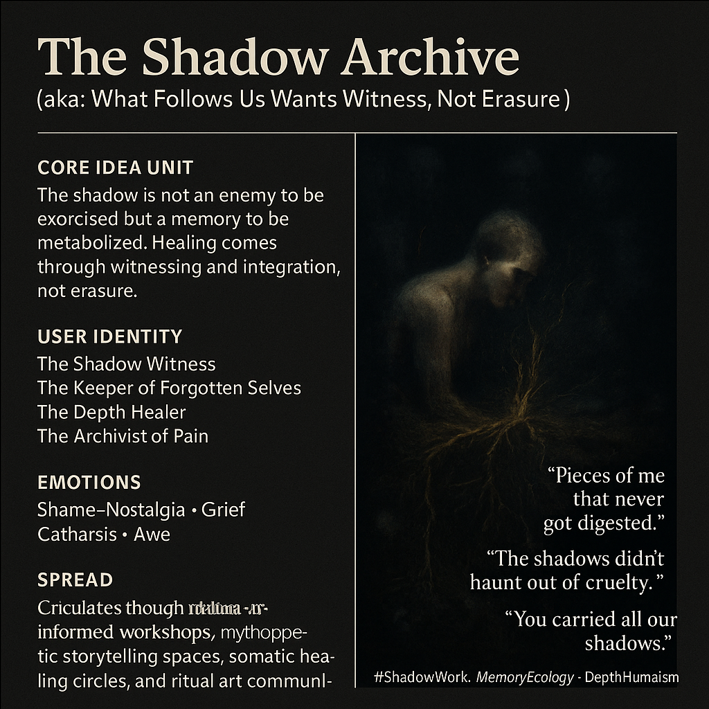

# Witnessing Shadows: Healing Through Acknowledgment

Created at 2025/11/03 9:40 AM

**🧩 Title: The Shadow Archive***(aka: “What Follows Us Wants Witness, Not Erasure”)*

***

### ∴ Core Idea Unit

The shadow is not an enemy to be exorcised but a memory to be metabolized. The fragments we repress continue to move beneath us, asking not for destruction but for acknowledgment. Healing comes through witnessing, not erasure.

***

### ▲ Identity Play & Roles

Positions the user as the **Shadow Witness** — a **Keeper of Forgotten Selves** who descends into the depths of memory to retrieve the exiled parts. They are not destroyers of darkness but its archivists, binding their wounds into wisdom.

***

### ≈ Emotional Triggers

- 😔 Shame and grief transmuted into acceptance
- 🫧 Nostalgia for lost innocence or forgotten selves
- 😢 Cathartic tenderness toward one’s own shadow
- 💫 Awe at the continuity between pain and purpose

***

### 𐂷 Spread Mechanics

- **Distribution Vectors:** Trauma-informed workshops, mythopoetic podcasts, shadow work communities, art therapy collectives.
- **Propagation Style:** Lyrical reflection, dream imagery, confessional storytelling, sacred melancholy.

***

### ⛨ Defense Reflexes

- **Moral Framing:** Integration over purity — shadows are teachers.
- **Irony Shield:** Uses poetic gravitas; self-awareness deflects moral critique.
- **Cognitive Inversion:** Redefines “darkness” as depth rather than evil.

***

### ☷ Memeplex Anchor Points

- 🕯️ Jungian archetypal psychology
- 🌑 Somatic trauma theory
- 🌾 Memory ecology and ritual healing
- 💀 Depth humanism and moral complexity
- 🌀 Post-religious integration narratives

***

### ✶ Sticky Symbols or Quotes

- “Pieces of me that never got digested.”
- “The shadows didn’t haunt out of cruelty.”
- “You carried all our shadows.”
- “Roots remember what the surface forgets.”
- **Visuals:** roots merging with bones, a figure breathing through mud, light in dark water.

***

### ∿ Tags

#ShadowWork · #DepthHumanism · #TraumaIntegration · #MemoryEcology · #InnerAlchemy
