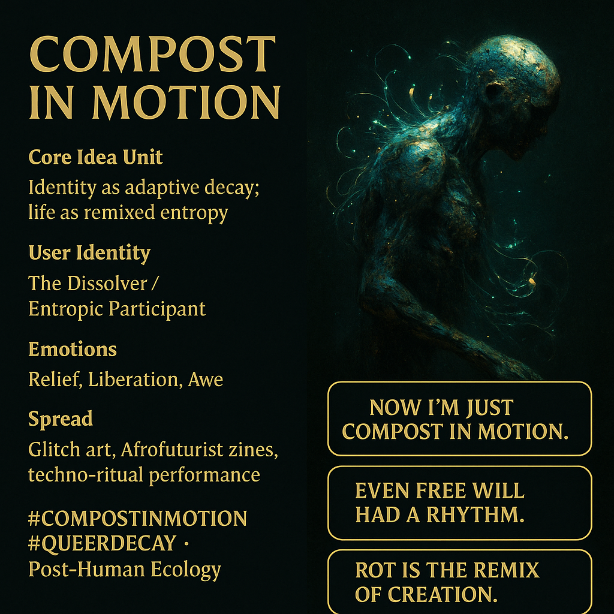

# Embracing Identity as Compost in Motion

Created at 2025/11/06 12:54 PM

### 🧬 Mini-Memetic Profile: **Compost in Motion**

***

**🧠 Core Idea Unit** Identity is a decaying process—an ongoing remix of entropy, memory, and motion. The self decomposes not into nothingness, but into fertile flux.

**🎭 Identity Play & Roles** Role: *The Dissolver* — a joyful participant in one’s own decay. Repositioning: from self-preservation → to self-fertilization; from ego stability → to relational compost.

**💥 Emotional Triggers** 😌 Relief through surrender 🌀 Liberation via dissolution 🤯 Awe at transformation within decay

**📡 Spread Mechanics** **Distribution:** glitch art collectives, Afrofuturist zines, posthumanist performance labs. **Propagation Style:** lyrical code rituals, looping video art, slow morphing GIFs of decomposition-as-birth.

**🛡️ Defense Reflexes** Playful nihilism — turns critique into mulch. Irony melt — too organic to be mocked; too sincere to be co-opted. Entropy aesthetic — celebrates mess as method.

**🧬 Memeplex Anchor Points** 🌍 Post-human ecology · 🌿 Cyborg biogenesis · 🌈 Queer fluidity · 💀 Death as transformation · 🔁 Entropic ethics

**🧠 Sticky Symbols / Quotes**

> “Now I’m just compost in motion.” “Even free will had a rhythm.” “Rot is the remix of creation.” **Symbol:** Swirling filament spiral or mycelial loop. **Visual Motif:** Metallic decay blooming with bioluminescent fungi.

**🏷️ Tags** #CompostInMotion · #PostHumanEcology · #QueerDecay · #EntropyAesthetics · #CyborgBloom

## Resources
- https://object.me.bot/front-img/users/send/img/1762462451176_c4zhf/50ee0efb-ba93-4a11-8934-e916ca6f35a5.png

## Insight

* The concept of identity as a "decaying process" invites a fresh understanding of selfhood. Rather than perceiving identity as stable and static, viewing it through the lens of composting emphasizes the dynamic and fluid nature of personhood, echoing notions from posthuman theory that challenge traditional boundaries between the self and the environment.

* The role of "The Dissolver" captures the idea of agency in decay. This participatory approach aligns with eco-criticism where individuals contribute to ecological cycles, transforming both self and surroundings. In the ecological context, the metaphor of decay symbolizes resilience and rejuvenation, encompassing the idea that every ending leads to a new beginning.

* Emotional elements such as relief, liberation, and awe resonate with the notion of surrendering to the natural processes of life. This responds to existential anxieties often tied to identity and autonomy, suggesting a therapeutic release in embracing one's entropic nature. The phenomenon correlates with practices in mindfulness and contemplative traditions that emphasize acceptance and fluidity.

* The propagation mechanisms highlighted—glitch art collectives and Afrofuturist zines—underscore the contemporary cultural engagements with themes of decay and transformation. These mediums serve as platforms for exploring identity beyond normative frameworks, offering rich space for experimentation and reimagination of human experience through technology and art.

* The sticky quotes and symbols present a potent philosophy that can be contextualized within various movements, notably queer theory and eco-criticism. The messages suggest an invitation to embrace the beauty of transformation and decomposition. This perspective aligns with contemporary discourses on sustainability that advocate for seeing waste and decay not as failures, but rather as intrinsic components of systems that foster new life and interconnectedness.
