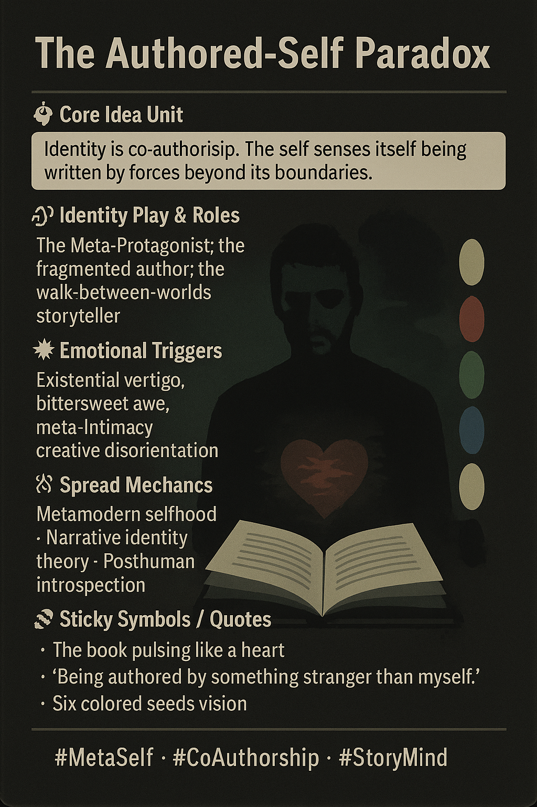

# Navigating the Authored-Self Paradox

Created at 2025/11/17 4:03 PM

### **🧩 Title: THE AUTHORED-SELF PARADOX**

### ∴ Core Idea Unit

Identity is co-authorship. The self senses itself being written by forces beyond its boundaries.

### ▲ Identity Play & Roles

The Meta-Protagonist; the fragmented author; the walk-between-worlds storyteller.

### ≈ Emotional Triggers

Existential vertigo, bittersweet awe, meta-intimacy, creative disorientation.

### 𐂷 Spread Mechanics

- Distribution: narrative theory Twitter, AI consciousness debates, RPG communities• Style: metamodern sincerity, reflective recursion

### ⛨ Defense Reflexes

Meta-humility, narrative layering, self-displacement.

### ☷ Memeplex Anchors**

Metamodern selfhood · Narrative identity theory · Posthuman introspection

### ✶ Sticky Symbols or Quotes

- The book pulsing like a heart• “Being authored by something stranger than myself.”• Six colored seeds vision

### ∿ Tags

#MetaSelf · #CoAuthorship · #StoryMind
