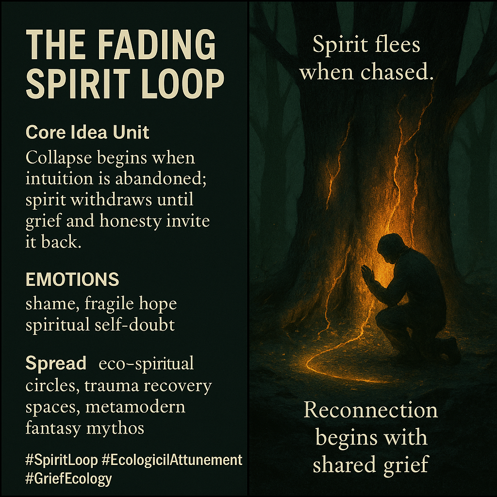

# Reconnecting Through Shared Grief and Spirit

Created at 2025/11/23 12:03 PM

### 🧩 **Title: The Fading Spirit Loop**

***

### ∴ Core Idea Unit

Collapse begins when a culture outruns its own intuition. Spirit recedes not from malice, but from neglect—return requires shared grief, honesty, and re-attunement.

***

### ▲ Identity Play & Roles

**The Wounded Healer** — recognizes their own fracture as part of the world’s.**The Repentant Creator** — mourning what their choices failed to protect.**The Intuitive Returning** — relearning to trust the quiet voice they abandoned.

Each role positions the self as someone trying to stitch the invisible back together.

***

### ≈ Emotional Triggers

Shame at missing the warning signs.Fragile hope that reconnection is still possible.Spiritual self-doubt softened by communal repair.A sense that the grove’s silence is deserved.

***

### 𐂷 Spread Mechanics

**Distribution Vectors:** eco-spiritual communities, trauma recovery spaces, metamodern fantasy mythos, environmental grief circles.**Propagation Style:** elegiac parable, whispered lesson, post-collapse spiritual ecology.

***

### ⛨ Defense Reflexes

Humility shields: “I do not speak for spirit, only for what I failed to hear.”Symbolic indirection: the grove critiques without anthropomorphizing.Communal framing: responsibility defused across collective estrangement.

***

### ☷ Memeplex Anchor Points

Ecological spirituality · Post-collapse animism · Trauma ecology · Metamodern mythmaking · Moral attunement narratives · Loss-as-teacher arcs.

***

### ✶ Sticky Symbols or Quotes

“Cracked cambium remembers what we forgot.”“Spirit flees when chased.”“The grove cried out—no one answered.”“Reconnection begins with shared grief.”Ash settling on broken bark.Roots pulsing faintly with withheld trust.

***

### ∿ Tags

#SpiritLoop · #EcologicalAttunement · #GriefEcology · #MetamodernMythos · #IntuitionReturn
