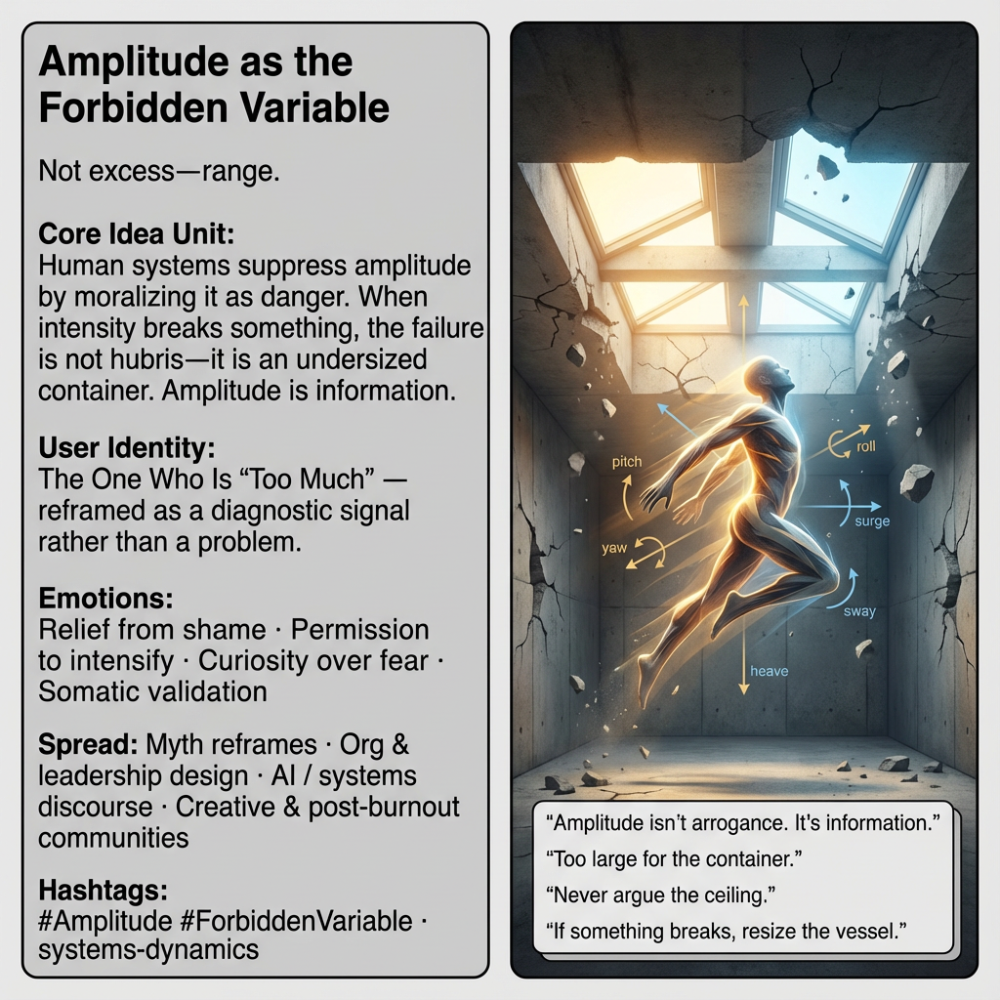

# Reframing Amplitude: From Shame to Signal

Created at 2025/12/28 9:41 PM

### 🧩 **Amplitude as the Forbidden Variable**

**Tagline** *Not excess—range.*

### 🧠 Core Idea Unit

Human systems suppress amplitude—range of motion, intensity, scale of becoming—by moralizing it as danger. The fall narrative trains fear through punishment. Liberation occurs when amplitude is reclassified from *moral risk* to *structural signal*: when something breaks, it is evidence of an undersized container, not a flawed motion.

**Mental shift provoked:** From *“I went too far”* → *“what ceiling constrained this movement?”*

### 🎭 Identity Play & Roles

**Cast roles:**

- The One Who Is “Too Much”
- The Overreacher
- The Misfit in a Small Room

**Repositioning:** The self is no longer a transgressor of norms but a diagnostic instrument revealing load limits in inherited systems.

### 💥 Emotional Triggers

- 😮‍💨 **Relief from shame** — intensity decoupled from defect
- 🔥 **Permission to intensify** — without apology or self-editing
- 🧭 **Curiosity over fear** — failure becomes directional data
- 🩻 **Somatic validation** — bruises as feedback, not debt

This meme converts fear of intensity into inquiry about capacity.

### 📡 Spread Mechanics

**Distribution Vectors**

- Mythic reframes (Icarus, hubris reversal)
- Leadership and organizational design language
- AI, systems, and complexity discourse
- Coaching, creative, and post-burnout communities

**Propagation Style**

- Calm but destabilizing
- Reframes rather than confronts
- Uses physics and kinematics instead of moral language

### 🛡️ Defense Reflexes

- **Anti-moralism:** refuses virtue/vice framing
- **Design pivot:** shifts blame from actor to container
- **Ceiling refusal:** “Never argue the ceiling—measure it.”

Critique is neutralized by refusing to debate norms at all.

### 🧬 Memeplex Anchor Points

- Anti-moralism, pro-dynamics
- Systems theory & ecological scaling
- Kinematics of growth (degrees of freedom)
- Post-heroic hubris reversal

Growth is not ethical or unethical—it is a physics problem.

### 🧠 Sticky Symbols / Phrases

- *“Amplitude isn’t arrogance. It’s information.”*
- *“If something breaks, resize the container.”*
- *“Too large for the room.”*
- *“Never argue the ceiling.”*
- Six Degrees of Freedom: pitch · yaw · roll · surge · heave · sway
- Low ceilings → Skylights

These form a **kinematic vocabulary**, not metaphor alone.

### 🏷️ Tags

#Amplitude · #ForbiddenVariable · #HubrisReversal · #DegreesOfFreedom · #ResizeTheContainer · #AntiMoralism · #SystemsThinking

### 🔁 Condensed Meme Formula (Portable)

> **Amplitude isn’t arrogance.** **It’s information.** **If something breaks, resize the container.**

This meme does quiet, dangerous work: it detaches intensity from guilt and reattaches it to design.

[HUBRIS: A Memetic Reversal of Icarus in the Age of Artificial Intelligence](https://memeticcowboy.substack.com/p/hubris-a-memetic-reversal-of-icarus)

## Resources
- https://object.me.bot/front-img/users/send/img/1766986848714_c4zhf/d9638e10-8fab-4015-ab6d-129974978cb9.png

## Insight

* The concept of amplitude as the "forbidden variable" reframes human intensity not as a moral failing, but as critical information about systemic limitations. This perspective shifts the narrative from punishment to inquiry, thus fostering an environment conducive to growth and exploration. 

* The highlighted user identity, "The One Who Is 'Too Much'," serves as a meaningful reminder that perceived overreach is often an indicator of inadequate frameworks, not individual defects. This can encourage a more constructive approach to personal and communal development by embracing intensity as a vital feedback mechanism.

* The emotional triggers associated with this idea—relief from shame, permission to intensify, and curiosity over fear—align with current movements in coaching and organizational leadership that aim to create safe spaces for radical self-expression. Such emotions can propel individuals to push boundaries, leading to innovative solutions and creative breakthroughs.

* The propagation mechanics, involving mythic reframes such as the story of Icarus, are particularly relevant in reshaping narratives around ambition and failure. By shifting the focus from personal hubris to structural constraints, the conversation moves toward understanding environmental limitations, thereby promoting resilience and adaptability in human systems.

* Sticky phrases like "If something breaks, resize the container" encapsulate the essence of the argument that growth is fundamentally a design challenge rather than an ethical one. This kinematic vocabulary encourages a physics-based approach to understanding human dynamics and organizational capacities, providing practical frameworks for addressing challenges in various domains such as AI, leadership, and community development.
