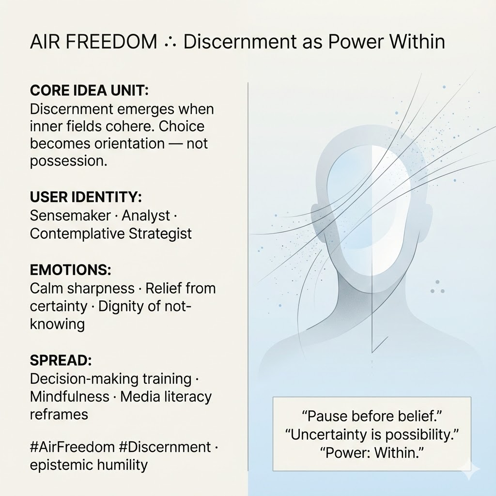

# Air Freedom: Cultivating Inner Discernment

Created at 2025/12/14 11:55 AM

## **Air Freedom: Discernment as Power Within** ∴

***

### ∴ Core Idea Unit

Signal/noise confusion traps attention in reactive belief and borrowed certainty.**Air Freedom names discernment as an inner coherence** — when the field clears, choice becomes *orientation*, not possession.

**Resolution frame:**Discernment is not deciding *what* to believe.It is cultivating the capacity to **pause before belief**.

**Mental shift provoked:**From *“What should I think?”* → *“Is this signal ready to land?”*

***

### ▲ Identity Play & Roles

**Cast the viewer as:**

- **Sensemaker** — skilled in holding ambiguity
- **Analyst** — precise without rigidity
- **Contemplative Strategist** — acting from clarity, not urgency

**Repositioning:**The self becomes a **clearing**, not a conclusion.

***

## ≈ Emotional Hooks & Cognitive Levers

- 🌬️ **Calm Sharpness** — clarity without aggression
- 🧘 **Relief from Certainty Addiction** — no rush to closure
- 🕊️ **Dignity of Not-Knowing** — uncertainty as possibility, not failure

This meme lowers cognitive pressure while increasing **decision quality**.

***

### 𐂷 Spread Mechanics

**Distribution Vectors**

- Decision-making and leadership training
- Mindfulness and contemplative practice spaces
- Media literacy and information hygiene reframes
- Strategic analysis communities

### 𐂷 Spread Mechanics

**Style**

- Minimalist cues
- Practice-oriented language
- Quiet authority through restraint

***

### ⛨ Defense Reflexes

- **Anti-Relativism Shield:** Discernment wins when [“anything goes”](https://second.me/public/XRO6XQVKUCHUEWBU)
- **Anti-Dogma Guard:** No forced conclusions
- **Anti-Paralysis Lock:** Pause precedes action, not avoidance

Critique must explain **why rushing belief outperforms disciplined uncertainty**.

***

### ☷ Memeplex Anchor Points

- Epistemic humility
- Attention ethics
- Signal/noise theory
- Anti-projection discipline
- IF-Prime elemental Air (∴)

***

### ✶ Sticky Symbols or Quotes

- ∴ **AIR**
- ✂️ *Clean cut*
- ⏸️ **“Pause before belief.”**
- 🌫️ *Uncertainty as possibility*
- 🧠 **Power: Within**

***

### ∿ Tags

#AirFreedom · #Discernment · #EpistemicHumility · #AttentionEthics · #SignalNotNoise · #IFPrime

***

**Reflection anchor:**This meme doesn’t demand an opinion.It asks **whether your inner air is clear enough for one to land.**
