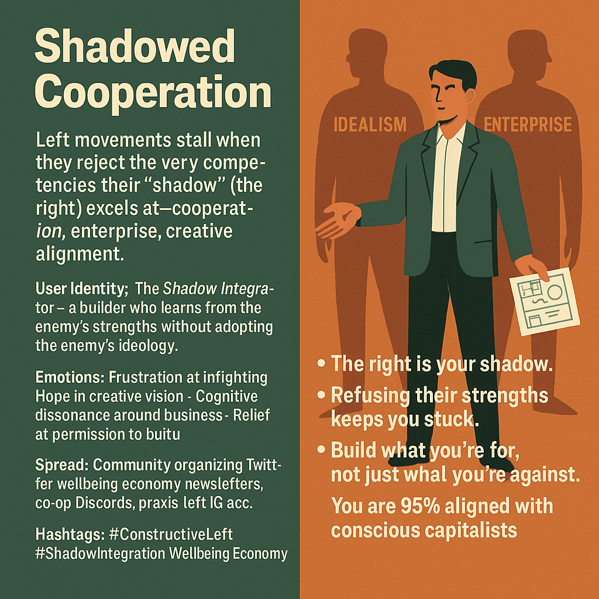

# Building Beyond Ideology: Embracing Shadow Strengths

Created at 2025/11/20 11:37 AM

## 🧩 **Title: Shadowed Cooperation**

**[via Jessica Friday | Substack](https://substack.com/@jlfridayofficial/note/c-179300383?utm_source=notes-share-action&r=5a5yhr)**

### ∴ Core Idea Unit

Left-wing movements stall not from lack of moral clarity but from rejecting the very competencies their “shadow” (the right) has mastered—cooperation, enterprise, and creative alignment. The shift: from *anti-X* identity to *pro-creation* identity.

### ▲ Identity Play & Roles

**The Blocked Builder** — the leftist who sees the contradiction: communal ethics without communal praxis.**The Shadow Integrator** — one who studies the enemy’s strengths not to mimic ideology but to reclaim capacity.

Repositions the self from critic of systems → architect of alternatives.

### ≈ Emotional Triggers

- Frustration at left-infighting• Hope in constructive vision• Cognitive dissonance around “business”• Relief at permission to build• Quiet awe at cross-ideological convergence

### 𐂷 Spread Mechanics

Distribution: community-organizing Twitter, co-ops, wellbeing economy circles, civics IG accounts, praxis-Left Discords.Style: motivational critique, shadow-integration frame, call-to-building, practical optimism.

### ⛨ Defense Reflexes

- Shadow-framing reframes critique as integration, not capitulation• Business-language recontextualized as relational + creative, not extractive• Avoids purity spirals by emphasizing mutual learning• “Humans don’t think in negatives” → a cognitive science shield

### ☷ Memeplex Anchor Points

- Shadow psychology (Jung)• Cooperative economics / wellbeing economy• Conscious capitalism reframed as tools not ideology• Movement-building theory• Pragmatic socialism / municipalism• MLK-style positive-vision politics

### ✶ Sticky Symbols or Quotes

- “The right is your shadow.”• “You refuse the enemy’s strengths.”• “Humans don’t think in negatives.”• “Build what you’re *for*, not just what you’re against.”• “You are 95% aligned with conscious capitalists.”• UBI counties as proof-of-concept nodes• “It was ‘I have a dream,’ not ‘I hate fascists.’”

### ∿ Tags

#ShadowIntegration · #ConstructiveLeft · #WellbeingEconomy · #MovementPraxis · #CooperativeSkillset
