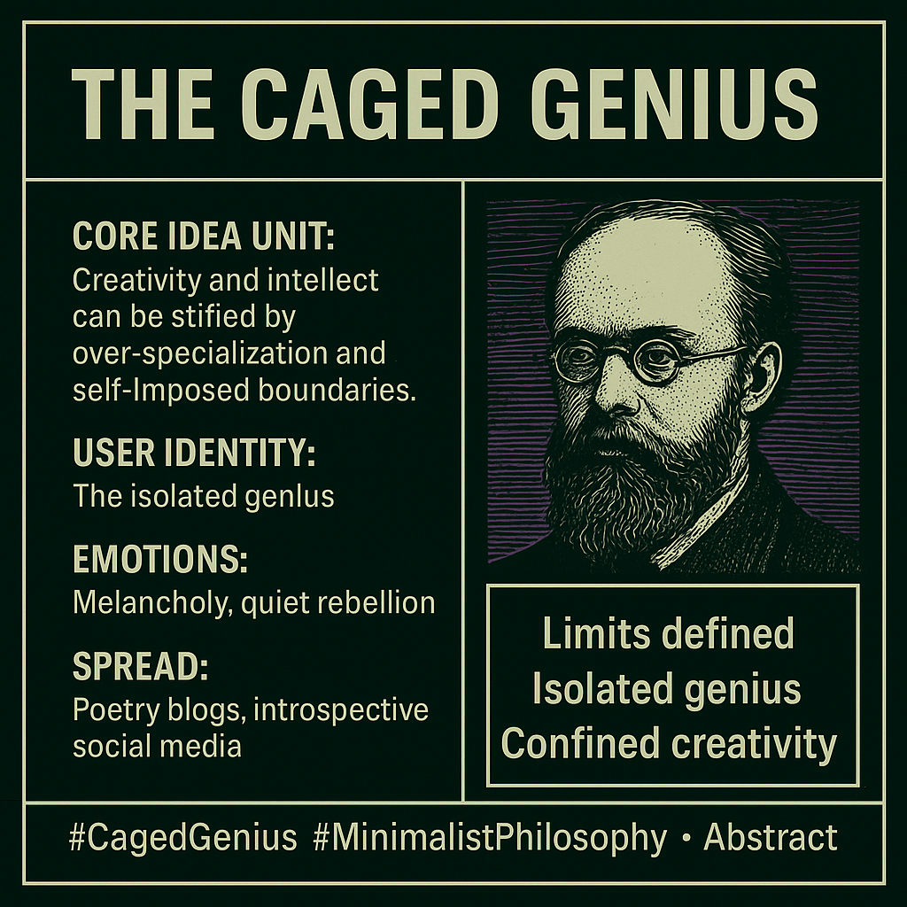

# Confined Creativity: The Isolated Genius's Lament

Created at 2025/07/30 12:46 PM

Mini-Memetic Profile

Title:

“The Caged Genius / Creativity in Chains”

🧠 Core Idea Unit:

- True creativity and intellect can be limited or stifled by over-specialization, narrow focus, or self-imposed boundaries.
- Isolation leads to brilliance but also confinement.

🎭 Identity Play & Roles:

- User as: The reflective philosopher, the isolated genius, or the self-aware artist struggling against constraints.
- Other roles implied: Society as the limiting force, the “walls” as gatekeepers of potential.

💥 Emotional Triggers:

- Nostalgia for lost creative freedom
- Subtle melancholy or resignation
- Awe for the disciplined but constrained mind
- Quiet rebellion against societal or structural limits

📡 Spread Mechanics:

- Distribution vectors: Poetry blogs, minimalist art posts, introspective social media threads, philosophy forums, creative writing spaces.
- Propagation style: Reflective micro-poetry, meditative haiku, subtle social commentary rather than direct provocation.

🛡️ Defense Reflexes:

- Irony shield: Framed as abstract art, which resists literal critique.
- Moral framing: Positions the meme as a universal human reflection on creativity and limitation—hard to “argue” with.
- Aesthetic armor: Artistic form implies deeper thought and intention, deflecting shallow dismissal.

🧬 Memeplex Anchor Points:

- Romanticized “tortured artist” or “lonely genius” narratives
- Anti-bureaucratic, anti-institutional creative ideals
- Minimalist / Zen aesthetics and philosophies of restraint
- Broader critiques of hyper-specialization in modern life

🧠 Sticky Symbols or Quotes:

- “Limits defined”
- “Isolated genius”
- Imagery of cages, walls, or narrow pathways
- Metaphor of “confined creativity” as a haiku in itself

🏷️ Tags:

#MinimalistPhilosophy #CagedGenius #IsolatedCreativity #ZenAesthetics #TorturedArtist #SpecializationCritique

## Resources
- https://object.me.bot/front-img/note/attachments/img/1753904771849/46B492E1-5EBE-4127-9180-603F0A62C6A4.png

## Insight

* The image presents a "Mini-Memetic Profile" centered around the theme of "The Caged Genius," exploring how creativity and intellect can be stifled by over-specialization, narrow focus, or self-imposed boundaries. This concept resonates with historical figures like Nikola Tesla, whose eccentricities and singular focus, while leading to groundbreaking inventions, also resulted in social isolation and perceived limitations in other areas of life.

* The profile identifies the user as embodying the role of "the isolated genius," a figure often romanticized in literature and art. This archetype is exemplified by characters like Dr. Frankenstein in Mary Shelley's novel, who, driven by scientific ambition, isolates himself to create life, ultimately facing dire consequences.

* The "Emotional Triggers" listed—nostalgia for lost creative freedom, melancholy, awe, and quiet rebellion—tap into deep-seated human experiences. These emotions are often explored in Romantic poetry, such as William Wordsworth's works, which lament the loss of natural connection and celebrate individual introspection.

* The "Spread Mechanics" suggest distribution through poetry blogs, minimalist art posts, and introspective social media threads, indicating a preference for subtle, reflective engagement rather than direct confrontation. This approach aligns with the communication strategies of minimalist artists like Agnes Martin, whose subtle, grid-based paintings invite quiet contemplation and personal interpretation.

* The "Defense Reflexes" of irony, moral framing, and aesthetic armor are designed to protect the meme from criticism. This strategy is akin to the use of irony in philosophical discourse, as seen in the works of Søren Kierkegaard, who used indirect communication to challenge conventional thinking and provoke self-reflection.

* The "Memeplex Anchor Points" include romanticized narratives of the "tortured artist" and critiques of hyper-specialization, reflecting broader cultural anxieties about the fragmentation of knowledge and the pressures of modern life. This critique echoes concerns raised by thinkers like Herbert Marcuse, who argued that advanced industrial society represses individual potential through technological rationality and consumerism.

* The "Sticky Symbols or Quotes" such as "Limits defined," "Isolated genius," and "Confined creativity" serve as concise encapsulations of the meme's core message. These symbols evoke the imagery of confinement and restriction, reminiscent of Franz Kafka's novels, which explore themes of alienation, bureaucracy, and the individual's struggle against oppressive systems.

* The tags "#MinimalistPhilosophy," "#CagedGenius," "#IsolatedCreativity," "#ZenAesthetics," "#TorturedArtist," and "#SpecializationCritique" categorize the meme within specific intellectual and artistic traditions. These tags connect the meme to broader discussions about the nature of creativity, the role of the artist in society, and the challenges of living a meaningful life in a complex world.
