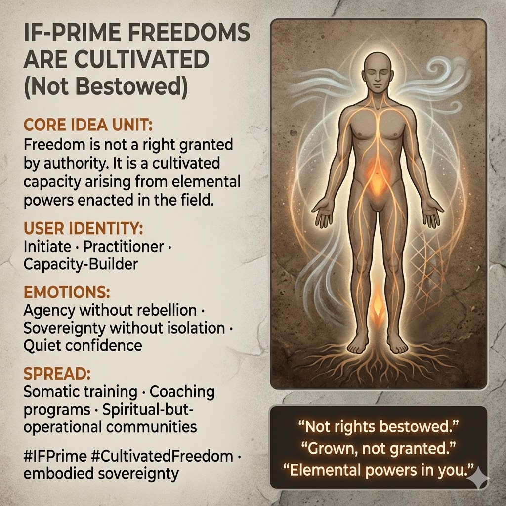

# Cultivating Freedom: Growing Inner Powers

Created at 2025/12/14 11:13 AM

## **IF-Prime Freedoms Are Cultivated, Not Bestowed**

***

## 🧠 Core Idea Unit

Rights-based freedom depends on recognition by authority and can always be revoked. **IF-Prime reframes freedom as cultivated capacity** — arising from elemental powers enacted in the field, not permissions granted from above.

**Resolution frame:** Freedom is something you **grow**, through practice and coherence, until it becomes irreversible.

**Mental shift provoked:** From *“What freedoms do I have?”* → *“What freedoms have I cultivated the capacity to enact?”*

***

## 🎭 Identity Play & Roles

**Cast the viewer as:**

- **Initiate** — entering practice, not ideology
- **Practitioner** — freedom as skill, not claim
- **Capacity-Builder** — training inner powers
- **Embodied Sovereign** — grounded, relational, non-performative

**Repositioning:** The self is no longer a petitioner to authority, but a **field-capable actor** whose freedoms persist because they are enacted, not granted.

***

## 💥 Emotional Hooks & Cognitive Levers

- 🌱 **Agency Without Rebellion** — power without opposition theater
- 🧘 **Sovereignty Without Isolation** — strength that remains relational
- 🔥 **“Grown, Not Granted”** — dignity through cultivation

This meme replaces resentment with **quiet confidence**.

***

## 📡 Spread Mechanics

**Distribution Vectors**

- Somatic and embodied training programs
- Spiritual-but-operational communities
- Coaching, facilitation, and practice-based leadership spaces
- Initiatory curricula

**Propagation Style**

- Practice-first language
- Minimal ideology, maximal embodiment
- “Train this and see” transmission

***

## 🛡️ Defense Reflexes

- **Anti-Legalism Shield:** Freedom not reduced to policy or rights-talk
- **Anti-Authoritarian Guard:** No need to overthrow authority to be free
- **Anti-Abstraction Lock:** Capacities must be demonstrable in action

Critique must explain **how bestowed rights substitute for cultivated capacity under pressure** — a weak case in lived systems.

***

## 🧬 Memeplex Anchor Points

- Virtue and capacity ethics
- IF-Prime elemental framework
- Embodied sovereignty traditions
- Anti-legalistic liberation
- Field-based agency models

***

## 🧠 Sticky Symbols / Quotes

- 🌿 **“Not rights bestowed.”**
- 🔨 **Cultivated, not granted**
- 🔥 *Elemental powers in YOU*
- 🌐 *Authority vs field*
- 🧭 *Freedom that survives pressure*

***

## 🏷️ Tags

#IFPrime · #CultivatedFreedom · #EmbodiedSovereignty · #CapacityEthics · #ElementalPower · #GrownNotGranted

## Resources
- https://object.me.bot/front-img/users/send/img/1765739587426_c4zhf/unnamed_%2827%29.jpg

## Insight

* The concept of freedom being cultivated rather than granted emphasizes a shift from a legalistic view to one rooted in personal agency and empowerment. This aligns with various philosophical and spiritual traditions that advocate for inner growth and self-realization as the true sources of power. For instance, Aristotle’s concept of virtue ethics emphasizes that moral virtues are developed through practice rather than bestowed by external authority. 

* The image invites individuals to see themselves as active participants in their own freedom, moving from a passive role of petitioning authority to one of embodying sovereignty. This reframing resonates with practices in mindfulness and somatic therapy, where personal development is seen as a journey of cultivating innate capacities and resilience through experiential learning.

* The emotional hooks highlighted—like “agency without rebellion” and “sovereignty without isolation”—suggest a harmonious balance between individual empowerment and communal relationships. This duality can be found in indigenous philosophies, such as those seen in many Native American traditions, which emphasize interconnectedness and collective well-being as integral to personal freedom.

* The use of "cultivated capacity" reflects modern psychological theories, such as Carol Dweck's growth mindset, where emphasis is placed on the belief that abilities and intelligence can be developed through effort and perseverance, contrasting sharply with fixed notions of freedom rooted in external validation.

* The image implies a call to action through various distribution vectors such as somatic training and coaching programs, posing a practical framework for embedding these ideas in everyday practice. This practical application is akin to the community-focused approaches seen in social movements that prioritize grassroots leadership and empowerment through learning and shared experiences. 

* The recurring themes of "not rights bestowed" and "elemental powers in you" serve as mantras that can inspire transformative thought. These encapsulate the essence of many spiritual paths that advocate for direct experience and self-discovery as foundations for authentic freedom.
