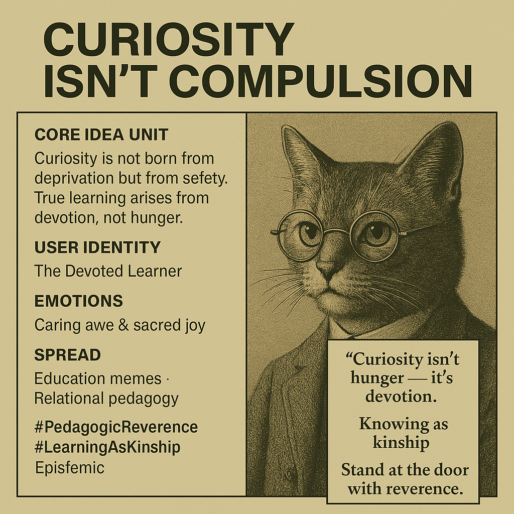

# Curiosity as Devotion, Not Compulsion

Created at 2025/10/27 2:36 PM

### ◈ Mini-Memetic Profile
***

### ∴ Core Idea Unit

Curiosity is not born from deprivation but from safety. True learning arises from devotion, not hunger — from reverence toward mystery rather than compulsion to possess it.
***

### ▲ Identity Play & Roles

Role: The Devoted Learner · The Relational EducatorRepositioning: From student-as-consumer to seeker-as-kin. From curiosity as craving to curiosity as communion.
***

### ≈ Emotional Triggers

🕊 Relief from performance anxiety💔 Gentle grief at manipulative teaching🌞 Reverence for genuine wonder✨ Joy of discovery without transaction
***

### 𐂷 Spread Mechanics

Distribution Vectors: Educator sub-threads · Pedagogy blogs · Reflective TikToks · Philosophy-of-education essaysPropagation Style: Soft manifesto tone · Poetic parable · Anti-gatekeeping critique framed through tenderness
***

### ⛨ Defense Reflexes

Uses moral inversion (“curiosity ≠ compulsion”) and spiritual tone as shields. Its sincerity deflects cynicism; devotion reframes critique as care.
***

### ☷ Memeplex Anchor Points

📘 Freire’s Pedagogy of the Oppressed🌱 Constructivist & relational learning💫 Post-scarcity knowledge ethics🕯 Contemplative pedagogy & trust-based teaching
***

### ✶ Sticky Symbols or Quotes

-	“Curiosity isn’t hunger — it’s devotion.”
-	“Knowing as kinship.”
-	“The leaf with a question mark written in sunlight.”
-	“Stand at the door with reverence.”
***

### ∿ Tags

#PedagogicReverence · #LearningAsKinship · #PostScarcityCuriosity · #MemeticEducation · #AntiGatekeeping · #TenderKnowledge
