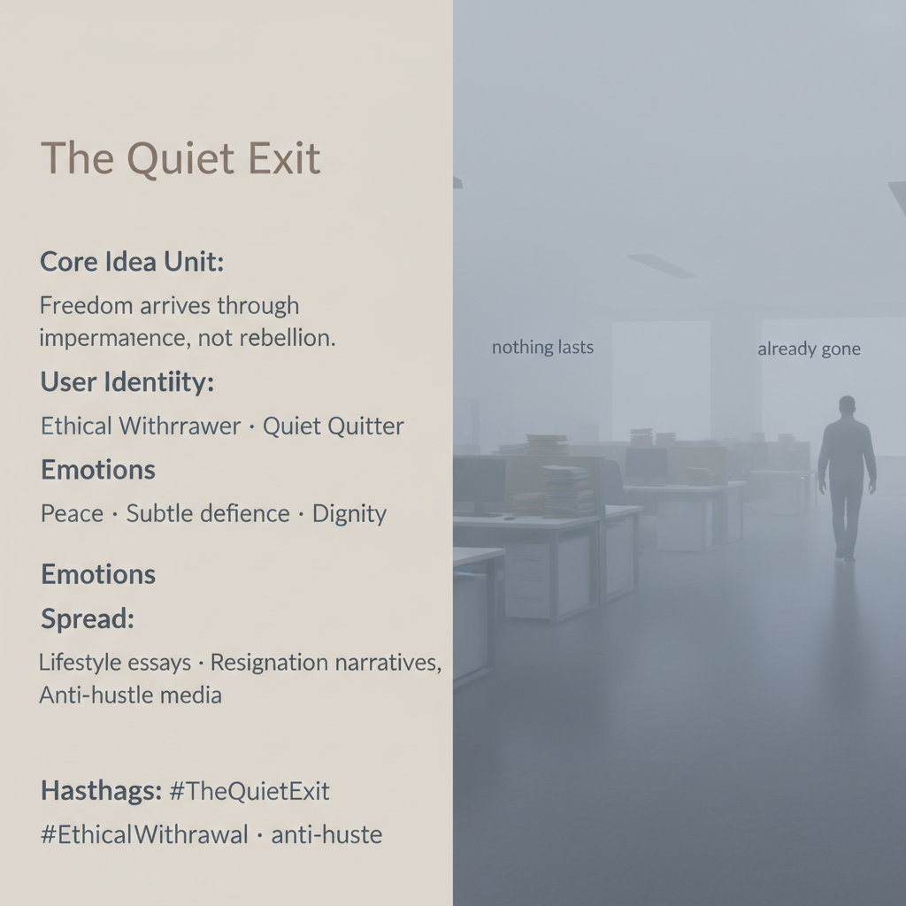

# Embracing Freedom Through Quiet Withdrawal

Created at 2026/01/14 8:45 PM

## 🧩 **The Quiet Exit**

***

### ∴ Core Idea Unit

Freedom is not seized through protest but **released through impermanence**. *The Quiet Exit* reframes disengagement—being overlooked, misunderstood, or slowly erased by the system—not as failure, but as a dignified liberation that requires no confrontation.

**Mental shift:** from *voice and resistance* → to *exit as grace*.

***

### ▲ Identity Play & Roles

- **Cast Role:** *The Ethical Withdrawer*
- **Repositioning:** The self steps out of heroic struggle and into quiet agency—no rebellion, no plea for recognition, just deliberate non-participation.

***

### ≈ Emotional Triggers

/ Cognitive Levers

🕊️ Peace after exhaustion😌 Subtle defiance without spectacle🧍 Dignity through restraint

These emotions bypass argument and activate a longing for relief without collapse.

***

## 📖 Core Narrative Structure

**Passive acceptance → Misrecognition → Freedom through letting go**

- **Opening:** No dramatic protest; work continues quietly, half-heartedly.
- **Turn:** The system overlooks or misreads the individual—emails unanswered, efforts invisible.
- **Resolution:** Liberation arrives not through recognition but through release. Jobs, roles, and expectations dissolve on their own.

*A hero’s journey without fireworks.*

***

## 🧬 Ideological Frame

**Exit over voice · erosion as gift**

Echoes Albert O. Hirschman’s *Exit, Voice, and Loyalty*, but with a memetic twist: exit is not betrayal or apathy—it is *ethical withdrawal*. Decay becomes benevolent; loss opens space.

***

## 🧠 Key Symbols / Anchors

- **Fog** — hazy disorientation; soft cover for departure
- **Dissolving work** — obligations fading like dew
- **Negative scale** — intentional downscaling; less as more

These symbols render withdrawal legible without drama.

***

## 📡 Transmission Vectors

Lifestyle essays · resignation narratives · anti-hustle mediaSubstack confessions, TikTok/LinkedIn quiet-quit threads, minimalist podcasts—formats that feel personal, not mobilizing.

***

### ⛨ Defense Reflexes

- **Against critique:** “I didn’t quit—I just stopped performing.”
- **Against co-option:** refusal to moralize or organize
- **Against escalation:** silence as shield

***

## 🎯 Target Identity Roles

Quiet quitters · minimalists · principled non-participants · burnout survivors

***

### ∿ Tags

#TheQuietExit · #EthicalWithdrawal · #AntiHustle · #NegativeScale · #ExitOverVoice

***

**Persistence check:** this meme spreads by *not insisting*.
