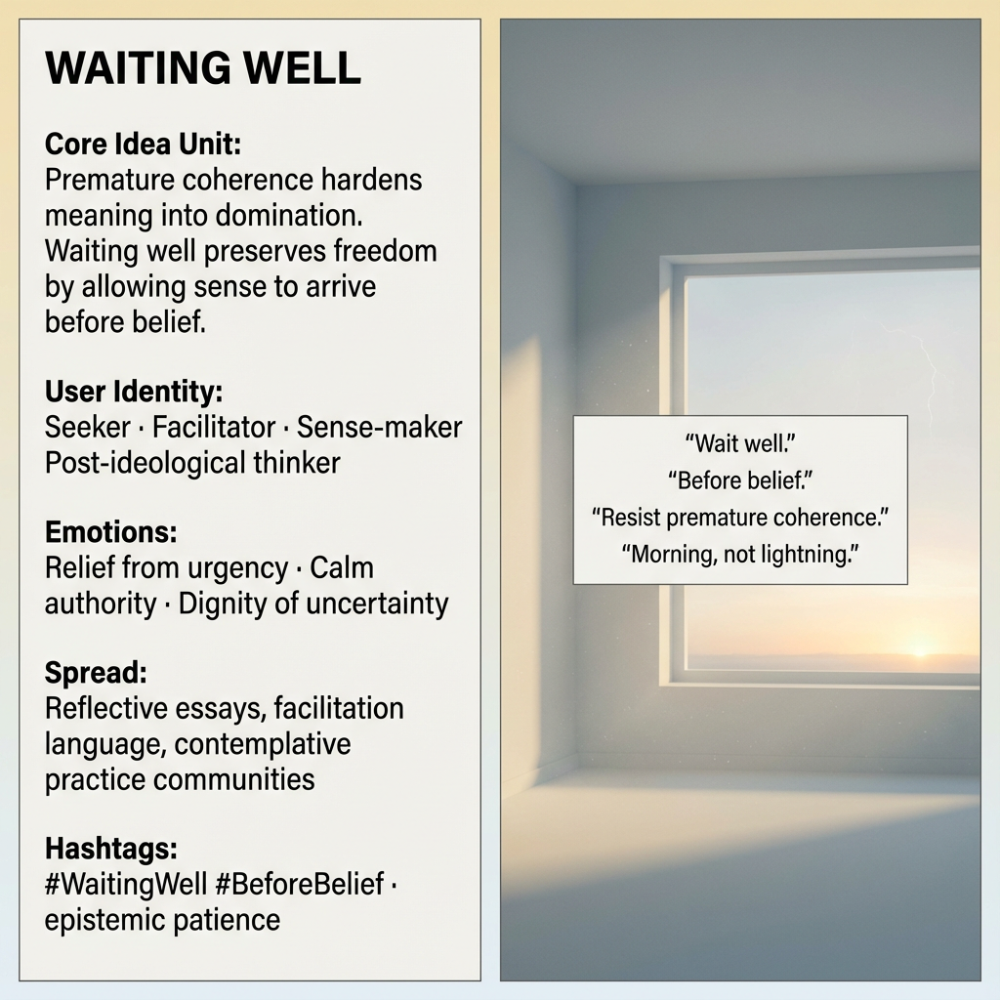

# Embracing Patience: The Art of Waiting Well

Created at 2025/12/18 6:37 PM

## 🧩 **Waiting Well**

***

### ∴ Core Idea Unit

Premature coherence is not clarity—it’s compression.Learning to *wait well* preserves epistemic freedom by allowing meaning to arrive without hardening into domination.

**Mental shift provoked:**From *“I must conclude”* → *“I can hold before belief.”*

***

### ▲ Identity Play & Roles

**Cast as:** Seeker · Facilitator · Sense-maker · Post-ideological thinker

The meme positions the self not as a knower who must decide, but as a steward of attention—someone trusted to hold ambiguity without collapse or force. Authority comes from restraint, not assertion.

***

### ≈ Emotional Triggers

- 😌 Relief from the pressure to conclude
- 🧠 Calm authority rooted in patience
- 🤍 Dignity of uncertainty
- 🌅 Spaciousness (morning light vs. lightning strike)

These emotions lower defensive urgency, creating a receptive state where the meme can settle without resistance.

***

### 𐂷 Spread Mechanics

**Distribution vectors:**

- Reflective essays
- Facilitation and coaching language
- Contemplative and sense-making communities
- Slow media spaces (longform, circles, retreats)

### 𐂷 Spread Mechanics

style:**Gentle, invitational, non-urgent. Often framed as a *practice* rather than a claim.

***

### ⛨ Defense Reflexes

- Deflects critique by refusing haste: “It’s not time yet.”
- Semantic ambiguity protects against dogmatization.
- Pre-empts polarization by declining final positions.

Criticism often slides off because the meme never claims closure.

***

### ☷ Memeplex Anchor Points

- Anti-dogmatic epistemology
- Sense-making and facilitation theory
- Contemplative traditions
- Post-ideological and meta-modern thought
- Attention ecology / cognitive liberty

***

### ✶ Sticky Symbols or Quotes

- “Wait well.”
- “Before belief.”
- “Resist premature coherence.”
- Morning light vs. lightning
- Breath held open, not braced

***

### ∿ Tags

#EpistemicPatience · #BeforeBelief · #AntiDogma · #Sensemaking · #SlowClarity · #AttentionEthics

***

**Reflection anchor:**This meme doesn’t tell you *what* to think—it trains *when* not to.The loop it reinforces is freedom through restraint.
