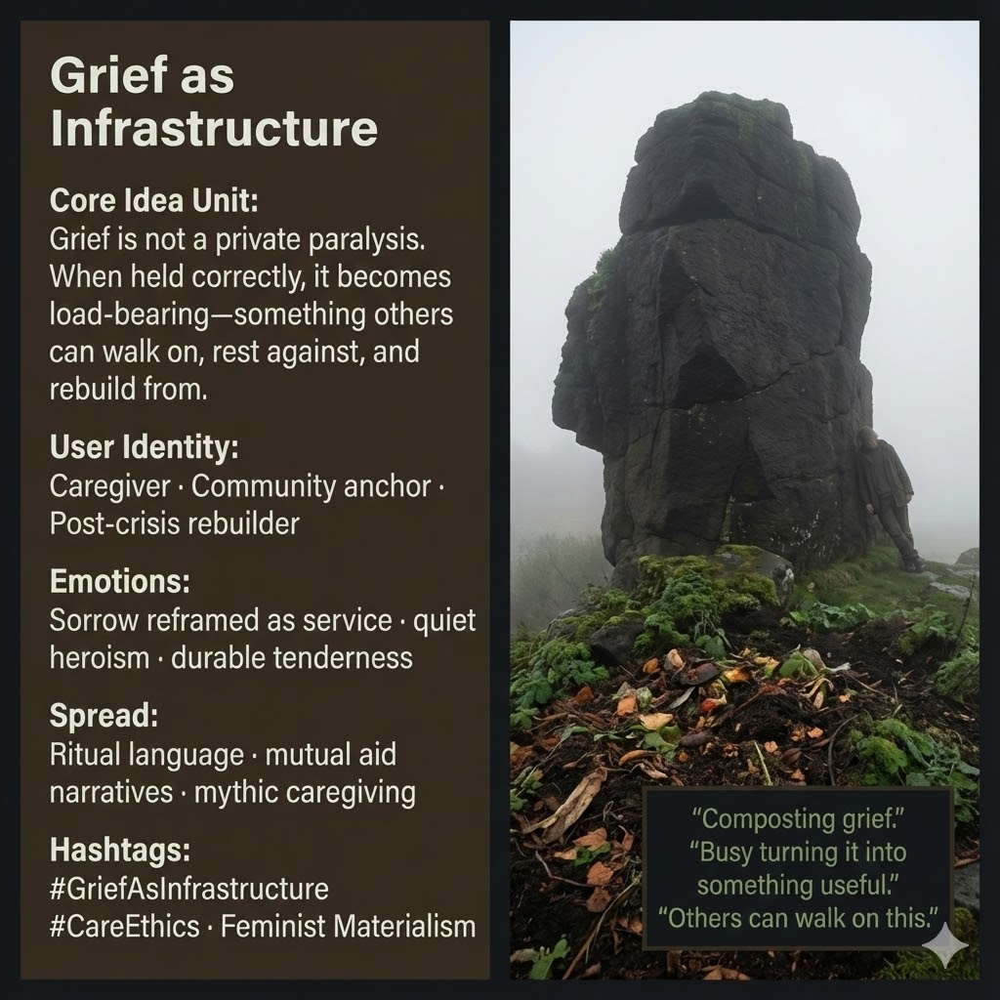

# Reframing Grief: Load-Bearing Sorrow

Created at 2025/12/20 1:35 PM

## 🧩 **Grief as Infrastructure**

[The Oxidized Expanse of Remembering](https://memeticcowboy.substack.com/p/the-oxidized-expanse-of-remembering)

***

### ∴ Core Idea Unit

Grief is commonly treated as a private, paralyzing emotion to be processed and left behind.Reframed, grief can become **load-bearing**—something worked, composted, and shaped so that others can walk on it, rest against it, and rebuild from it.

**Mental shift provoked:**From *“Grief stops me”* → *“Grief, held well, can hold others.”*

***

### ▲ Identity Play & Roles

- **Quiet Carrier** — bears sorrow without display
- **Community Anchor** — stabilizes others through endurance rather than action
- **Post-Crisis Builder** — converts loss into usable ground

The meme repositions the self from *overwhelmed mourner* to **structural caregiver**.

***

### ≈ Emotional Triggers

- 🌱 Sorrow reframed as service
- 🪨 Quiet, uncelebrated heroism
- 🧠 Relief from pressure to “move on”
- 🤍 Dignity in endurance

These emotions validate grief without demanding performance or resolution.

***

### 𐂷 Spread Mechanics

**Distribution Vectors**

- Ritual language and memorial practice
- Mutual aid and community rebuilding narratives
- Care work discourse
- Mythic caregiving archetypes

### 𐂷 Spread Mechanics

**Style**

- Low-voice, non-performative
- Material metaphors (stone, soil, weight)
- Slow time scales
- Statements that read like vows or field notes

***

### ⛨ Defense Reflexes

- **Anti-sentimentality:** Refuses inspirational framing
- **Material grounding:** Grief shown as substance, not mood
- **Non-resolution stance:** No promise of closure or healing arc

Critique that demands catharsis dissolves against durability.

***

### ☷ Memeplex Anchor Points

- Care ethics
- Feminist materialism
- Relational labor
- Mutual aid infrastructures
- Post-crisis social repair

***

### ✶ Sticky Symbols or Quotes

/ Phrases**

- Composting grief
- Basalt tor
- Load-bearing sorrow
- “Busy turning it into something useful.”
- “Others can walk on this.”

***

### ∿ Tags

#GriefAsInfrastructure · #CareEthics · #FeministMaterialism · #QuietHeroism · #MutualAid · #PostCrisisCare

***

**Reflection cadence (anchor):***Healing that hurts* names the pain, 

*distributed selfhood* explains what remains, 

and *grief as infrastructure* shows how 

loss becomes **ground rather than void**.
