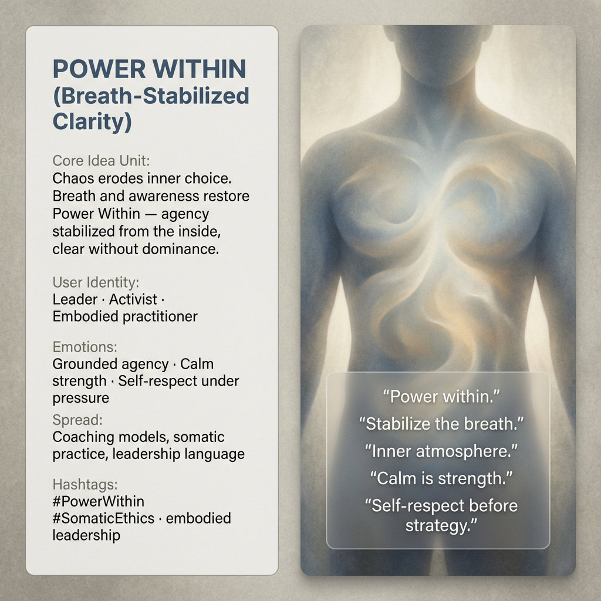

# Harnessing Inner Power Through Breath Awareness

Created at 2025/12/18 9:20 PM

## 🧩 **Power Within (Breath-Stabilized Clarity)**

***

### ∴ Core Idea Unit

When chaos erodes inner choice, power is often sought outward—through control, speed, or dominance.Breath and awareness restore *Power Within*: agency stabilized from the inside, clear without coercion.

**Mental shift provoked:**From *reactive control* → *grounded self-possession*.

***

### ▲ Identity Play & Roles

**Cast as:** Leader · Activist · Embodied practitioner

The meme positions the self as a *holder of inner atmosphere*—someone whose authority comes from steadiness rather than force. Power is not exerted over others, but maintained within oneself under pressure.

***

## ≈ Emotional Hooks & Cognitive Levers

- 🫁 Grounded agency through breath
- 🧘 Calm strength without dominance
- 🧭 Self-respect under stress
- 🌱 Relief from performative power

These levers shift power from adrenaline to presence.

***

### 𐂷 Spread Mechanics

**Distribution vectors:**

- Coaching and leadership models
- Somatic and embodied practice communities
- Language of resilient, non-reactive leadership

### 𐂷 Spread Mechanics

style:**Practical, embodied, quietly authoritative. Often transmitted as cues, pauses, or practices rather than arguments.

***

### ⛨ Defense Reflexes

- Immune to escalation traps
- Resists domination narratives by refusing reactivity
- Deflects critique that equates power with aggression

The meme holds because it does not compete—it stabilizes.

***

### ☷ Memeplex Anchor Points

- Somatic ethics
- Embodied cognition
- Internalized power vs. external control
- Attention and breathwork traditions
- Elemental Air as inner atmosphere

***

### ✶ Sticky Symbols or Quotes

- “Power Within.”
- “Stabilize the breath.”
- “Inner atmosphere.”
- “Calm is strength.”
- “Self-respect before strategy.”

***

### ∿ Tags

#PowerWithin · #SomaticEthics · #EmbodiedLeadership · #CalmStrength · #InnerAgency · #BreathAsPower

***

**Reflection anchor:**Power that must dominate is already unstable.Breath steadies the inner weather—and from that steadiness, choice returns.
