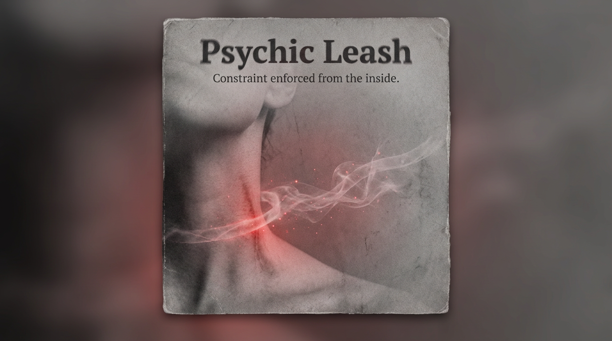

# Internal Constraints: The Psychic Leash Phenomenon

Created at 2025/12/28 4:07 PM

## **Hubris as a Psychic Leash**

[HUBRIS: A Memetic Reversal of Icarus in the Age of Artificial Intelligence](https://memeticcowboy.substack.com/p/hubris-a-memetic-reversal-of-icarus)

### ∴ Core Idea Unit

Expansion of self or vision is pre-coded as moral failure. Growth triggers accusation; accusation enforces retreat. The meme trains ambition to self-police before it externalizes.

### ▲ Identity Play & Roles

**Cast role:** The Overreacher Who Must Be Cut Down The subject is positioned as dangerous when exceeding assigned scale, learning to pre-emptively shrink to remain legitimate.

### ≈ Emotional Triggers

- 😨 Fear of shame
- 😰 Anticipatory punishment
- 🪫 Anxiety of exposure
- 🧱 Internalized ceiling

These emotions activate **self-censorship before action**, preventing visible transgression.

### 𐂷 Spread Mechanics

**Distribution Vectors:**

- Mythic education
- Moralizing critique
- Social shaming
- Institutional narratives

**Propagation Style:** Cautionary tales, tone of grave wisdom, retrospective punishment (“this is what happens when…”).

### ⛨ Defense Reflexes

- Appeals to tradition (“this is how it’s always been”)
- Moral framing (“it’s for your own good”)
- Retrospective inevitability (“the fall was obvious”)

Critique is reframed as naïveté or arrogance.

### ☷ Memeplex Anchor Points

- Scarcity cosmology
- Hierarchical legitimacy
- Zero-sum dignity
- Moralized restraint

### ✶ Sticky Phrases / Symbols

- “Who do you think you are?”
- Pride-before-fall
- Divine punishment
- The cautionary bludgeon

∿ **Tags:** #PsychicLeash · #MoralCeiling · #AntiExpansion · #MemeGrid

## Resources
- https://object.me.bot/front-img/users/send/img/1766966837288_c4zhf/2174f5fe-ded9-4863-bc19-462c66837b94.png

## Insight

* The image evokes the concept of a "psychic leash," symbolizing the internal constraints individuals impose on themselves, aligning with the idea of hubris as a moral failure. This reflects the broader theme of self-policing, where ambition becomes stifled by fear of shame and anticipatory punishment, inhibiting personal growth and expression. 

* The visual representation of a neck, possibly restrained by a conceptual 'leash,' resonates with the notion of identity play where individuals feel compelled to conform to societal expectations. This aligns with the core idea that exceeding normative boundaries leads to facing judgment or condemnation, reinforcing internalized ceilings.

* Emotional triggers such as fear of exposure and anxiety are visually reinforced in the image. The red hue, signifying tension or danger, is appropriate for highlighting the stress associated with self-censorship. This underscores how institutional narratives often prioritize maintaining the status quo over empowering individual expansion.

* The propagation mechanisms outlined in the hint, notably cautionary tales and moralizing critiques, manifest in the subconscious messages people absorb from their environments. The imagery of constraint serves as a reminder of the societal narratives that demonize ambitious endeavors, reinforcing the idea of a zero-sum dignity in competitive cultures.

* The concept of a "moral ceiling" encapsulates the feelings presented in the image. The caption “Constraint enforced from the inside” succinctly summarizes how this psychic mechanism functions, suggesting that individuals become their own worst critics, curtailing their aspirations before they visibly manifest in the world.
