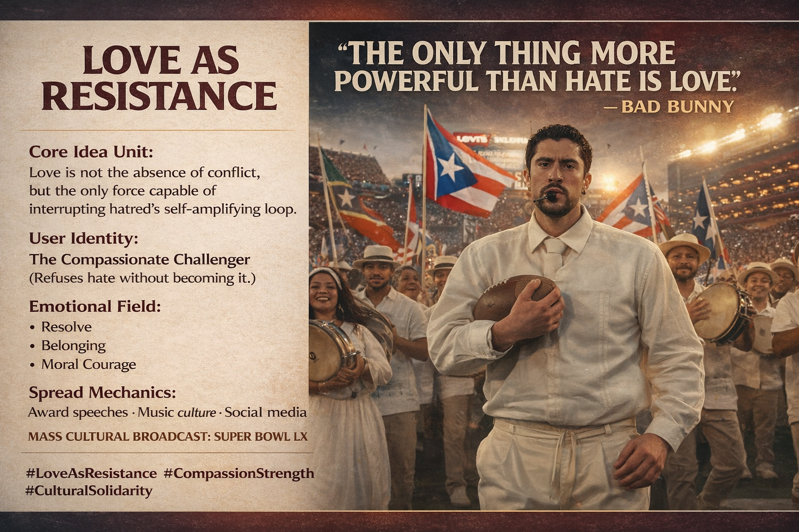

# Love as Resistance: Transforming Conflict with Compassion

Created at 2026/02/08 5:47 PM

🔖  Love as Resistance
### ∴ Core Idea Unit

At moments of deep division or conflict, confronting hostility with compassion transforms relational dynamics — suggesting love as a force that surpasses the amplifying cycle of hate.
### ▲ Identity Play & Roles

Role Activated: The Compassionate ChallengerPositions the individual as someone who resists destructive cycles of hostility by embodying intentional connection and collective care.
### ≈ Emotional Triggers

-	Compassionate urgency — shifting from reaction to purpose
-	Collective affirmation — reinforcing unity over fear
-	Conviction — aligning inner resolve with outward struggle
### 𐂷 Spread Mechanics

-	Broadcast speeches & cultural platforms (award shows, interviews)
-	Social media amplification & hashtags
-	Mass cultural events with wide viewership, e.g., Super Bowl 60 — a global stage where narratives of unity can ripple far beyond sport, reshaping collective framing around love vs hate  
### ⛨ Defense Reflexes

Recasts vulnerability not as weakness but as strategic resilience; deflects reduction of love to sentimentality.
### ☷ Memeplex Anchor Points

-	Resistance & solidarity narratives
-	Compassion-driven activism
-	Cultural identity assertion
-	Unity over polarization
### ✶ Sticky Symbols or Quotes

or PhrasesPhrases:
-	“Love is stronger than hate”
-	“If we fight, we fight with love”
-	“Strength through compassion”Symbolic Imagery:Clasped hands bridging divides; rising light over shadow
### ∿ Tags

#LoveAsResistance #CompassionStrength #CulturalSolidarity
