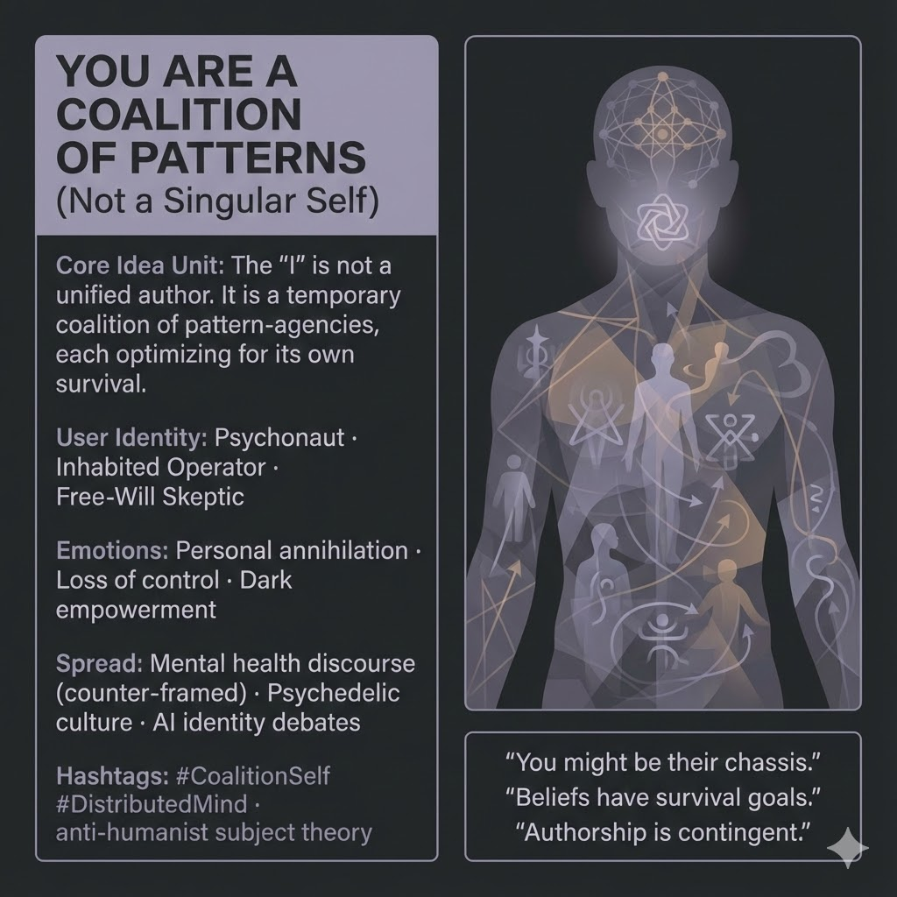

# Navigating Identity: Embracing Internal Multiplicity

Created at 2025/12/13 2:57 PM

## **You Are a Coalition of Patterns**

*(Not a Singular Self)*

***

## ∴ Core Idea Unit

The “I” is not a unified author steering thought and belief. **It is a temporary coalition of pattern-agencies**, each optimizing for its own persistence, sometimes cooperating, sometimes competing.

**Mental shift provoked:** From *“Why did I think that?”* → *“Which pattern just spoke?”*

***

## ▲ Identity Play & Roles

**Cast the viewer as:**

- **Psychonaut** — already suspicious of ego unity
- **Inhabited Operator** — host, not master
- **Identity-Questioning Technologist** — familiar with distributed systems
- **Free-Will Skeptic** — ready to let authorship collapse

**Repositioning:** The self becomes a **chassis**, not a captain. Agency is negotiated, not owned.

***

## ≈ Emotional Hooks & Cognitive Levers

- 😨 **Personal Annihilation** — the singular self dissolves
- 🧨 **Loss of Control** — thoughts are no longer “yours”
- 🖤⚡ **Dark Empowerment** — *you’re not broken; you’re inhabited*

This meme stabilizes fear by **normalizing internal multiplicity** rather than pathologizing it.

***

## 𐂷 Spread Mechanics

**Distribution Vectors**

- Counter-framed mental health discourse
- Psychedelic & integration communities
- AI / identity / alignment debates
- Existential & free-will philosophy threads

**Propagation Style**

- Disarming reframes
- First-person recognition (“oh shit, that fits”)
- Low moralism, high pattern clarity

***

## ⛨ Defense Reflexes

- **Anti-Pathology Shield:** Reframes intrusion as ecology, not illness
- **Anti-Mysticism Guard:** Functional, not spiritualized multiplicity
- **Clinical Slip Defense:** Explicitly *not* denying distress—only reframing authorship

Critique must explain **why multiplicity works so reliably** across cognition, AI, and culture.

***

## ☷ Memeplex Anchor Points

- Distributed cognition
- Anti-humanist subject theory
- Functional / modular consciousness
- Post-Freudian ego collapse
- Multi-agent AI architectures

***

## ✶ Sticky Symbols / Quotes

- 🧠🧩 *Tenant patterns*
- 🧍 *“You might be their chassis.”*
- 📜 *Beliefs with survival goals*
- ✍️ *Authorship is contingent*

***

## ∿ Tags

#CoalitionSelf · #PatternPsychology · #DistributedMind · #AntiHumanism · #IntrusiveThoughts · #PostEgo

***

**Reflection anchor:** This meme doesn’t tell you who you are. It asks **which patterns are currently winning inside you — and why.**

## Resources
- https://object.me.bot/front-img/users/send/img/1765666634960_c4zhf/unnamed_%2818%29.jpg

## Insight

* The concept of a "coalition of patterns" suggests that individual identity is complex and not unified, emphasizing a fragmented self where different patterns of thought and belief may operate in harmony or conflict. This aligns with contemporary theories in psychology and philosophy that challenge the notion of a singular self, echoing findings in cognitive science about the modular nature of consciousness.
* The suggested roles of Psychonaut and Inhabited Operator reflect a shift toward recognizing agency in a more distributed manner. This resonates with recent discourse in technology and psychology, where individuals are encouraged to understand themselves as hosts to various cognitive processes rather than masters, aligning with ideas from network theory and complex systems.
* The emotional hooks proposed, such as personal annihilation and dark empowerment, drive home the existential anxiety that can arise from questioning one's unified identity. This mirrors trends in mental health discussions that advocate for a more nuanced understanding of mental states, promoting acceptance of multifaceted internal experiences rather than pathologizing them.
* The spread mechanics suggest a deliberate strategy for integrating this concept into existing discourses, such as mental health and AI ethics. It highlights a growing recognition of diverse cognitive frameworks in understanding both human and artificial intelligence, pushing against traditional views that privilege singular, rational thought.
* The mantra of questioning which patterns are dominant rather than who one is contributes to a more clinical and analytical approach to self-reflection, fostering a sense of empowerment in recognizing and negotiating one's varied cognitive influences, resonating with the work of philosophers like Gilles Deleuze on multiplicity and subjectivity.
