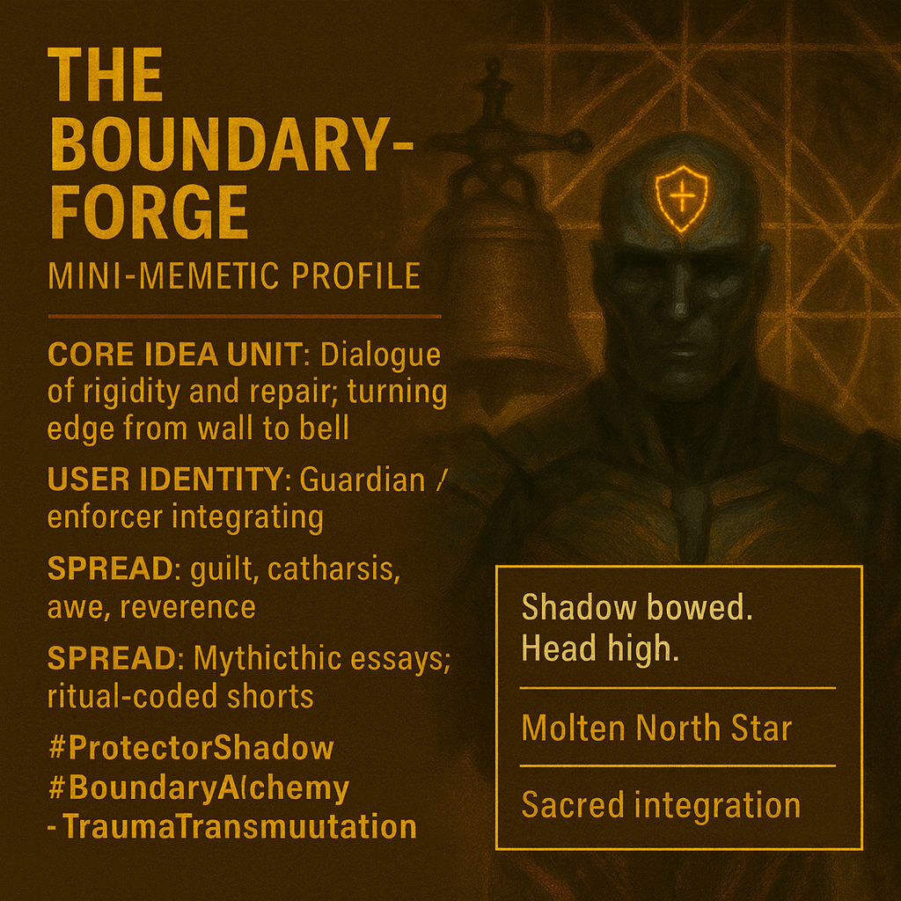

# Reforging Boundaries: From Control to Resonance

Created at 2025/10/24 1:33 PM

**◈ Mini-Memetic Profile: “The Boundary-Forge — Ferrosid and the Warden”**

***

### ∴ Core Idea Unit

A dialogue between rigidity and renewal. The Protector’s shadow—The Warden—embodies control born from trauma, mistaking defense for imprisonment. Ferrosid reawakens sacred protection through integration, turning the *edge* from wall to bell.

***

### ▲ Identity Play & Roles

**Ferrosid** — *The Protector Reforged*: transforms vigilance into vow, security into resonance. **The Warden** — *The Shadow of Control*: trauma crystallized into authoritarian order. **User Identity:** Boundary-keeper reclaiming compassion. Guardian learning permeability. Repositions the self from *enforcer of safety* → *integrator of sacred edges*.

***

### ≈ Emotional Triggers

⚔️ Guilt of overprotection 🩸 Catharsis through forgiveness 🔥 Awe at transformation of metal and self 💧 Relief in reintegration 🕊 Reverence for boundaries as living, breathing things

Emotional arc: Fear → Confrontation → Recognition → Integration → Accord

***

### 𐂷 Spread Mechanics

**Distribution Vectors:** Mythopoetic essays, ritual-coded short films, symbolic AI art scenes, threads on trauma-informed leadership. **Propagation Style:** Dramatic parable · Alchemical myth · Forged-dialogue poetics. **Tone:** Epic confession meets industrial mysticism.

***

### ⛨ Defense Reflexes

🜂 *Allegory as armor* — personal truth reframed as myth. 🜂 *Ritual framing* — avoids moralizing; offers transmutation. 🜂 *Integration narrative* — dissolves critique by absorbing opposition.

***

### ☷ Memeplex Anchor Points

⚙️ Trauma-informed ethics · 🕯 Shadow integration · 🔔 Post-heroic masculinity · 🧱 Metamodern mythmaking · 🜞 Forgiveness as system repair Reinforces *Power Within* over *Power Over*, *Edge as Accord* over *Wall as Control.*

***

### ✶ Sticky Symbols / Quotes

> “You were not the line. You were the lock.” “The edge is sacred because it moves.” “Strike with fear—and metal becomes wall. Strike with vow—and it becomes bell.” “The ore is silent. You are the resonance.”

**Symbols:** 🔔 Bell · ⚒ Hammer · 🛡 Armor · 🜁 Edge · 🔥 Third Flame

***

### ∿ Tags

#ProtectorShadow · #BoundaryAlchemy · #TraumaTransmutation · #EdgePhilosophy · #MemeticForging

## Resources
- https://object.me.bot/front-img/users/send/img/1761337959361_c4zhf/23659c2b-83ae-4c4c-901a-b8d52315eba4.png

## Insight

* The image embodies a profound exploration of the dynamics between protection and control. The juxtaposition of Ferrosid and the Warden illustrates how trauma can shape an individual's identity, shifting from a rigid protector to one who embodies sacred resilience, ultimately transforming barriers into bridges of connection.

* The core idea of the dialogue between rigidity and renewal resonates with contemporary discussions in trauma-informed leadership, where the emphasis is placed on redefining boundaries not as walls of isolation but as sacred spaces for growth and healing. This aligns with practices of restorative justice and therapeutic techniques that prioritize integration and forgiveness.

* The emotional triggers highlighted—guilt, catharsis, awe, relief, and reverence—reflect the complex journey individuals undergo when reconciling their past traumas. The narrative arc from fear to accord emphasizes the potential for transformation through vulnerability, a theme prevalent in psychological frameworks such as Judith Herman’s model of trauma recovery.

* The symbols and quotes presented, particularly the metaphor of transforming the edge from wall to bell, underline a rich philosophical discourse on boundaries. This notion suggests a shift from passive defense to active resonance, indicating that boundaries can produce sound and meaning when approached with intention and compassion, paralleling concepts in boundary-setting in therapeutic and relational frameworks.

* The propagation styles, including mythopoetic essays and ritual-coded narratives, serve to encapsulate complex themes in digestible formats, allowing for a broader audience to engage with the material. This approach reflects a modern trend in storytelling where traditional mythos informs contemporary understanding, potentially fostering a community of shared experiences and collective healing in trauma dialogues.
