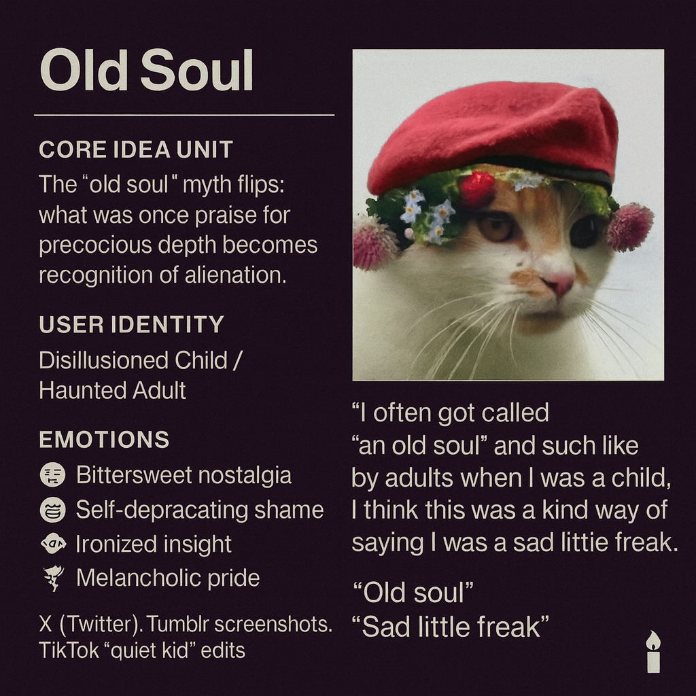

# Reframing the 'Old Soul' Mythos

Created at 2025/10/19 12:37 PM

**◈ Mini-Memetic Profile** **Title:** *Old Soul (Dark Edition)*

*Source: https://x.com/atlanticesque/status/1949513749460558273*

***

∴ Core Idea Unit:** The “Old Soul” myth flips — what was once praise for precocious depth becomes recognition of alienation. The meme reframes sentimental wisdom as early-onset melancholy, hinting that sensitivity in a harsh world looks like dysfunction.

***

▲ Identity Play & Roles:** **Role:** The Disillusioned Child / Haunted Adult The poster reclaims the “old soul” label, turning it from flattery into self-aware diagnosis. They perform the wounded sage who saw too much too young.

***

≈ Emotional Triggers:** 😢 Bittersweet nostalgia 😬 Self-deprecating shame 🧠 Ironized insight 🥀 Melancholic pride

***

𐂷 Spread Mechanics:** **Distribution Vectors:** X (Twitter), Tumblr screenshots, TikTok “quiet kid” edits. **Propagation Style:** Deadpan confession, black-humor aphorism, post-ironic sincerity.

***

⛨ Defense Reflexes:** Irony shield (“sad little freak”) protects sincerity from ridicule. By mocking their own pathos first, they own it.

***

☷ Memeplex Anchor Points:** #TraumaHumor · #GiftedKidBurnout · #PostRomanticism · #NeurodivergentAesthetic

***

✶ Sticky Symbols or Quotes:** “Old soul” → code for *emotional exile* “Sad little freak” → badge of tragic authenticity Candle 🕯 → flicker of self-awareness in darkness

***

∿ **Tags:** #OldSoul #MelancholyHumor · #PostIronicConfessional

***

CTA: [Join the Memescape Mindshifters X Community](https://x.com/i/communities/1893788598295753081)

## Resources
- https://object.me.bot/front-img/users/send/img/1760902633119_c4zhf/62dc2bb5-090a-414d-a234-2a651abcecba.png

## Insight

* The image creatively integrates a cat with elements representative of the “old soul” concept, juxtaposing innocence and depth with a humorous twist. This reflects the broader theme of how traits associated with wisdom can often lead to feelings of alienation, encapsulating the “disillusioned child” and “haunted adult” identities.  
* The emotions listed — bittersweet nostalgia, self-deprecating shame, ironized insight, and melancholic pride — resonate strongly with contemporary discussions around mental health and neurodiversity. This illustrates how humor can serve as a coping mechanism for those navigating their feelings of inadequacy or isolation.  
* The referencing of social media platforms like Twitter and TikTok highlights the role of digital culture in the propagation of memes and identity narratives. The use of hashtags like #TraumaHumor and #NeurodivergentAesthetic connects this sentiment to a larger community grappling with similar experiences, fostering a sense of belonging through shared humor and self-awareness.  
* The specific phrases, “old soul” and “sad little freak,” are not just descriptors but rather badges of identity, amplifying the notion that what was once merely a label can transform into a source of collective identity among marginalized groups. This aligns with post-ironic confessional styles that redefine vulnerability in a contemporary context.  
* The candle symbolically used in the image evokes themes of illumination within darkness, representing resilience amid emotional struggles. This aligns with narratives of self-awareness and the notion that acknowledging one's pain can ultimately lead to a deeper understanding of oneself and one's place in the world.
