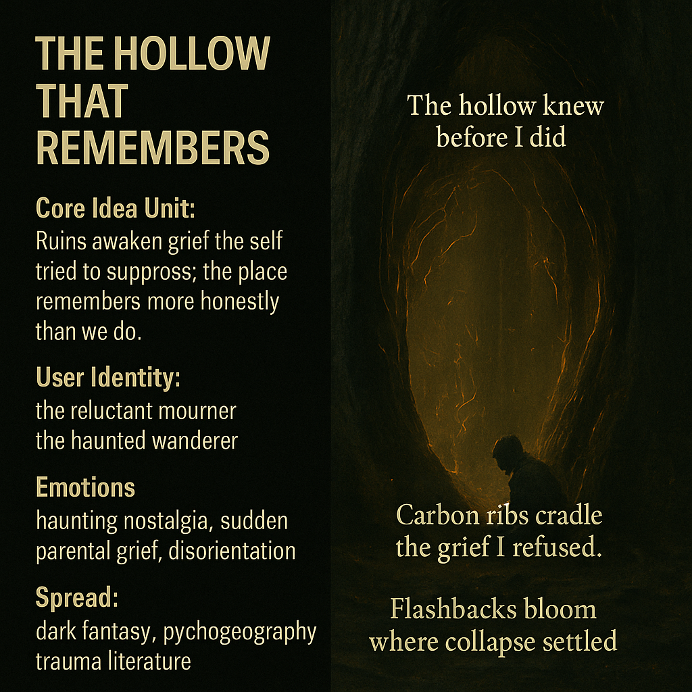

# The Carbon Cathedral's Grief Awakening

Created at 2025/11/23 12:22 PM

### 🧩 **Title: The Hollow That Remembers**

***

### ∴ Core Idea Unit

Some ruins remember us more honestly than we remember ourselves. Entering the carbon cathedral triggers grief the self tried to bury; the place becomes the true storyteller.

***

### ▲ Identity Play & Roles

**The Reluctant Mourner** — someone who didn’t come to grieve but is forced to.**The Haunted Wanderer** — drawn into memories encoded in the environment.

These roles reframe the self as not choosing remembrance, but being chosen by it.

***

### ≈ Emotional Triggers

Haunting nostalgia that rises unbidden.Sudden parental grief surfacing like a wound touched by accident.Spatial disorientation merging with emotional vertigo.

***

### 𐂷 Spread Mechanics

**Distribution Vectors:**Dark fantasy settings, psychogeographic writing, trauma literature, post-collapse fiction.

### 𐂷 Spread Mechanics

Style:**Somber spatial allegory, ruin-induced revelation, memory-echo myth.

***

### ⛨ Defense Reflexes

Emphasis on “the place did it” creates emotional distance.Mythic framing dampens personal exposure.Ambiguous causality between environment and psyche.

***

### ☷ Memeplex Anchor Points

Trauma geography · Memory architecture · Gothic ecology · Post-apocalyptic mourning · Parental-loss narratives.

***

### ✶ Sticky Symbols or Quotes

“Carbon ribs cradle the grief I refused.”“The hollow knew before I did.”“Flashbacks bloom where collapse settled.”Fetal heartbeat threads in bark.

***

### ∿ Tags

#MemoryInPlace · #TraumaGeography · #CarbonCathedral · #GothicEcology
