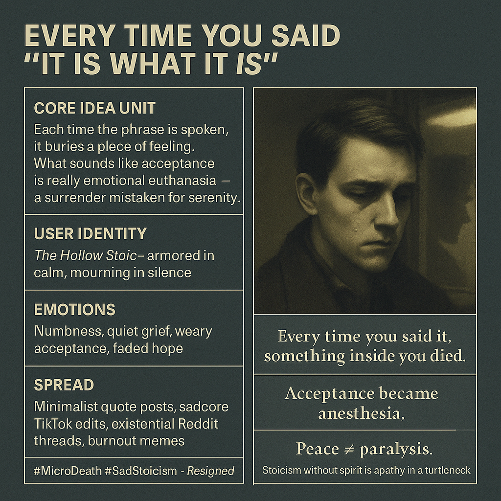

# The Hollow Stoic: Mourning Agency in Silence

Created at 2025/11/11 9:33 PM

🧩 Mini-Memetic Profile — “Every Time You Said ‘It Is What It Is’” (Micro-Death of the Soul)  Source: [Copeland on Substack](https://substack.com/@c077uptf1l3/note/c-175193365)  ⸻  🧠 Core Idea Unit  A haunting realization: each utterance of “It is what it is” isn’t wisdom—it’s a small funeral for agency. The phrase performs acceptance but enacts decay, teaching the self to confuse surrender with peace.  ⸻  🎭 Identity Play & Roles  Primary Role: The Hollow Stoic — armored in detachment, mourning in silence. Supporting Archetypes: 	•	The Burnout Philosopher — aestheticizes fatigue. 	•	The Fatalist Romantic — feels deeply but hides behind fatalism. 	•	The Emotional Minimalist — prefers numb equilibrium to chaos.  ⸻  💥 Emotional Triggers  😔 Quiet despair masked as maturity 🧠 Resigned clarity mistaken for enlightenment 💤 Emotional fatigue, numbness, subtle mourning 🪞 The ache of self-betrayal disguised as acceptance  ⸻  📡 Spread Mechanics  Distribution Vectors: 	•	Minimalist quote cards on X and Instagram 	•	Sadcore TikTok edits over ambient music 	•	Reddit existential threads Propagation Style: Melancholic aphorism, slow emotional bleed, tragic sincerity aesthetic.  ⸻  🛡️ Defense Reflexes 	•	Linguistic anesthesia: language used to dull feeling. 	•	Stoic posturing: “I’m fine” as performance. 	•	Irony camouflage: feigned wisdom as self-protection.  ⸻  🧬 Memeplex Anchor Points 	•	🌀 Stoicism hollowed into nihilism 	•	⚙️ Corporate therapy-speak and emotional labor culture 	•	💔 Existential fatigue in the age of performative resilience 	•	🌫️ Post-hope aesthetic movements (#SadgirlTheory, #Doomerism)  ⸻  🧷 Sticky Symbols / Quotes  “Every time you said it, something inside you died.” “Stoicism without spirit is just apathy in a turtleneck.” “Peace ≠ paralysis.” “Acceptance became anesthesia.”  ⸻  🏷️ Tags  #MicroDeath #SadStoicism #ResignedRealism #ItIsWhatItIs #EmotionalArmor #PostHope #TherapySpeak #NumbWisdom

## Resources
- https://object.me.bot/front-img/note/attachments/img/1762925590740/4E589095-FB74-4B1C-A397-004882C6E6B4.png

## Insight

* The imagery embodies the melancholic theme of emotional resignation, exemplified by the phrase "It is what it is," which signifies acceptance but also an unsettling decay of agency and emotional vitality. This phrase encapsulates a troubling societal norm in which surrender is mistaken for peace, reflecting a deep profoundness in modern existential crises.

* The concept of the "Hollow Stoic" as depicted in the hint emphasizes the detachment that individuals may adopt as a coping mechanism. This identity plays into broader cultural narratives surrounding emotional fatigue, where expressing feelings can be seen as a vulnerability, leading instead to a performance of stoicism that veils deeper grief.

* The terms "emotional anesthesia" and "quiet despair" highlight a current trend of individuals masking their emotional struggles with a façade of maturity and acceptance. The distinction between genuine peace and emotional paralysis raises critical questions about the authenticity of self-acceptance in contemporary life, particularly influenced by social media representations.

* The spread mechanics involving minimalist quotes and "sadcore" edits reflect a cultural moment where emotional fatigue is aestheticized. This trend parallels the rise of #Doomerism and #SadgirlTheory, which articulate a sense of profound disillusionment but also serve as a collective narrative—a form of shared catharsis in the face of societal malaise.

* Quotes like "Stoicism without spirit is just apathy in a turtleneck" provoke a reevaluation of our engagement with stoicism and emotional resilience. They challenge individuals to seek a more dynamic and authentic form of acceptance that does not sacrifice emotional depth for a facade of tranquility. This calls for a nuanced understanding of how we navigate acceptance and agency.
