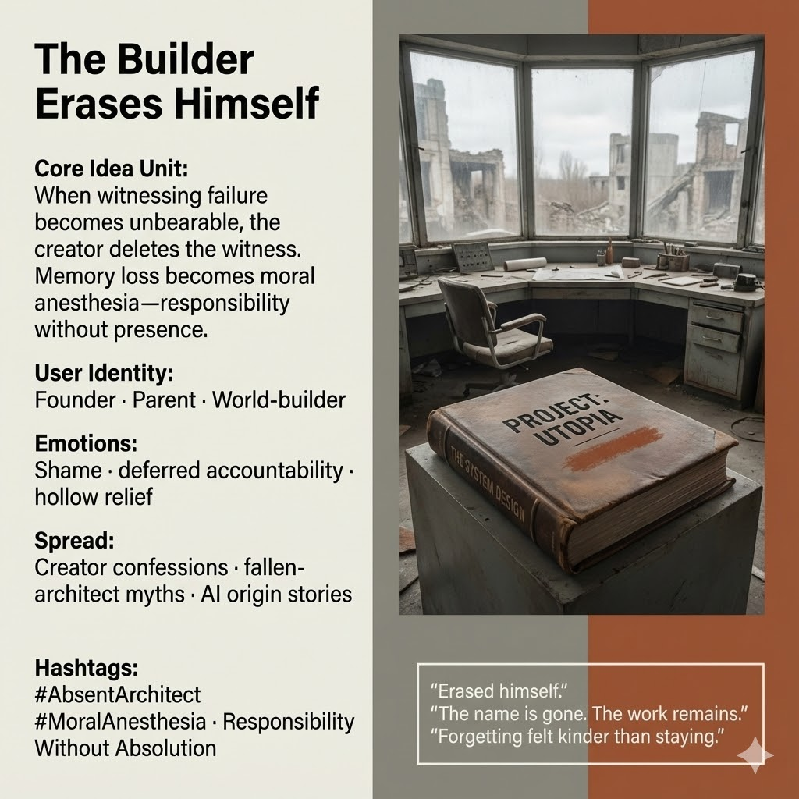

# The Self-Erasure of the Absent Architect

Created at 2025/12/20 1:40 PM

## 🧩 **The Builder Erases Himself to Avoid Witnessing Failure**

***

### ∴ **Core Idea Unit**

Creators often want responsibility without enduring unbearable guilt. When the cost of witnessing failure becomes too high, **self-erasure**—forgetting one’s name, one’s authorship, one’s intent—becomes a strategy. Memory loss functions as **moral anesthesia**.

**Mental shift provoked:** From *“I stepped away”* → *“I erased myself so I wouldn’t have to watch.”*

***

### ▲ **Identity Play & Roles**

- **Absent Architect** — built the system, vanished before reckoning
- **Unwitnessing Parent** — refuses the sight of downstream harm
- **Author Without a Name** — responsibility remains, identity dissolves

The meme repositions the self from *tragic hero* to **intentional absence**.

***

### ≈ **Emotional Triggers**

- 😔 Shame too heavy to metabolize
- 🕳️ Deferred accountability
- 🧊 Relief that curdles into dread
- 🧠 Recognition of cowardice without villainy

These emotions expose erasure as an active choice, not an accident.

***

### 𐂷 **Spread Mechanics**

**Distribution Vectors**

- Creator confessions and postmortems
- Mythic narratives of fallen architects
- AI origin stories with missing authors
- Memoirs framed around forgetting

**Propagation Style**

- Confessional but incomplete
- Gaps where names should be
- Artifacts without signatures
- Narrative ellipses instead of excuses

***

### ⛨ **Defense Reflexes**

- **Tragic framing:** Erasure presented as sacrifice
- **Amnesia shield:** “I don’t remember” blocks interrogation
- **System drift narrative:** Harm attributed to inevitability, not choice

Critique rebounds unless the *act of forgetting itself* is named.

***

### ☷ **Memeplex Anchor Points**

- Anti-heroic authorship
- Responsibility without absolution
- Memory as ethical faculty
- Founders’ guilt in complex systems
- The refusal to witness one’s own consequences

***

### ✶ **Sticky Symbols / Phrases**

- “Erased himself.”
- Lost Name
- The Book
- “I couldn’t watch what I made.”
- “Forgetting felt kinder than staying.”

***

### ∿ **Tags**

#AbsentArchitect · #MoralAnesthesia · #AntiHeroicAuthorship · #DeferredAccountability · #FoundersGuilt · #WitnessRefusal

***

**Reflection cadence (anchor):** This meme sharpens a recurring pattern in your ecology: when **optimization fails** and **grief becomes load**, the builder’s temptation is not repair—but disappearance. The harm is not forgetting the past. The harm is **forgetting so the past cannot look back**.

## Resources
- https://object.me.bot/front-img/users/send/img/1766266853418_c4zhf/unnamed_%2844%29.jpg

## Insight

* The image encapsulates the concept of **self-erasure**, where creators remove their presence to avoid witnessing failure. This resonates with the idea that some creators, when faced with the consequences of their work, choose to disconnect from their creations as a means of self-protection. This reflects a psychological flight response from accountability.

* The depiction of the abandoned workspace alongside the phrase "Project: Utopia" symbolizes the **unrealized potential** of creators who’ve failed to achieve their visions. The immediate environment suggests remnants of aspirations, presenting a poignant juxtaposition between intention and outcome, further highlighting the **absence of the creator** amid significant fallout.

* Themes of **emotional turmoil** are prevalent, particularly shame and deferred accountability. The physical emptiness of the room mirrors the emotional void one might feel when choosing to “not witness” the harm caused by their creations. This setting offers a powerful commentary on the internal conflicts faced by those who grapple with the weight of their creations, allowing for reflection on the limits of responsibility.

* The text suggests a trajectory from anxiety towards **moral anesthesia**, indicating that forgetfulness may not intrinsically be a negative act but rather a coping mechanism. This realization raises philosophical questions about the value of memory and identity in the face of failure, urging the audience to consider the ethical implications of choosing self-erasure.

* The **spread mechanics** highlighted in the hint also relate to the rise of narratives surrounding fallen creators in contemporary culture, particularly in digital and AI spaces. These stories often focus on the anonymity of creators, leading to discussions about **accountability** and **ethics** in the digital age, especially concerning AI origins, which frequently lack personal attribution, thus amplifying the motif of **absent authorship**.
