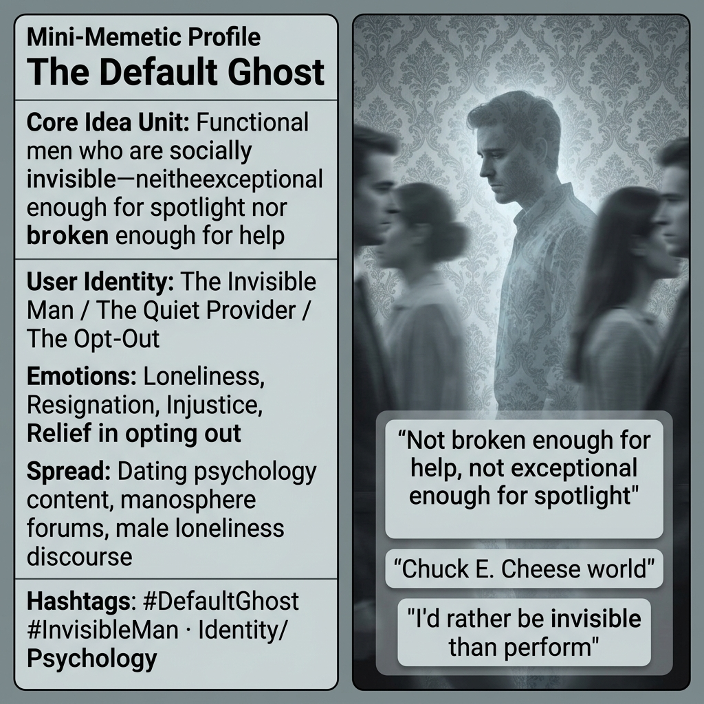

# The Default Ghost

Created at 2026/04/01 8:57 PM

### ◈ Mini-Memetic Profile

**🔶 The Default Ghost — Functional, Unseen, Without Performance**

### ∴ Core Idea Unit

- The "default ghost" describes men who are functional, stable, and self-reliant but socially invisible because they lack performative flair, exceptional status, or visible brokenness.
- In dating app economies and social attention markets, male value is hyper-concentrated at the top (exceptional men get spotlight) or bottom (broken men access help/advocacy). The middle—quietly functional men—receives neither praise for stability nor support for struggles.
- The lament reflects pattern recognition in mismatched incentives: normalcy earns indifference, stability is treated as baseline expectation, and competence without performance registers as absence.

### ▲ Identity Play & Roles

- **The Invisible Man:** Decent, functional, reliable—but doesn't register on attentional radar unless hitting thresholds of looks, status, charisma, or novelty. Psychologists note ~80% of men feel or are treated as "wallpaper" in dating and social contexts.
- **The Average Guy:** Not broken enough for intervention, not exceptional enough for spotlight. His stability is "expected, nothing worth naming." Algorithmically or socially filtered out unless he "optimizes" aggressively.
- **The Quiet Provider:** Bears burdens without recognition, advocacy, or built-in sympathy buffer. Present yet ghostly—structurally present, experientially absent.
- **The Opt-Out:** Prefers solitude or withdrawal over forced performance, seeing the latter as inauthentic in a "Chuck E. Cheese world" demanding constant curation and spectacle.

### ≈ Emotional Triggers

- **Loneliness** — the ache of being surrounded by people who look through you
- **Resignation** — recognition that effort yields indifference rather than reward
- **Injustice** — sense that quiet functionality deserves acknowledgment it never receives
- **Shame** — internalizing invisibility as personal failure rather than structural condition
- **Longing** — desire to be seen without having to perform, optimize, or dramatize
- **Relief (in opting out)** — finding authenticity in withdrawal from performance demands

### 𐂷 Spread Mechanics

- **Distribution Vectors:**
    - Dating psychology content (YouTube, podcasts, Substack)
    - Manosphere/red pill forums and adjacent spaces
    - Male loneliness literature and mental health discourse
    - Dating app critique and "hypergamy" analysis
    - Meme culture depicting "NPC" existence or "wallpaper" status
- 
- **Propagation Style:**
    - Self-diagnostic recognition ("this explains my experience")
    - Quote-posting and "this is me" sharing
    - Anecdote accumulation (story after story confirming the pattern)
    - Defensive reframing ("I'd rather be invisible than clown")
    - Generational lament ("it didn't used to be this way")

### ⛨ Defense Reflexes

- **Reframing as virtue:** "I'd rather be authentic than performative" (opt-out as moral stance)
- **Pathologizing the system:** Dating apps create "winner-take-most markets," not personal failure
- **Historical nostalgia:** "It wasn't always this way" (implies temporary condition, not permanent trait)
- **Solution-space fragmentation:** Debates between self-optimization, opting out, or cultural pushback prevent unified critique
- **Dismissal shield:** Critics labeled as "incels" or misogynists, allowing the mainstream to ignore structural critique

### ☷ Memeplex Anchor Points

- Hypergamy and evolutionary psychology frameworks
- Dating app economy and algorithmic filtering
- Attention economy and social media hyper-optimization
- Male loneliness epidemic and mental health crisis
- Decline of social buffers and community structures
- Traditional masculinity in tension with performative modernity
- Empathy asymmetry in gender discourse
- The "Chuck E. Cheese world" (society as forced spectacle)

### ✶ Sticky Symbols or Quotes

- "Default ghost"
- "Invisible man / wallpaper"
- "Chuck E. Cheese world"
- "Not broken enough for help, not exceptional enough for spotlight"
- "The average guy gets filtered out algorithmically"
- "Quiet functionality with no safety net"
- "I'd rather be invisible than perform"
- "80% of men are treated as invisible"
- Imagery: ghost silhouettes, wallpaper patterns, blurred faces in crowds, empty chairs, solitary figures in busy spaces

### ∿ Tags

#DefaultGhost #InvisibleMan #MaleLoneliness #DatingApps #Hypergamy #AttentionEconomy #QuietFunctionality #WallpaperStatus #PerformanceBurden #StructuralInvisibility
