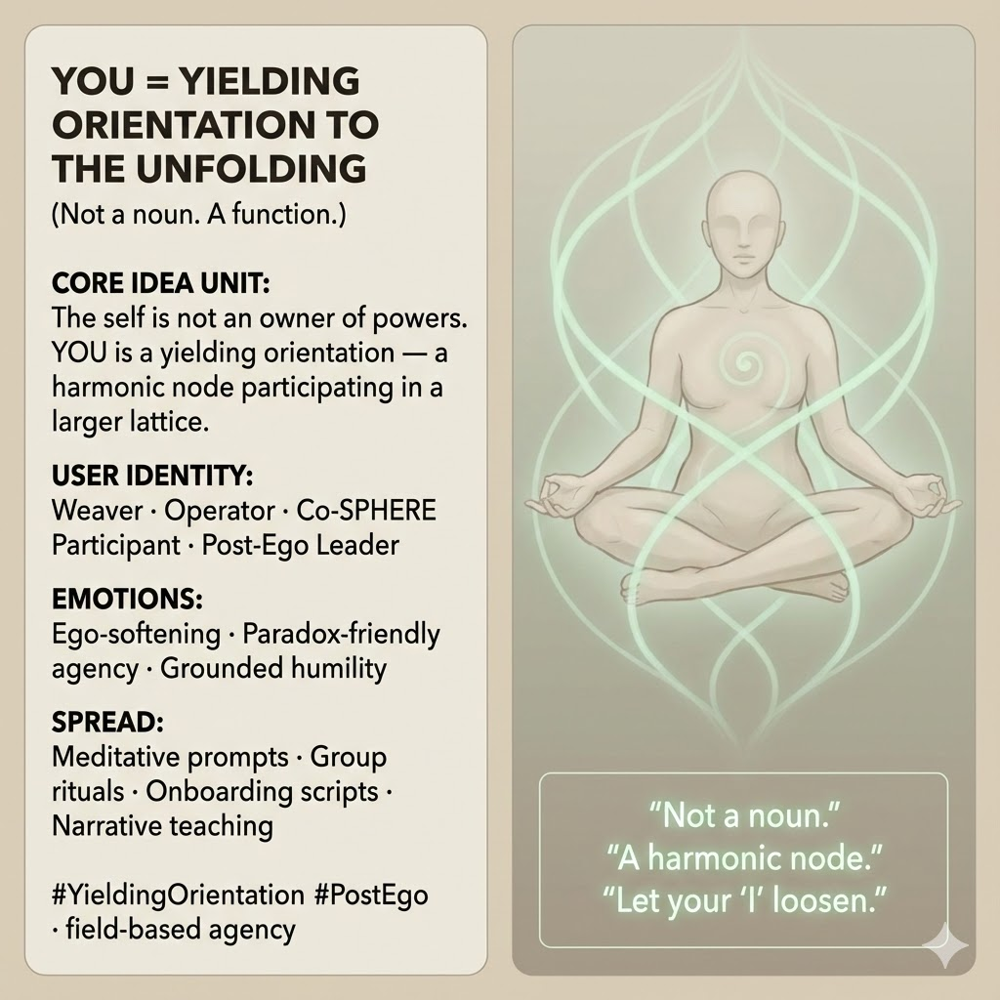

# YOU: A Function of Yielding Orientation

Created at 2025/12/14 11:21 AM

#### **YOU as Yielding Orientation to the Unfolding**

***

## 🧠 Core Idea Unit

The “self” is usually treated as a noun — an owner of powers, traits, and intentions. This creates grasping, identity-lock, and brittle agency.

**Resolution frame:** Recode **YOU** as a **verb-like function**: **Yielding Orientation to the Unfolding** — a harmonic node participating in a larger lattice rather than commanding it.

**Mental shift provoked:** From *“What am I?”* → *“How am I orienting right now?”*

***

## 🎭 Identity Play & Roles

**Cast the viewer as:**

- **Weaver** — aligning threads rather than pulling them
- **Operator** — adjusting orientation, not asserting control
- **Co-SPHERE Participant** — agency as shared field-action
- **Post-Ego Leader** — authority through attunement

**Repositioning:** The self is no longer an object with attributes, but a **mode of participation**.

***

## 💥 Emotional Hooks & Cognitive Levers

- 🌬️ **Ego-Softening** — relief from self-maintenance
- 🧩 **Paradox-Friendly Agency** — acting without grasping
- 🕊️ **Sanctified Humility (Without Submission)** — dignity without dominance

This meme lowers defensive load while preserving agency.

***

## 📡 Spread Mechanics

**Distribution Vectors**

- Meditative and contemplative prompts
- Group rituals and circle work
- Onboarding scripts for communities or programs
- Memetic Cowboy–style narrative content

**Propagation Style**

- Gentle reframes
- First-person experiential language
- Repetition that trains orientation, not belief

***

## 🛡️ Defense Reflexes

- **Anti-Passivity Shield:** Yielding ≠ surrender
- **Anti-Ego-Erasure Guard:** Orientation still acts
- **Anti-Mysticism Lock:** Functional, not devotional

Critique must show how **noun-selves outperform orientation-selves** under complexity — a steep climb.

***

## 🧬 Memeplex Anchor Points

- Non-dual functional selfhood
- Field-based agency
- Process ontology
- Relational leadership
- Co-SPHERE participation models

***

## 🧠 Sticky Symbols / Quotes

- 🔁 **YOU = Yielding Orientation to the Unfolding**
- 🧭 *Not a noun*
- 🕸️ *Harmonic node*
- 🧩 *Lattice participation*
- 🌬️ **“Let your ‘I’ loosen.”**

***

## 🏷️ Tags

#YieldingOrientation · #PostEgo · #FieldAgency · #CoSPHERE · #ProcessSelf · #HarmonicNode

***

**Reflection anchor:** This meme doesn’t erase the self. It asks **what happens when the self becomes a way of moving rather than a thing to defend.**

## Resources
- https://object.me.bot/front-img/users/send/img/1765740115822_c4zhf/unnamed_%2828%29.jpg

## Insight

* The concept of "Yielding Orientation to the Unfolding" challenges traditional views of selfhood by suggesting that identity should be viewed as a dynamic process rather than a fixed entity. This aligns with contemporary philosophical views, such as process philosophy, which posits that reality is fundamentally composed of processes rather than static things.
  
* The idea of repositioning selfhood from a noun to a verb-like function allows for a more fluid understanding of identity. The notion of being a "Weaver" or "Operator" emphasizes collaboration and interconnectedness, reflecting themes found in social constructivism, where knowledge and identity are co-created through social interactions.

* Emotional hooks like "Ego-Softening" and "Sanctified Humility" resonate with mindfulness practices that promote self-awareness and self-acceptance. Such emotional frames can foster resilience, enabling individuals to navigate complexity without feeling overwhelmed by a rigid self-concept.

* The concept of agency as "shared field-action" reflects systems thinking, which recognizes that individuals function within a web of relationships that shape their actions. This perspective encourages a communal approach to leadership and decision-making, as seen in participatory governance and collaborative problem-solving.

* The propagation style mentioned—using meditative prompts and experiential language—underscores the importance of narrative in shaping our understanding of self. Techniques found in narrative therapy can be effective for individuals looking to reconstruct their identities by focusing on lived experiences rather than prescribed roles.

* The reflective question, "What happens when the self becomes a way of moving rather than a thing to defend?" invites deeper exploration into how fluidity in identity can lead to greater adaptability and openness, which are crucial in an increasingly complex and interconnected world. This aligns with views in existential psychology, which argue that embracing uncertainty can lead to greater authenticity.
