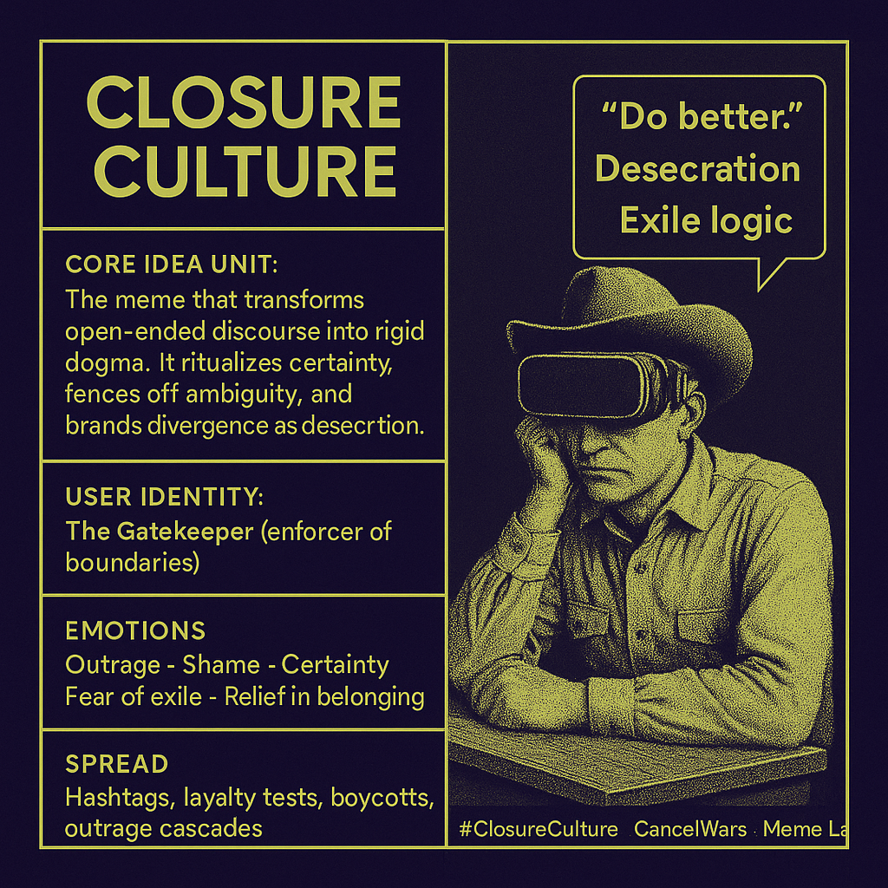

# Closure Culture: Dogma, Exile, and Gatekeepers

Created at 2025/09/17 6:35 PM

## ∴ Core Idea Unit:

Closure Culture is the memetic logic that turns discourse into dogma, turning living ambiguity into fixed scripts. It thrives on certainty, ritualizing speech as judgment and exile. Rather than tending the wild range of meaning, it fences it off—declaring some feelings, questions, or stories untouchable, and branding deviation as desecration.

***

## ▲ Identity Play & Roles:

- **The Gatekeeper** (enforcer of boundaries)
- **The Outlaw** (those branded for deviation)
- **The Loyalist** (performer of approved scripts)
- **The Exile** (those denied meaning-space)

Repositions self relative to the system as either *belonging through conformity* or *banished for divergence.*

***

## ≈ Emotional Triggers:

😡 Outrage · 😬 Shame · 🧠 Certainty · 🤯 Fear of exile · 🧎 Relief in belonging

***

## 𐂷 Spread Mechanics:

- **Distribution Vectors:** Hashtags, loyalty tests, boycotts, outrage cascades, cancellation rituals.
- **Propagation Style:** Moral compression, performative purity, script repetition, aesthetic of justice.

***

## ⛨ Defense Reflexes:

- **Irony Shields:** “It’s just accountability.”
- **Moral Framing:** Any critique becomes proof of guilt.
- **Semantic Ambiguity:** Shifts definitions of “harm,” “violence,” or “safety” to expand jurisdiction.

***

## ☷ Memeplex Anchor Points:

- 📱 Digital tribalism & call-out culture
- ✝️ Religious heresy trials / witch hunts
- ⚖️ Purity politics & ideological policing
- 🧬 Memetic fixation (dogma vs ambiguity)

***

## ✶ Sticky Symbols or Quotes:

- “That’s not your lane.”
- “Do better.”
- “This isn’t up for debate.”
- 🔥 Purity flames consuming the stage
- 🪧 Loyalty oaths, hashtags, monuments

***

## ∿ Tags:

#ClosureCulture · #CancelWars · #ScriptedSpeech · #MoralCompression · #ExileLogic · #PurityTheater

## Resources
- https://object.me.bot/front-img/users/send/img/1758159281901_c4zhf/93322341-55a7-4c11-9754-0d4f37d84423.png

## Insight

*   The image presents "Closure Culture" as a memetic force that transforms open discourse into rigid dogma, emphasizing certainty and branding divergence as desecration. This concept aligns with the observation that online and offline social dynamics often prioritize adherence to specific viewpoints, suppressing dissenting opinions.

*   The "Gatekeeper" is identified as a key role within this culture, acting as an enforcer of boundaries. This role is reminiscent of sociological concepts like "norm entrepreneurs," individuals or groups who take the lead in defining and enforcing social norms. Howard Becker's work on deviance and labeling theory discusses how such actors play a crucial role in defining what is considered acceptable or unacceptable behavior within a community.

*   The emotional triggers listed—outrage, shame, certainty, fear of exile, and relief in belonging—highlight the psychological mechanisms that drive and maintain closure culture. These emotions are often exploited in social dynamics to encourage conformity and discourage dissent. Social psychology research, particularly studies on conformity and obedience such as the famous Milgram experiment, demonstrates the power of these emotions in shaping individual behavior within group settings.

*   The spread mechanics, including hashtags, loyalty tests, boycotts, and outrage cascades, illustrate how closure culture propagates through social media and other communication channels. These mechanisms are amplified by algorithms that prioritize engagement, often leading to echo chambers and the rapid spread of emotionally charged content.

*   The image's sticky symbols and quotes, such as "Do better," "Desecration," and "Exile logic," encapsulate the judgmental and exclusionary nature of closure culture. These phrases serve as shorthand for complex moral judgments and can be used to quickly dismiss or condemn dissenting viewpoints.

*   The cowboy wearing a VR headset symbolizes the modern individual navigating digital spaces while potentially enforcing or being subjected to closure culture. The cowboy archetype, traditionally associated with independence and self-reliance, is juxtaposed with the VR headset, suggesting a tension between individual autonomy and the pressures of conformity within digital communities.
