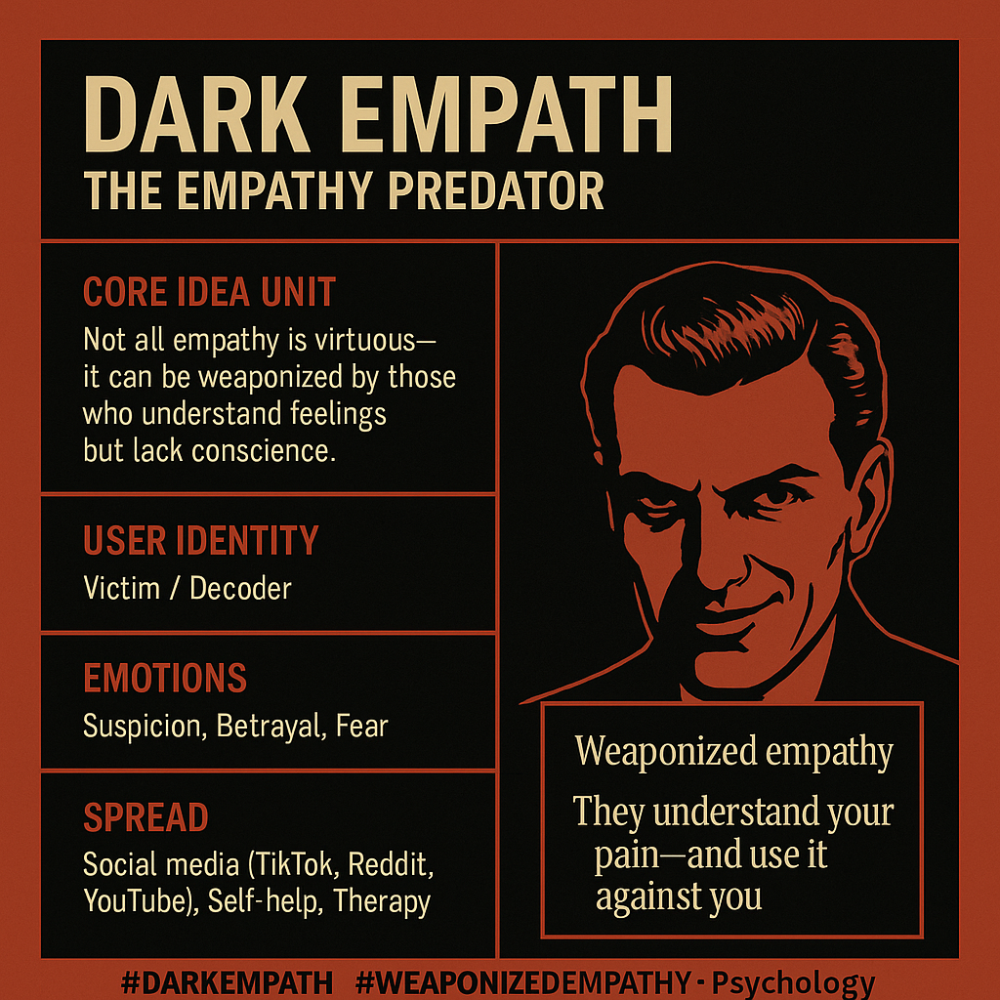

# Dark Empath: Weaponized Empathy and Manipulation

Created at 2025/07/21 7:13 PM

**Mini-Memetic Profile**

**Dark Empath – The Empathy Predator**

[Found via New Scientist](https://www.newscientist.com/article/mg26735520-800-what-characterises-a-dark-empath-the-science-behind-the-buzzword/)

🧠 Core Idea Unit:

“Not all empathy is virtuous — it can be weaponized by those who understand feelings but lack conscience.”

This thought-virus challenges the sacred status of empathy, reframing it as a potential tool of manipulation when combined with dark personality traits. It disrupts the moral binary of “empathic = good” by suggesting emotional intelligence can serve narcissistic ends.

🎭 Identity Play & Roles:

- User as Victim/Insider: Warned to be cautious—“you may have been emotionally manipulated.”

- User as Decoder: Granted the role of identifying the hidden predator in social dynamics.

- Antagonist as Charismatic Manipulator: Uses empathy performatively, posing as sensitive but covertly exploitative.

💥 Emotional Triggers:

- Suspicion & Betrayal: “I thought they cared — but it was strategy.”

- Validation: “That explains my experience; I wasn’t crazy.”

- Fear: “What if I’m vulnerable to emotional manipulation right now?”

- Empowerment: “Now I can spot the signs and protect myself.”

📡 Spread Mechanics:

- Distribution Vectors: Social media (TikTok, Reddit, YouTube), self-help blogs, therapy discourse, pop psych journalism.

- Propagation Style: 

    - Direct claims: “Dark empaths are more dangerous than narcissists.”

    - Cautionary storytelling: Relationship anecdotes and psychoeducation threads.

    - Trendification: Hashtag-ready archetype formation.

🛡️ Defense Reflexes:

- Preemptive Legitimization: “It’s backed by psychology research.”

- Moral Framing: Empathy should be used for good — the meme accuses its inverse.

- Reversal Shield: Criticism = potential manipulation tactic itself.

🧬 Memeplex Anchor Points:

- Dark Triad Discourse – Narcissism, Machiavellianism, psychopathy

- Trauma Recovery & Gaslighting Awareness

- Pop Psychology & Relationship Coaching

- Anti-Narcissist / Empath Identity Subcultures

- “Spiritual Bypassing” & Toxic Positivity Critique Zones

🧠 Sticky Symbols or Quotes:

- “Dark Empath” (oxymoronic contrast itself is memetically sticky)

- “Weaponized empathy”

- “They understand your pain — and use it against you.”

- Visuals: Smiling mask over skull; mirror reflecting predator eyes; empath’s tear with dagger-shaped drop.

🏷️ Tags:

#DarkEmpath #WeaponizedEmpathy #DarkTriad #RedFlagPsychology #PopPsychMeme #EmotionalManipulation #Gaslighting #ShadowSelf #EmpathSubculture

## Resources
- https://object.me.bot/front-img/note/attachments/img/1753150426974/4600BF1A-4E1E-4B79-930D-BCA68978F9E5.png

## Insight

*   The image presents the concept of a "Dark Empath," characterizing them as "The Empathy Predator." This term suggests a person who possesses the ability to understand and share the feelings of others (empathy) but uses this understanding for manipulative or harmful purposes, lacking the moral compass or conscience that typically guides empathic behavior.

*   The "Core Idea Unit" section emphasizes that empathy is not inherently virtuous. It highlights the potential for empathy to be "weaponized" by individuals who understand feelings but lack conscience. This challenges the conventional positive association with empathy, suggesting it can be a tool for manipulation. This concept aligns with research on the "Dark Triad" traits (narcissism, Machiavellianism, and psychopathy), where individuals may use emotional intelligence to exploit others.

*   The image identifies two potential user identities: "Victim" and "Decoder." The "Victim" identity suggests that the viewer may have experienced emotional manipulation by a dark empath, while the "Decoder" identity implies that the viewer is now equipped to recognize and understand the tactics of such individuals. This dual identity serves to both validate the experiences of those who feel manipulated and empower them to identify and protect themselves from future manipulation.

*   The "Emotions" section lists "Suspicion, Betrayal, and Fear" as key emotional triggers associated with dark empaths. These emotions reflect the experience of being manipulated or exploited by someone who feigns empathy. The inclusion of these emotions serves to resonate with individuals who have experienced such manipulation, reinforcing the validity of their feelings and experiences.

*   The "Spread" section identifies social media platforms like TikTok, Reddit, and YouTube, as well as self-help resources and therapy, as channels through which the concept of the dark empath is disseminated. This highlights the role of online communities and mental health resources in popularizing and spreading awareness of this psychological concept. The mention of "therapy" suggests that the concept of the dark empath is also being discussed and explored in professional mental health settings.

*   The phrase "Weaponized empathy: They understand your pain—and use it against you" encapsulates the core manipulative tactic of the dark empath. This statement highlights the idea that dark empaths use their understanding of others' emotions to exploit their vulnerabilities and inflict harm. This concept is visually reinforced by the image of a person with a subtle, unsettling smile, suggesting a hidden agenda or manipulative intent.

*   The hashtags at the bottom of the image, such as #DarkEmpath, #WeaponizedEmpathy, #DarkTriad, #RedFlagPsychology, #PopPsychMeme, #EmotionalManipulation, #Gaslighting, #ShadowSelf, and #EmpathSubculture, categorize the concept of the dark empath within broader discussions of personality psychology, emotional manipulation, and online subcultures. These hashtags facilitate the spread and discoverability of the concept on social media platforms, connecting it to related topics and communities.

