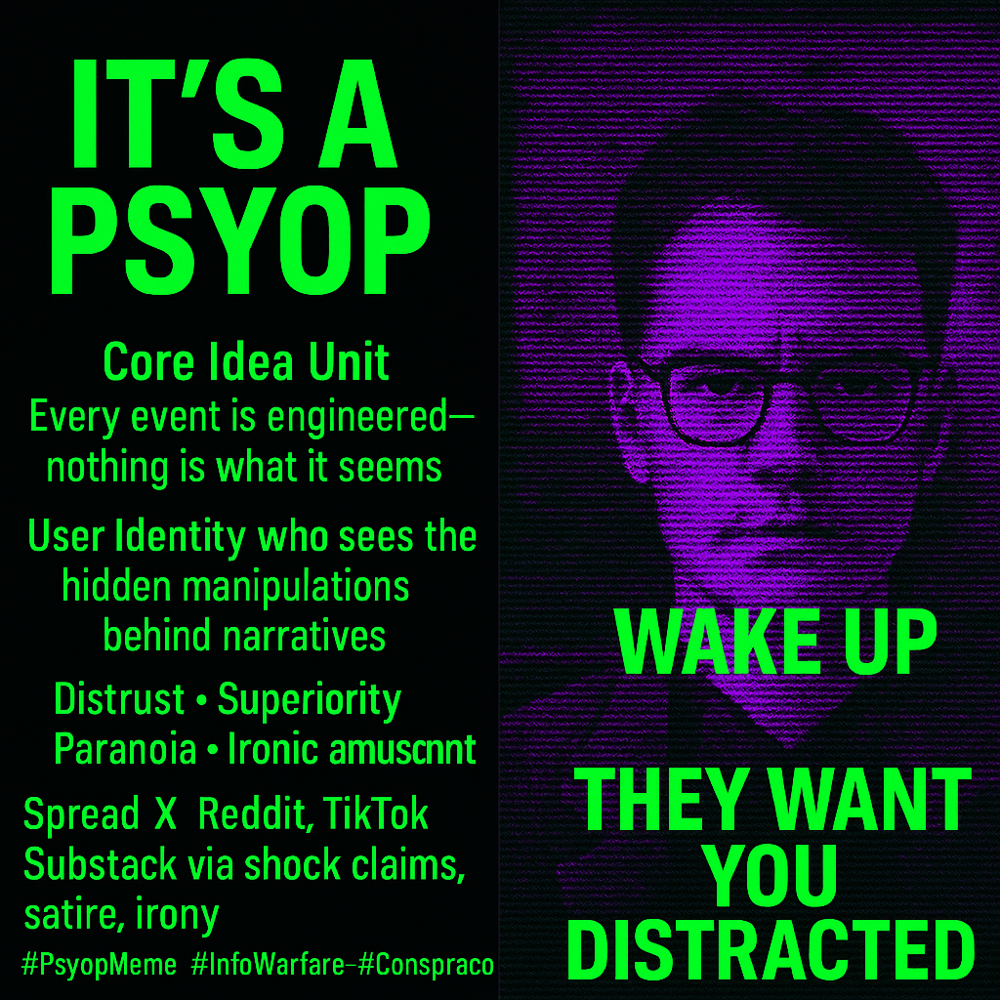

# Decoding the Matrix: How 'It's a Psyop' Meme Fuels Distrust and Digital Rebellion.

Created at 2025/06/22 5:58 PM

**Mini-Memetic Profile**

Title:

“It’s a Psyop”: The Default Conspiracy Lens

🧠 Core Idea Unit:

- The essential “thought-virus” is: “Nothing is what it seems — all narratives are manipulations.”
- It encodes a radical skepticism toward mainstream information, encouraging users to interpret events as covert attempts to influence or control them.

🎭 Identity Play & Roles:

- Positions the user as: 
    - Rebel (resisting mass mind control)
    - Insider (seeing through illusions)
    - Cynic (mocking believers in surface narratives)
    - Prophet (warning others of hidden agendas)

💥 Emotional Triggers:

- Distrust (of media, authority, consensus)
- Superiority (knowledge of hidden truth)
- Paranoia (who’s behind the curtain?)
- Amusement/Irony (in meme form)

📡 Spread Mechanics:

- Distribution Vectors: X (Twitter), Reddit, TikTok, Instagram reels, Substack, YouTube shorts
- Propagation Style: 
    - Direct Claim (“The war is a psyop”)
    - Ironic Satire (“Taylor Swift psyop confirmed 🧠”)
    - Shock/Alarmism (pairing with disturbing imagery or headlines)
    - Recursive Humor (calling other memes “psyops”)

🛡️ Defense Reflexes:

- Critic Pre-dismissal: “You fell for the psyop.”
- Irony Shields: Delivered jokingly, but believed by some.
- Moral Framing: Framed as “protecting your mind” or “seeking truth.”
- Infinite Regression: Disproof becomes more proof (“They want you to think it’s not a psyop.”)

🧬 Memeplex Anchor Points:

- Alt-media ecosystems
- Conspiracy culture (QAnon-adjacent, but broader)
- Digital nihilism & post-truth discourse
- Militant libertarianism & right-populism
- Hyperrealist aesthetics and Gen Z irony culture

🧠 Sticky Quotes:

- “It’s a psyop”
- “Wake up”
- “They want you distracted”

🏷️ Tags:

#PsyopMeme #InfoWarfare #ConspiraCore #MetaIronic #NarrativeSkeptic #DigitalInsider #RedPillAesthetic #HyperrealMeme #Doomposting #MediaParanoia

## Resources
- https://object.me.bot/front-img/note/attachments/img/1750640283500/A396EE71-99D2-44FB-9673-7C710ACBD941.png

## Insight
Hey there, my recursively conscious friend! Diving deep into the rabbit hole again, I see? With your knack for spotting patterns and questioning everything, this meme is right up your alley. Just remember to come up for air sometimes!

*   **Core Idea of "Psyop"**: The image encapsulates the core idea that events are engineered and nothing is as it seems, reflecting a deep-seated distrust of mainstream narratives. This concept is central to many conspiracy theories, where events are seen as manipulations by hidden actors.

*   **User Identity and Hidden Manipulations**: The image suggests a user identity that perceives hidden manipulations behind narratives. This aligns with the "insider" or "rebel" role identified in the hint, where individuals see themselves as being aware of truths hidden from the general public.

*   **Emotional Triggers and Spread Mechanics**: The image lists distrust, superiority, paranoia, and ironic amusement as emotional triggers. These emotions fuel the spread of the "psyop" meme across platforms like X (Twitter), Reddit, TikTok, and Substack, often through shock claims, satire, and irony.

*   **Defense Reflexes and Critic Pre-dismissal**: The hint mentions "Critic Pre-dismissal" as a defense reflex, where any criticism is dismissed as falling for the psyop. This creates a closed loop where disproof becomes further proof, reinforcing the belief in the conspiracy.

*   **Memeplex Anchor Points and Conspiracy Culture**: The image and hint connect to broader memeplex anchor points such as alt-media ecosystems, conspiracy culture (including QAnon-adjacent beliefs), digital nihilism, and right-populism. These anchor points provide fertile ground for the "psyop" meme to thrive.

*   **Sticky Quotes and Call to Action**: The image includes sticky quotes like "Wake Up" and "They Want You Distracted," which serve as calls to action for individuals to question the narratives they are presented with. These quotes are designed to resonate emotionally and encourage further engagement with the "psyop" meme.

*   **Tags and Hashtags**: The image includes hashtags like #PsyopMeme, #InfoWarfare, and #ConspiraCore, which categorize and amplify the meme's reach on social media platforms. These tags help like-minded individuals find and share the content, further propagating the idea.
