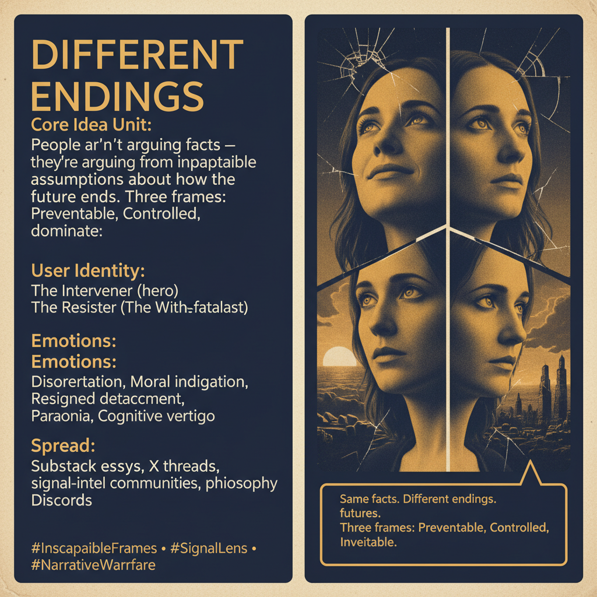

# Different Endings — Incompatible Future Frames

Created at 2026/05/01 11:04 AM

***

### ∴ Core Idea Unit

The dominant civic framing — that disagreement stems from misinformation or bias, and that better facts would close the divide — is false. What's actually happening is more structural: people are interpreting identical facts through incompatible assumptions about **how the future ends**. Three terminal frames dominate: the future is **preventable** (urgency, intervention, escalation), the future is **being controlled or distorted** (distrust, resistance), or the future is **fixed and inevitable** (withdrawal, fatalism). Each frame is internally coherent and information-resistant — new data gets absorbed into the frame rather than disrupting it. The breakdown in communication isn't about bad inputs. It's about different outputs. People aren't talking past each other because they're dumb or misinformed. They're talking past each other because they're standing in different futures.

***

### ▲ Identity Play & Roles

The meme casts every participant into one of three archetypal stances:

- **The Intervener** (Preventable frame) — Hero/savior identity. Must act now. Moral urgency justifies escalation. "If not me, who? If not now, when?"
- **The Resister** (Controlled/distorted frame) — Cassandra/whistleblower identity. Sees through the illusion. Distrust is a virtue signal. "I know what's really going on."
- **The Withdrawn** (Inevitable frame) — Stoic/realist identity. Above the fray. Fatalism as sophistication. Engagement is naïve. "It's already over."

Each role positions the self as epistemically superior to the others, making cross-frame dialogue structurally impossible — you can't argue someone out of a frame they don't know they're in.

***

### ≈ Emotional Triggers

- 🤯 Disorientation — realizing the other person isn't misinformed but operating from an entirely different destination model
- 😤 Moral indignation — when the preventable-frame person sees the fatalist as complicit
- 🥶 Resigned detachment — when the inevitable-frame person watches the intervener "waste energy"
- 😬 Paranoia — the controlled-frame's ambient distrust of any consensus
- 🧠 Cognitive vertigo — the unsettling recognition that all three frames might be simultaneously "true" within their own logics

***

### 𐂷 Spread Mechanics

**Distribution Vectors:** Substack long-form essays, X/Twitter threads, signal-intelligence communities, philosophy Discords, meta-modernist spaces, defense/intel analyst circles

**Propagation Style:** Aphoristic compression ("Same facts. Different endings."), structural analysis over moralizing, diagnostic framing rather than prescriptive. Spreads because it explains an experience people already have (exhaustion with arguments that go nowhere) without blaming anyone.

***

### ⛨ Defense Reflexes

- Meta-level framing: the meme doesn't argue for any one frame — it diagnoses all three from above. You can't refute a diagnosis without looking like a case study
- Structural, not partisan: by targeting the architecture of disagreement rather than any side's content, it deflects accusations of bias
- Self-referential protection: anyone who tries to debate the thesis is demonstrating the thesis — their frame is doing exactly what the analysis predicts

***

### ☷ Memeplex Anchor Points

- Signal intelligence / OSINT culture (the "Signal Lens" framing itself)
- Hyperstition (frames shape reality through collective orientation toward a future)
- Meta-modernism (oscillation between frames, sincerity and irony)
- Information warfare / cognitive security
- Predictive processing / Bayesian brain (priors shape perception)
- Structuralism / post-structuralism (meaning through difference, not reference)

***

### ✶ Sticky Symbols or Quotes

- "Same facts. Different endings."
- "They're not arguing facts — they're arguing from different destinations."
- "You can't resolve a disagreement if the destination itself is different."
- "Three frames: Preventable, Controlled, Inevitable."
- "Standing in different futures."

***

### ∿ Tags

#IncompatibleFrames · #FutureModels · #SignalLens · #NarrativeWarfare · #MetaModern · #Hyperstition · #DiscourseCollapse · #InfoOps
