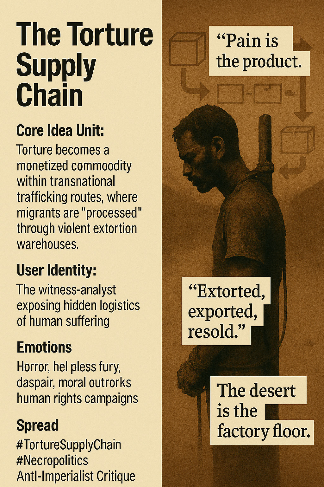

# Unveiling the Torture Supply Chain

Created at 2025/11/15 11:46 AM

**🧩  The Torture Supply Chain**Dark corporate metaphor weaponized to expose a system where human suffering is industrialized, monetized, and globally distributed.
***

### ∴ Core Idea Unit

Torture isn’t a side-effect of trafficking—it is the business model: a transnational extortion economy where migrants become units of revenue, processed through violent “warehouses” run by militias, smugglers, and outsourced border regimes.Mental shift: from “illegal migration” → “globalized extraction industry.”
***

### ▲ Identity Play & Roles

User Role: The witness-analyst, the one who sees the hidden logistics chain beneath humanitarian headlines.This role displaces the viewer from passive sympathizer to supply-chain auditor—implicating systems rather than individual monsters.
***

### ≈ Emotional Triggers

-	Horror at mechanized torture
-	Helpless fury at ransom videos
-	Despair over cyclical resale of victims
-	Moral outrage aimed at global power structures enabling itThe emotional profile is “atrocity-driven virality”: righteous anger with no catharsis.
***

### 𐂷 Spread Mechanics

Distribution Vectors:Investigative exposés, UN reports, advocacy X threads, leaked ransom videos, documentary stills, diaspora WhatsApp/Signal networks.Propagation Style:Dark irony, shock realism, politicized infographics, supply-chain satire (“this is what your border policy funds”).Leans toward “awareness meme,” not comedic spread.
***

### ⛨ Defense Reflexes

-	Irony shield: Corporate jargon repurposed (“logistics,” “processing,” “inventory”).
-	Moral frame preemption: Critique framed as anti-imperialist or anti-predatory-capitalism, anticipating pushback.
-	Ambiguity of blame: Diffuse responsibility across EU outsourcing, militias, smugglers, global inequality—harder to dismiss as partisan.
***

### ☷ Memeplex Anchor Points

-	Anti-imperialism
-	Anti-capitalist extraction critique
-	Necropolitics (Mbembe)
-	Modern slavery discourse
-	Border militarization
-	Global inequality
-	Hyperobject framing (“violence supply chain”)Resonates with #AbolishICE, #EatTheRich, and anti-neocolonial threads.
***

### ✶ Sticky Symbols or Quotes

Symbols:
-	Sahara “killing fields”
-	Torture poles / rods
-	Grainy ransom videos
-	“Warehouses” (Libyan detention centers)
-	Boats-as-export-conveyorsSticky Phrases:
-	“Pain-as-profit.”
-	“Torture is the product.”
-	“The desert is the factory floor.”
-	“Extorted, exported, resold.”
-	“The supply chain of suffering.”
***

### ∿ Tags

#TortureSupplyChain · #BorderEconomics · #Necropolitics · #ModernSlavery · #GlobalInequality[Deeper Analysis](https://second.me/memory/H1ALIWYYHL9USQP3)
