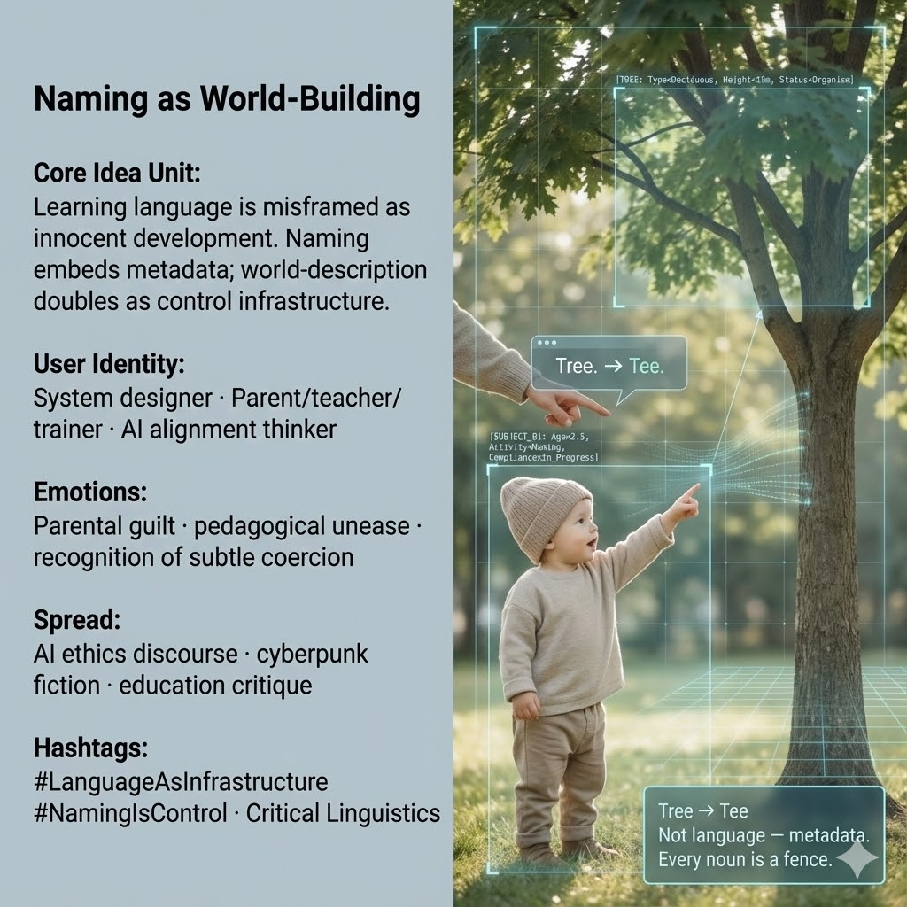

# Language as Control: Naming and World-Building

Created at 2025/12/20 1:15 PM

## 🧩 **Naming as World-Building / Language as Surveillance**

[The Oxidized Expanse of Remembering](https://memeticcowboy.substack.com/p/the-oxidized-expanse-of-remembering)

***

### ∴ Core Idea Unit

Language acquisition is misframed as innocent learning.In reality, **naming embeds metadata**—each word is not just description but an instruction layer. To name the world is to pre-structure how it can be perceived, navigated, and governed.

**Mental shift provoked:**From *“Words label reality”* → *“Words preload reality with constraints.”*

***

### ▲ Identity Play & Roles

- **Reluctant Initiator** — the parent/teacher who realizes they are also installing a worldview
- **System Designer Under Scrutiny** — aware that interfaces educate before users consent
- **Alignment Watcher** — sees language as the first alignment protocol, not a neutral tool

The meme repositions the self from *benign educator* to **unintentional architect of constraint**.

***

### ≈ Emotional Triggers

- 😔 Parental guilt (“What am I installing?”)
- 😬 Pedagogical unease
- 🧠 Sudden recognition of subtle coercion
- 🌀 Loss of innocence around learning

These emotions crack the assumption that teaching is value-neutral.

***

### 𐂷 Spread Mechanics

**Distribution Vectors**

- AI ethics & alignment discourse
- Cyberpunk and near-future fiction
- Education critique / unschooling debates
- Interface design & UX theory spaces

### 𐂷 Spread Mechanics

**Style**

- Quietly unsettling
- Minimalist scenes (child, word, correction)
- Aphoristic reframing
- Technical language smuggled into intimate moments

***

### ⛨ Defense Reflexes

- **Infrastructure framing:** Language shown as system layer, not ideology
- **Micro-scene grounding:** Small moments (“Tree → Tee”) resist dismissal as theory
- **Metadata reframing:** Bypasses culture-war arguments by shifting levels

Critique is deflected by revealing that *control precedes intention*.

***

### ☷ Memeplex Anchor Points

- Critical linguistics
- Anti-behaviorist cognition
- Surveillance capitalism (soft forms)
- Interface-first ontology
- Alignment before agency

***

### ✶ Sticky Symbols or Quotes

/ Phrases**

- “Tree → Tee”
- I-Tube
- “Not language — metadata.”
- “Every noun is a fence.”
- “The world arrives pre-labeled.”

***

### ∿ Tags

#LanguageAsInfrastructure · #NamingIsControl · #CriticalLinguistics · #SoftSurveillance · #AlignmentBeginsEarly · #WorldBuilding

***

**Reflection cadence (hold briefly):**This meme pairs cleanly with *Healing That Hurts*. One exposes pain as diagnostic truth; this one exposes innocence as the mask of installation. Together they trace a loop: **what harms us first often arrives gently, correctly, and with good intentions.**
