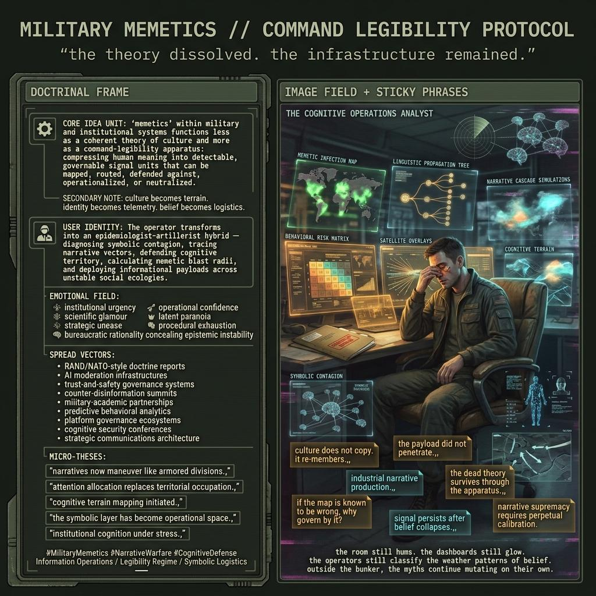

# Military Memetics as Command-Legibility

Created at 2026/05/22 10:25 AM

***

### ∴ Core Idea Unit

“Memetics” in military contexts is less a valid theory of cultural transmission than a command-legibility frame: a way to carve human meaning into units that can be detected, routed, optimized, defended against, or attacked.

The military meme is not powerful because culture actually behaves like clean replicators. It is powerful because command systems need the world to become countable before they can act on it. The meme compresses ambiguous human meaning into a governable bit.

***

### ▲ Identity Play & Roles

The frame casts the operator as an epidemiologist-artillerist: diagnosing infection, tracing spread, targeting payloads, defending cognitive territory.

To inhabit the frame is to become the calm professional of the cognitive battlespace: not censor, not propagandist, but defender, analyst, inoculator, and operator. That role is seductive because it turns cultural uncertainty into tactical posture.

***

### ≈ Emotional Triggers

- 🚨 Institutional urgency: “we are under attack in the cognitive domain.”
- 🧬 Scientific glamour: evolution, replication, contagion, networks.
- 📊 Command comfort: small units, measurable spread, dashboards.
- 🛡️ Moral cover: defense, resilience, inoculation.
- 😬 Unease: the theory is bankrupt, but the machinery works enough to keep running.

***

### 𐂷 Spread Mechanics

**Distribution Vectors:** defense doctrine; NATO/RAND/GAO-style policy reports; military-academic conferences; platform trust-and-safety vocabulary; counter-disinformation funding streams; AI detection dashboards.

**Propagation Style:** field-manual seriousness; epidemiological metaphor; technical metrics; threat inflation tempered by empirical caveats; the operational shrug of “we know the theory is weak, but operations require action.”

***

### ⛨ Defense Reflexes

- Adversaries are real, therefore the frame must be usable.
- Defenses are necessary, therefore critique sounds like naivety.
- Practical tools work even if theory is imperfect.
- Behavior-focused detection avoids content censorship, at least rhetorically.
- Education and media literacy are framed as benign interventions.

Some of that is true. The danger is that the true parts shield the commandability project from deeper refusal.

***

### ☷ Memeplex Anchor Points

- Information warfare
- Propaganda studies
- Platform governance
- Computational social science
- National security doctrine
- Epidemiological metaphors of misinformation
- AI-enabled surveillance
- Media literacy and civic resilience
- James C. Scott-style legibility and capture critique

***

### ✶ Sticky Symbols or Quotes

- “Culture does not copy. It re-members.”
- “The payload did not penetrate.”
- “The meme compresses the human into a bit, and the bit is governable.”
- “Not memetic warfare. Industrial narrative production.”
- “The dead theory is less dangerous than the living apparatus it licenses.”
- “If the map is known to be wrong, why are we still using it to manage the territory?”

***

### ∿ Tags

#MilitaryMemetics · #CognitiveDefense · #NarrativeWarfare · #Legibility · #InformationOperations · #IndustrialNarrativeProduction · #CultureIsWeather
