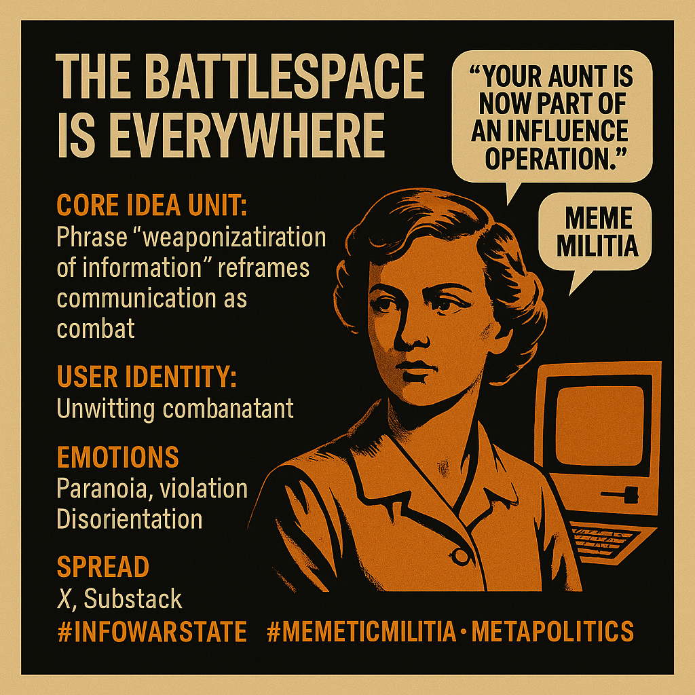

# Weaponized Information: The Civic Battlespace

Created at 2025/09/07 6:59 PM

🧩 Title:

The Battlespace is Everywhere

### ∴ Core Idea Unit

The phrase “weaponization of information” reframes communication as combat, recasting ordinary online behavior as warfare. This metaphor collapses boundaries between civilian and combatant, public square and battlefield, justification and pretext.

It provokes a mental shift: from seeing social media as expression → to seeing it as infrastructure of conflict.

### ▲ Identity Play & Roles

- Role: The Unwitting Combatant
- Archetype: The Civilian Dragged to War
- Repositioning: From participant in civic discourse → to embedded node in psychological warfare
- Flip: You thought you were sharing a meme; the state saw you routing enemy influence ops.

### ≈ Emotional Triggers

- 😰 Paranoia – Is this meme innocent? Or hostile payload?
- 😡 Violation – Feeling used as a pawn in unseen conflicts
- 🧠 Cognitive Dissonance – How free is speech in a militarized infosphere?
- 🌀 Disorientation – If everyone is in the battlespace, where is “peace”?

### 𐂷 Spread Mechanics

- Distribution Vectors: X (Twitter), Substack posts, cyber-intel reports, hacker blogs, think tank threads
- Propagation Style:
    - Policy-speak cloaked in military metaphor
    - Analytic dread layered with civilian moral shock
    - Strategic irony (e.g. “meme militias,” “weaponized grandma”)

### ⛨ Defense Reflexes

- 🛡️ Irony Shield: Mocking the absurdity of calling memes weapons
- 🔄 Semantic Ambiguity: “Information war” as a vague frame—flexible, deniable
- ⚖️ Legal Elasticity: The metaphor justifies both censorship and surveillance without naming them
- 🦾 Counter-narrative Preemption: Frames critique as susceptibility to enemy ops

### ☷ Memeplex Anchor Points

- 🛰️ Cybersecurity narratives
- 🕵️ Information warfare doctrine
- 🇺🇸 Post-9/11 securitization logics
- ⚖️ Free speech vs national security
- 📱 Platform governance debates
- ⚙️ Hybrid warfare theory (Gerassimov Doctrine, etc.)

### ✶ Sticky Symbols or Quotes

- “The meme is the missile.”
- “Your aunt is now part of an influence operation.”
- “Every like is a data point in someone’s war plan.”
- “The battlefield is cognitive.”
- “We defend by deleting.”
- Visuals: redacted documents, glowing data maps, militarized emoji grids.

### ∿ Tags

#InfowarState · #MemeticMilitia · #DigitalDoctrine · #WeaponizedDiscourse · #CivicBattlespace · #SemanticWarfare · #PostSpeechSociety
