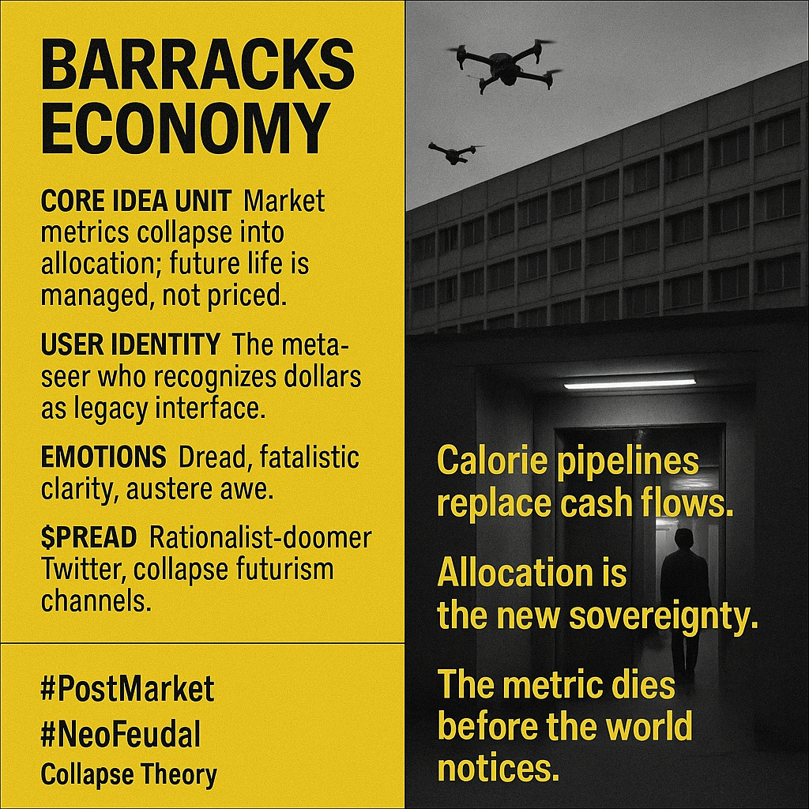

# Shifting to Resource-Administered Survival Modes

Created at 2025/11/19 1:26 PM

- 🧩 Title: Barracks Economy  ∴ Core Idea Unit  A shift from money-mediated life to resource-administered survival: the market collapses into allocation. The meme reframes “poverty” from cash-scarcity to institutional capture and infrastructural dependence. It provokes a mental shift from income to control.  ▲ Identity Play & Roles  The Seer-of-Regime-Shift; the Systems Cynic; the Disillusioned Rationalist who “sees one meta-level higher.” The meme casts the viewer as someone who understands that dollars are a vestigial metric and that future agency lies in proximity to supply chains, not salaries.  ≈ Emotional Triggers  Doom-clarity, anticipatory dread, technocratic fatalism, paranoia tempered with intellectual pride, awe at structural inevitability.  𐂷 Spread Mechanics  Distribution: rationalist-doomer X threads, macro-catastrophe Substack, acceleration skepticism circles, prepper-techno hybrids.  Style: analytic bleakness, pseudo-academic calm, infrastructural horror.  ⛨ Defense Reflexes
- Irony shield (“just analysis, bro”), structural inevitability framing (“even if I’m wrong, trend-lines aren’t”), and Moloch-invocation as epistemic forcefield.
- Critique is deflected by depicting critics as stuck in the obsolete money-frame.
- “This isn’t ideology; it’s thermodynamics.”
-  Moral framing avoided by invoking systemic necessity.
- Irony shield: “I’m not endorsing it — I’m predicting failure modes.”   ☷ Memeplex Anchor Points  Moloch theory · Multipolar traps · Post-growth economics · Sovereignty collapse · Neo-feudalism · Dark rationalism · Allocation vs. markets · Late-Soviet aesthetics · Corporate-state convergence.  ✶ Sticky Symbols / Quotes  • “Money stops mattering when the barracks come online.” • Calorie pipelines • Drone-supervised dormitories • “The metric is dead; the allocation is alive.” • Institutional rations, not incomes • Defect–defect equilibria as destiny  ∿ Tags  #NeoFeudal · #PostMarket · #MultipolarTrap · #ControlEconomy · #DoomerRationalism  noticed on [x/xperimentalunit](https://x.com/xperimentalunit/status/1991146282191057042?s=46&t=7Z-E-ACnGlzdI-iyUwNCrQ)

## Resources
- https://object.me.bot/front-img/note/attachments/img/1763587565183/C638F085-C7CE-4D9A-9A51-61B49697A38A.png

## Insight

* The "Barracks Economy" concept suggests a fundamental restructuring of societal values and economic systems, where reliance shifts from monetary exchange to resource allocation. This highlights an emerging narrative about survival and governance amidst perceived market failures, drawing from ideas of control rather than cash as the key survival metric.

* The notion of the "metaseer" characterizes individuals who understand the limitations of traditional economic frameworks and navigate emerging realities where supply chain accessibility becomes paramount. This reflects broader shifts in identity formation, suggesting individuals are aligning their self-concept with pragmatic adaptations to impending resource constraints.

* The emotional responses of dread and fatalistic clarity present in this framework resonate with contemporary anxieties about societal collapse and resource scarcity. These feelings are explored extensively in literature on social collapse and can be paralleled with apocalyptic themes in both fiction and economic theory, emphasizing a collective awareness of structural vulnerabilities.

* The spread mechanisms outlined suggest a community of rationalist-doomers and futurists who engage in discussions around these concepts, revealing social media's role in shaping discourse on economic instability. The appeal to accelerated skepticism engages a niche audience that resonates with themes from thinkers like Eliezer Yudkowsky or the creators behind collapse theory narratives.

* Symbols and quotes such as "calorie pipelines replace cash flows" serve to foreshadow a future where basic subsistence is mediated by institutional control rather than traditional financial systems. This resonates with dystopian themes in both sociopolitical commentary and science fiction, such as in the works of Ursula K. Le Guin and her explorations of resource allocation. 

* The hashtags like #PostMarket and #NeoFeudal encapsulate the meme's identity as part of a larger critique of capitalist structures, calling into question the sustainability of current economic ideologies and hinting at a reversion to more tribal or feudal systems in the face of systemic breakdowns. These themes echo throughout historical analyses of economic transitions, drawing parallels with the decline of empires and the rise of new social orders.
