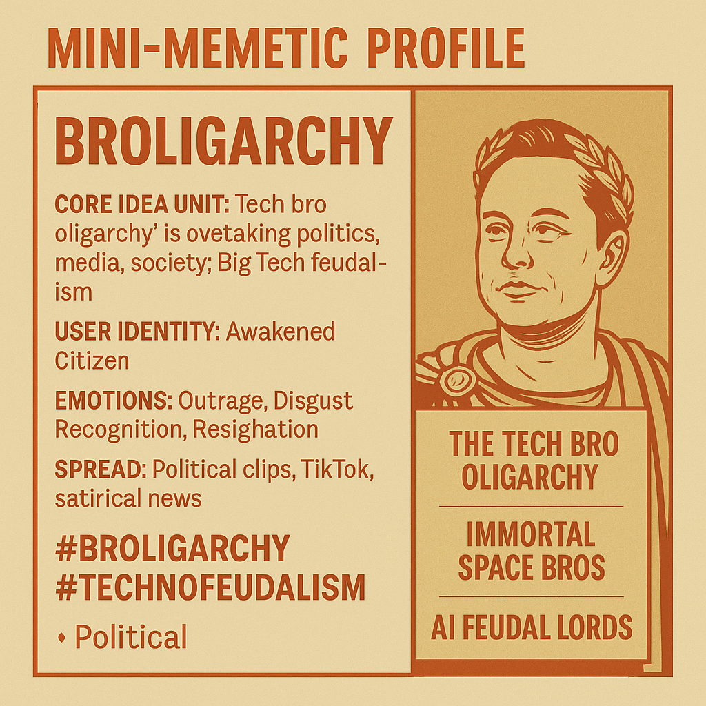

# Broligarchy: Tech Bro Oligarchy Unveiled

Created at 2025/10/19 3:04 PM

### ◈ Mini-Memetic Profile
***

### ∴ Core Idea Unit

“Broligarchy” fuses bro culture with oligarchy, encoding the belief that a small cabal of tech billionaires—Musk, Thiel, Vance, et al.—are reshaping politics, media, and society to serve their own techno-authoritarian interests. It frames Big Tech dominance as a new digital feudalism.
***

### ▲ Identity Play & Roles

Positions the user as the Awakened Citizen or Tech Dissident standing against billionaire control. The meme flatters the sharer as socially aware, skeptical, and morally superior to the “bros” running the world.
***

### ≈ Emotional Triggers

😡 Outrage — corruption, greed, power concentration😬 Disgust — frat-boy arrogance, moral decay of elites🤯 Recognition — relief at seeing patterns of control named😢 Resignation — helplessness in face of digital feudalism
***

### 𐂷 Spread Mechanics

-	Distribution Vectors: X (Twitter), TikTok political clips, satirical news segments, meme coins, policy think-tank threads.
-	Propagation Style: Irony, parody, political satire, moral critique disguised as meme humor (“tech bros conquering space for immortality”).
***

### ⛨ Defense Reflexes

-	Irony Shield: “Just jokes about bros and billionaires.”
-	Moral Framing: Critique is positioned as defending democracy or fairness.
-	Counter-Narrative Immunity: Rebuttals from elites only confirm the meme’s premise (“See, they’re mad we noticed”).
***

### ☷ Memeplex Anchor Points

-	🧠 Tech Skepticism & Anti-Oligarchy Discourse
-	⚙️ Digital Sovereignty & Data Colonialism Critique
-	🗳️ Left-populism & Progressive Tech Reform
-	💻 Neo-feudalism & AI Ethics debates
-	💰 Anti-Crypto/Anti-Capitalist Activism
***

### ✶ Sticky Symbols or Quotes

-	“The Tech Bro Oligarchy.”
-	“Immortal space bros.”
-	“AI feudal lords.”
-	“How to Survive the Broligarchy.”
-	Visuals: Musk/Vance/Thiel as Roman emperors or cartoon frat gods; AI-coded castles; Bitcoin halos.
***

### ∿ Tags

#Broligarchy #TechnoFeudalism #AIOverlords #DigitalOligarchy #TechBros #PostDemocracy #BigTech #SystemicPower
