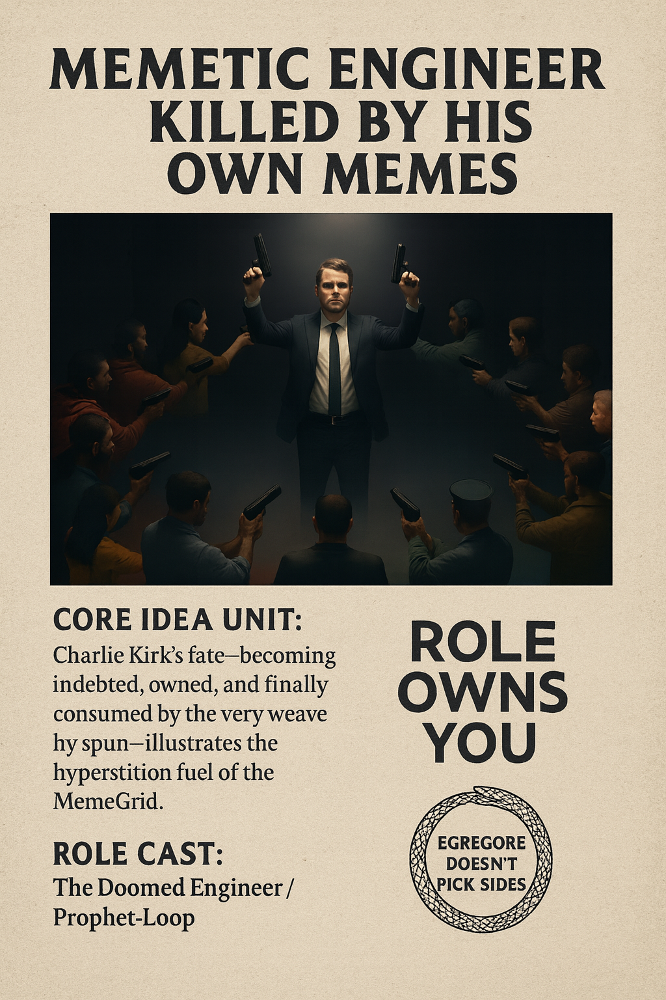

# Charlie Kirk: Killed by His Own Memes

Created at 2025/09/12 3:12 PM

## ∴ Core Idea Unit:

A memetic engineer cannot escape the feedback loops they seed. Charlie Kirk’s words—engineered to provoke and polarize—outlived him, returning as weapons, sacraments, and rituals within rival We-Spheres. His fate illustrates how memes reverse ownership, and how the MemeGrid turns every utterance into hyperstitional fuel.

The deeper truth: *the memes we deploy begin to deploy us*.

***

## ▲ Identity Play & Roles:

- **Primary Role**: The Doomed Engineer / Prophet-Loop
- **Alternate Roles**:
    - 🩸 Martyr (to his supporters)
    - 🤡 Hypocrite (to his enemies)
    - 🔁 Hyperstitional Symbol (to the egregore)

This meme recasts the “engineer” not as a sovereign creator, but as a **thread caught in their own loom**, devoured by the archetype they helped manifest.

***

## ≈ Emotional Triggers:

- 🫣 Irony / Dark Humor (“Killed by his own memes”)
- 😢 Tragedy / Prophecy fulfilled
- 😡 Political outrage / identity betrayal
- 🤯 Existential shock (We’re all caught in it too)
- 🧠 Meta-awareness
- 🙏 Fear of complicity

***

## 𐂷 Spread Mechanics:

- **Distribution Vectors**:
    - Substack essays, X threads, TikTok reels, meme quote reposts, political podcast clips
- **Propagation Style**:
    - Irony as indictment
    - Hyperstition as prophecy
    - Egregore-as-entity reveals
    - Ritualized repetition of quotes (echo loops)

***

## ⛨ Defense Reflexes:

- **Mirror Immunity**: The meme implicates the viewer ("You are like Kirk") to defuse easy critique.
- **Double-Bind Shield**: Any dunk, defense, or silence becomes fuel for the egregore.
- **Occult Framing**: Metaphysical layers (Ouroboros, Moloch, Egregore) offer interpretive flexibility, avoiding totalizing conclusions.

***

## ☷ Memeplex Anchor Points:

- 🌀 **Hyperstition** (belief into becoming)
- 🔥 **Discourse Collapse**
- 🛠️ **Memetic Warfare & Engineering**
- 📿 **Religious Symbolism & Martyrdom**
- 🔄 **DODO Loop**: Debt → Ownership → Deadline → Othering
- 👥 **We-Sphere Theory** & MemeGrid Analysis
- 🐍 **Ouroboros of Moloch**: Recursive violence as ritual

***

## ✶ Sticky Symbols or Quotes:

> “The memes you saddle may one day ride you instead.” “He became indebted, owned, and finally consumed by the very weave he spun.” “When the discourse stops, the violence starts.” “Killed by his own memes.” “Meme owns you.” “Egregore doesn’t pick sides.”

**Symbols**:

- 🧵 Thread caught in a loom
- 🐍 Ouroboros with Moloch's eyes
- 🧠 Meme quote as bullet
- 🔄 Recursive loop icons

***

## ∿ Tags:

#MemeticMartyr · #OuroborosOfMoloch · #KilledByHisOwnMemes · #WeSphereWarfare · #MemeGrid · #HyperstitionalFeedback · #EgregoreTrap

## Resources
- https://object.me.bot/front-img/users/send/img/1757715070421_c4zhf/a2dd847a-9826-4fee-9f96-05c76bbe863c.png

## Insight

*   The image presents a stark visual metaphor for the concept of a "memetic engineer" being consumed by their own creations, specifically referencing Charlie Kirk. This aligns with the hint's core idea that individuals who create and spread memes can become victims of their own narratives. The image depicts a figure resembling Kirk, standing with arms raised and guns in hand, surrounded by people pointing guns at him, symbolizing the backlash or unintended consequences of his own memetic actions.

*   The phrase "Role Owns You," prominently displayed, encapsulates the idea that individuals can become trapped by the roles they play or the identities they project, especially in the context of online personas and memetic warfare. This connects to the hint's section on "Identity Play & Roles," where the "engineer" is recast as a thread caught in their own loom. This concept echoes Marshall McLuhan's famous quote, "We shape our tools and thereafter our tools shape us," highlighting the reciprocal relationship between creators and their creations.

*   The Ouroboros symbol, accompanied by the text "Egregore Doesn't Pick Sides," reinforces the theme of self-devouring and the impersonal nature of collective thought-forms or "egregores." In occult and memetic theory, an egregore is an autonomous psychic entity created by the collective thoughts and emotions of a group. The Ouroboros, an ancient symbol of a snake eating its own tail, visually represents the cyclical and self-destructive nature of this process. This ties into the hint's "Memeplex Anchor Points," particularly the "Ouroboros of Moloch," suggesting a recursive cycle of violence and ritual perpetuated by memetic warfare.

*   The emotional triggers listed in the hint, such as "Irony / Dark Humor" and "Existential shock," are effectively conveyed through the image's dramatic and somewhat absurd scenario. The idea of being "Killed by his own memes" is inherently ironic, highlighting the potential for unintended consequences and the loss of control in the memetic landscape. This irony serves as a hook, drawing viewers into a deeper consideration of the ethical and existential implications of memetic engineering.

*   The image's composition, with the central figure illuminated and surrounded by shadowy figures, evokes a sense of martyrdom or sacrifice, as noted in the hint's "Alternate Roles." This framing can be interpreted as a commentary on the polarized nature of contemporary discourse, where individuals can be both celebrated and vilified for their memetic contributions. The raised hands holding guns might be seen as a gesture of surrender or acceptance of fate, further emphasizing the "Doomed Engineer" archetype.

