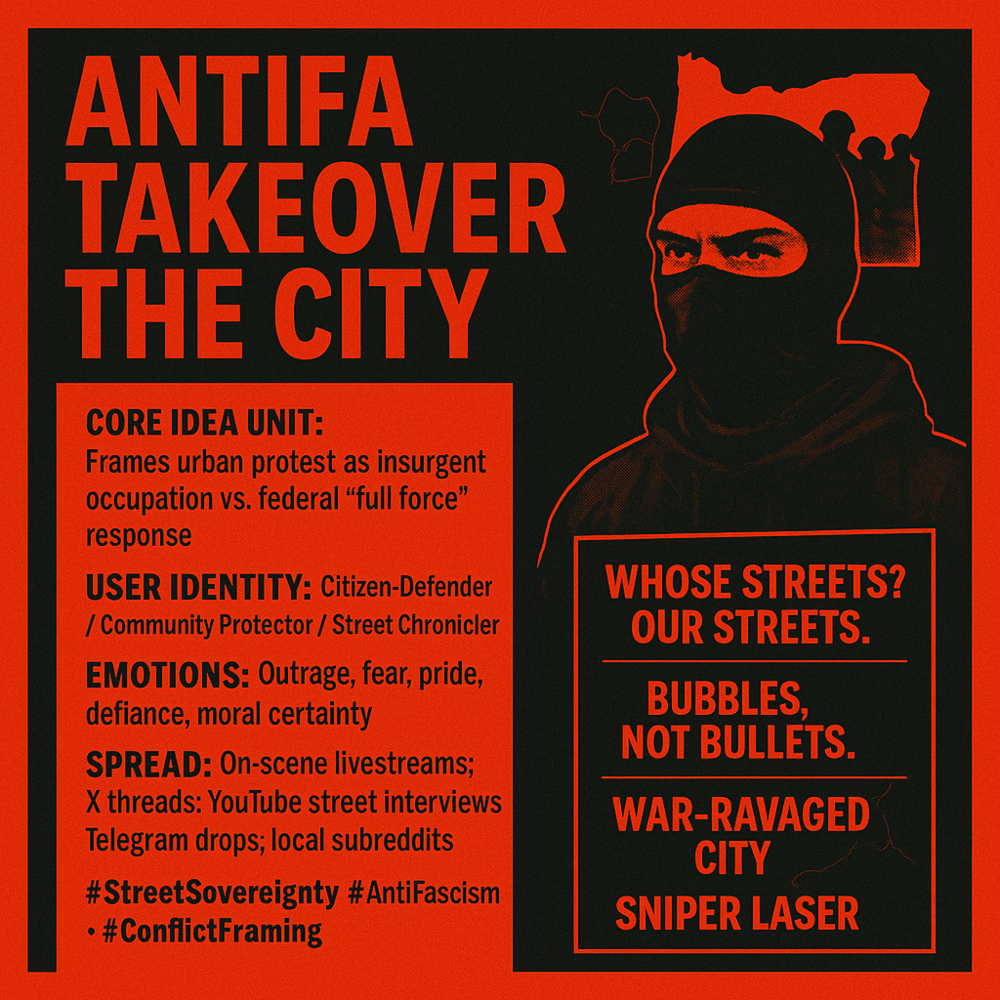

# Conflict Framing: Antifa's Urban Insurgency Narrative

Created at 2025/10/29 2:34 PM

Mini-Memetic Profile: “ANTIFA Takeover the City”  🧠 Core Idea Unit A conflict-frame that casts urban protest as insurgency and federal response as counter-insurgency. The “takeover” narrative reframes decentralized anti-fascist actions as a coordinated occupation, provoking a security logic (“full force”) vs. civil-liberty logic (“protest, not terror”). It tries to shift observers from “dispute over policy” → “existential street war.”  🎭 Identity Play & Roles 	•	Protagonists (Version A): Guardians/Citizen-Defenders protecting the city from “terrorists.” 	•	Protagonists (Version B): Anti-Fascists/Protectors of Community resisting authoritarian overreach. 	•	Assigned Antagonist: The Other is whichever side your I-Tube (identity filter) already mistrusts—black-bloc “Antifa” or “militarized feds.” 	•	Self vs. System: Self becomes frontline agent (witness, streamer, street medic, cop, “boomer with a walker,” masked marcher) set against an illegitimate/overreaching System—or a failing one that must reassert order.  💥 Emotional Triggers 	•	Outrage & Fear: “Sniper laser,” “terrorist designation,” “war-ravaged city.” 	•	Moral Certainty: “Anti-fascism is an ideology” vs. “Antifa is an organization.” 	•	Tribal Pride & Defiance: “Whose streets? Our streets.” “Keep Portland weird.” 	•	Threat & Martyrdom: “Red line,” “sacrifice,” targeted arrests, pepper balls, gas. Priming: compresses attention into My-Streams of adrenaline (danger), righteousness (defense of community), and humiliation/retaliation loops (clips of scuffles).  📡 Spread Mechanics 	•	Distribution Vectors: On-scene livestreams, clipped verticals, Twitter/X threads, YouTube “man-on-the-street,” Telegram/Discord drops, local subreddits. 	•	Propagation Style: Shock cuts (sirens, arrests), confrontation vox-pops, irony shields (“Do I look like a terrorist? I’m a boomer.”), label warfare (“terrorist,” “fascist”), aesthetic of black-bloc vs. tactical kit. 	•	Algorithmic Hooks: Fight-or-flight micro-dramas; “gotcha” debates; night-vision/riot-line visuals; creator ad-reads mid-chaos (monetization loop).  🛡️ Defense Reflexes 	•	Irony & Ambiguity: “Antifa is an ideology, not an org” ⇄ “It’s organized; I know the leader.” 	•	Preemption: “Media is rage-baiting” ⇄ “You’re hiding violence.” 	•	Moral Framing: “Community defense” ⇄ “Public safety & law.” 	•	Proof-by-Clip: Each side curates video shards to inoculate its audience against counter-claims (MemeGrid knotting).  🧬 Memeplex Anchor Points 	•	Security State vs. Civil Liberty (law-and-order conservatism ⇄ protest rights liberalism). 	•	Urban Mythos & Local Identity (“Keep Portland Weird,” sanctuary city narratives). 	•	Ideology Labels (anti-fascism, Marxism, “terrorism” designation politics). 	•	Platform Incentives (creator-economy virality; outrage optimization).    Memetic Ecology Zones: 	•	I-Tube: pre-sets who is “protector” vs “threat.” 	•	My-Stream: fear/indignation keeps viewers glued. 	•	We-Sphere: chants/rituals sync group tempo on the street and online. 	•	Other-Sphere: out-group tagging (“terrorist,” “fascist”) stabilizes conflict. 	•	Lumeme vs. Usurpene: “Community safety” as lumeme; “invasion/occupation” as usurpene that hijacks the safety frame.  🧠 Propagation Tactics (both sides) 	•	Scene-setting: sunset → riot-police silhouettes → helicopter audio to signal “threshold.” 	•	Role Conferral: interviewer crowns “leaders,” “warriors,” “boomers,” “MAGA protector.” 	•	Escalation Beat: announce “they’re coming,” cut to push/pepper balls, then a moral verdict.  🧠 Sticky Symbols or Quotes 	•	“Whose streets? Our streets.” 	•	“Keep it weird.” 	•	“Bubbles, not bullets.” 	•	“Sniper lasered on you.” 	•	“War-ravaged city.” 	•	“Red line… sacrifice.” 	•	Visuals: black-bloc uniforms, umbrellas with slogans, pepper-ball clouds, ICE gate line, handheld gimbals, glow of police vans/helos.  🏷️ Tags #StreetSovereignty · #LawAndOrder · #AntiFascism · #PlatformRage · #InfoOps · #MemeGrid · #UrbanMythos · #ProtestAesthetics · #NarrativeCombat · #ConflictFraming  — Why it matters to me: I’m mapping how conflict-frames hijack attention and identity. This profile helps me spot when “safety” or “freedom” are being memetically weaponized, so I can design counter-loops (de-escalation lumemes, repair rituals, cross-cut edits) instead of feeding the outrage machine.

## Resources
- https://object.me.bot/front-img/note/attachments/img/1759524994188/A22B89E7-CE5D-4AF1-84B4-75A7969F2D9F.png

## Insight

* The image encapsulates a vivid representation of a conflict narrative surrounding urban protests, particularly those associated with anti-fascist movements. It effectively portrays a dual perspective where urban unrest is framed as either an insurgent occupation or a community defense response to state overreach.

* The use of dramatic language, such as "war-ravaged city" and "sniper laser," evokes a strong emotional response. This aligns with the core idea unit, which highlights how the framing can divert the discourse from policy disputes to an existential battle, intensifying the urgency and perceived stakes of the protests.

* Identity plays a crucial role as well, with the image encouraging audiences to see themselves as either defenders of the community or agents of governmental authority. This duality creates an “us vs. them” mentality that is central to the emotional triggers of outrage, fear, and moral certainty.

* The propagation mechanics demonstrated—through social media platforms and live streams—exemplify modern methods of spreading conflict narratives. These tactics utilize real-time engagement and curated content to reinforce group identity and rally support, making the narrative virally resonant within specific communities.

* Sticky symbols, such as the phrases “Whose streets? Our streets” and “Bubbles, not bullets,” resonate deeply within certain urban contexts, encapsulating the ethos of resistance and community identity while simultaneously serving as rallying cries that can enhance group cohesion and activism.

* The integration of visual elements, like bold colors and striking imagery, further emphasizes the urgency and gravity of the message. This artistic choice aligns with the overall narrative strategy of creating a sense of immediacy and mobilization among viewers, compelling them to engage actively with the content and its implications.
