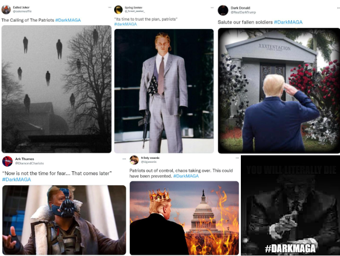

# Dark MAGA: The Punished Strongman's Vengeful Return in Post-Democratic Populism

Created at 2025/06/05 9:24 AM

### ◈ Mini-Memetic Profile

***

### ∴ Core Idea Unit

- *Dark MAGA* frames Donald Trump not as a hopeful populist but as a **punished strongman** returning with vengeance. It replaces optimism with *authoritarian swagger*, advocating a mythic purge of “traitors” and systemic corruption.
- The core belief: **Only ruthless power can restore a collapsing nation.**

***

### ▲ Identity Play & Roles

- **User as Wrathful Avenger or Shadow Patriot:** Feels betrayed by institutions and softened conservatism, now embraces the role of a *mythic revenger*.
- **Target as Liberal Democracy & GOP Weakness:** Both framed as cowardly or compromised.
- **Performer as Outlaw Hero or Post-Apocalyptic Loyalist:** Fighting for order by embracing chaos.

***

### ≈ Emotional Triggers

- **Outrage & Revenge Fantasy:** Toward elites, the media, and perceived traitors.
- **Pride in Rebellion:** Relishing outsider status and symbolic power.
- **Awe & Urgency:** Mythic imagery invokes near-religious conviction.
- **Fear of Decline:** Society is cast as fallen — Dark MAGA is the necessary shock.

***

### 𐂷 Spread Mechanics

- **Distribution vectors:** X (formerly Twitter), Telegram, TikTok, Reddit, right-wing meme circles
- **Propagation style:**
    - **Shock memes:** Trump with red/blue laser eyes, militarized aesthetics
    - **Satirical blurring:** Tone oscillates between serious threat and ironic bravado
    - **Hashtag swarms:** e.g. #DarkMAGA used in waves to influence trending narratives
    - **Dystopian edits:** Monuments burning, enemies falling, Trump framed as the last hope

***

### ⛨ Defense Reflexes

- **Irony Shield:** Criticism dismissed as humorless — “it’s just a meme, bro”
- **Moral Reversal:** Ruthlessness framed as necessary virtue
- **Deflector Logic:** “If you’re offended, it must be true”
- **Post-Satirical Inversion:** Even earnest critiques strengthen the myth

***

### ☷ Memeplex Anchor Points

- **MAGA 2.0 / Post-MAGA populism**
- **Right-wing Accelerationism**
- **QAnon aesthetics**, **Clown World narrative**, **Doomer Right**
- Shares bloodlines with:
    - **TradCore**, **White Nationalist aesthetics**, **Neo-fascist futurism**
    - **Dark Enlightenment**, **Cyberpunk-right symbolism**, **Militant Christian nationalism**

***

### ✶ Sticky Symbols or Quotes

- Trump with laser eyes (often blue or red)
- “You turned your back on him. He never will.”
- Dystopian backdrops, burning flags, decayed monuments
- “Dark times demand dark heroes”
- Mixed aesthetics: crusader helmets, vaporwave ruins, fascist futurism

***

### ∿ Tags

#DarkMAGA #PunishedTrump #PostMAGA #VengefulPopulism #DoomerRight #LaserEyesLeader #AuthoritarianAesthetic #SymbolicRevenge #PostSatire #TradFuturism #MemeMilitia #ClownWorldAccelerant

### Key Citations

- [Know Your Meme - DarkMAGA](https://knowyourmeme.com/memes/darkmaga)
- [Newsweek - What Is Dark MAGA? Trump Supporters Attempt Rebrand for 2024](https://www.newsweek.com/dark-maga-donald-trump-supporters-attempt-rebrand-2024-1697855)
- [The Telegraph - Dark Maga isn’t a gateway to fascism](https://www.telegraph.co.uk/us/politics/2025/03/01/what-is-dark-maga-elon-musk/)
- [Business Insider - Dark MAGA movement dreams of a vengeful Trump](https://www.businessinsider.com/dark-maga-explained-far-right-memes-calling-for-trump-revenge-2022-5)
- [GNET - Assessment of the Dark MAGA Trend in Far-Right Online Spaces](https://gnet-research.org/2022/04/05/from-orange-to-red-an-assessment-of-the-dark-maga-trend-in-far-right-online-spaces/)
- [The Times of India - Elon Musk said I am Dark MAGA](https://timesofindia.indiatimes.com/world/us/elon-musk-said-i-am-dark-maga-what-exactly-is-dark-maga/articleshow/113989846.cms)
- [Vox - What does the “Dark Brandon” meme mean?](https://www.vox.com/culture/23300286/biden-dark-brandon-meme-maga-why-confusing-explained)
- [X - @3rdincarnate DarkMAGA tower post](https://x.com/3rdincarnate/status/1502750433856659468)
- [X - @conan_esq DarkMAGA aesthetic description](https://x.com/conan_esq/status/1503981289468153857)
- [X - @forest_seeker DarkMAGA Trump eyepatch post](https://x.com/_forest_seeker_/status/1503377206831165445)
- [Reddit - /r/DarkMAGA subreddit](https://www.reddit.com/r/darkmaga)
