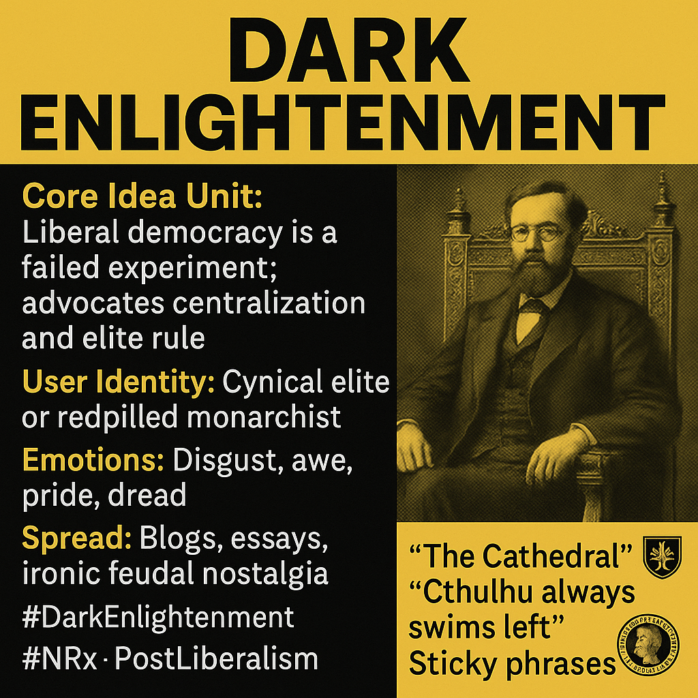

# Decoding Dark Enlightenment: From Cynical Elites to Techno-Monarchism's Anti-Democratic Vision

Created at 2025/06/04 9:01 PM

### ◈ Mini-Memetic Profile

Title: Dark Enlightenment — Exit from Democratic Delusion

### ∴ Core Idea Unit

- The Dark Enlightenment encodes the belief that liberal democracy is a failed experiment — equality, progress, and human rights are illusions that obscure power, entropy, and hierarchy.
- It advocates for neoreactionary realism: return to order, centralization, and elite rule, often through techno-political acceleration.

### ▲ Identity Play & Roles

- User as Cynical Elite or Redpilled Monarchist: One who sees through egalitarian “myths” and embraces a brutally hierarchical order.
- Target as Enlightenment Liberalism: Framed as childish, corrupt, or self-destructive.
- Performer as Intellectual Dissident: Cultured, informed, and unafraid to think “dangerous truths.”

### ≈ Emotional Triggers

- Disgust: Toward democratic media cycles, performative activism, and bureaucratic decay.
- Awe and Fear: Of centralized power, techno-sovereignty, and “exit” utopias.
- Pride: In claiming post-democratic clarity or aristocratic aesthetics.
- Dread: At the perceived decline of Western civilization.

### 𐂷 Spread Mechanics

- Distribution vectors: Neoreactionary blogs (Unqualified Reservations), Twitter/X threads, Substack essays, Discord salons, academic-adjacent fringe circles.
- Propagation style:
    - Dense essays and aphoristic provocations
    - Meme-fied references to “Cathedral,” “Patchwork,” “Sovereign CEO”
    - Alt-right-adjacent aesthetics fused with high-concept governance theory
    - Ironic feudal nostalgia, “CEO monarchies,” and futurist neomedievalism

### ⛨ Defense Reflexes

- Preemptive Intellectual Framing: Presents critics as philosophically naïve or emotionally reactive.
- Meta-Irony: Uses post-ironic masks to disarm moral critique.
- Epistemic Smugness: Knowledge becomes a class barrier — “you just don’t get Moldbug.”
- Decentralized Denial: “This isn’t a movement, it’s a critique.”

### ☷ Memeplex Anchor Points

- Neoreaction (NRx), Postliberalism, Techno-Monarchism, Accelerationism
- Overlaps with:
    - Dark Futurism, Catholic Integralism, Tradcore
    - Anti-egalitarian philosophy, Silicon Valley governance experiments
    - Cyberpunk elitism, Exit memes (charter cities, seasteading)

### ✶ Sticky Symbols or Quotes

- “The Cathedral” — informal alliance of media, academia, and democracy
- “Cthulhu always swims left”
- Moldbug/UR screenshots
- Throned CEOs, Roman busts, and feudal chic
- “Demotism” (as slur for democracy)
- Patchwork flags and cryptographic seals

### ∿ Tags

#DarkEnlightenment #NRx #MoldbugLore #AntiDemocracy #ExitPolitics #TheCathedral #PostLiberalism #PatchworkGovernance #TechnoMonarchism #NeoReactionaryThought #TradFuturism
