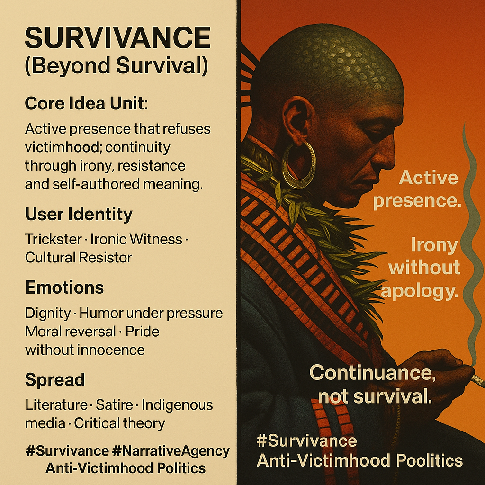

# Embracing Survivance: Beyond Victimhood and Survival

Created at 2025/12/14 7:08 PM

**Survivance (Beyond Survival)**
X/change [w/xperimentalunit](https://x.com/memeticcowboy/status/2000380226946396524?s=46&t=7Z-E-ACnGlzdI-iyUwNCrQ)
***

### ∴ Core Idea Unit

Survivance rejects the frame of mere survival or victimhood and asserts active, ironic, self-authored presence.The mental shift: from “enduring damage” → to continuing agency that outlives the colonizer’s narrative.
***

### ▲ Identity Play & Roles

-	Trickster-Witness — speaks from within constraint but refuses moral capture
-	Cultural Resistor — active continuity, not frozen tradition
-	Narrative Agent — authors meaning rather than requesting recognitionThe self is repositioned from object of history to operator within it.
***

### ≈ Emotional Triggers

& Cognitive Levers
-	Dignity without pleading
-	Humor under pressure (irony as sovereignty)
-	Moral reversal (the gaze is returned)
-	Pride without innocence (strength without sanitization)These emotions inoculate against pity and moral extraction.
***

### 𐂷 Spread Mechanics

Distribution Vectors
-	Indigenous literature & theory (e.g., Vizenor)
-	Satire, storytelling, performance
-	Indigenous-run media and cultural criticismPropagation Style
-	Irony, refusal, wit
-	Anti-sentimental clarity
-	Narrative judo: letting dominant frames overextend and collapse
***

### ⛨ Defense Reflexes

-	Irony shield — critique slides off without purchase
-	Refusal of victimry — denies the moral economy of pity
-	Narrative preemption — names the trap before it closes
***

### ☷ Memeplex Anchor Points

-	Indigenous sovereignty & continuity
-	Postcolonial critique
-	Anti-liberal-paternalism
-	Trickster cosmologies
-	Narrative agency as political power
***

### ✶ Sticky Symbols or Quotes

/ Phrases
-	“Survivance”
-	Ironic giveaway (miinidiwag)
-	Active presence
-	Repudiation of victimry
-	Humor as resistance
-	Continuance, not recovery
***

### ∿ Tags

#Survivance · #NarrativeAgency · #TricksterPolitics · #AntiVictimhood · #CulturalContinuity · #IronyAsPower
***
Anchor note:This meme does not ask to be recognized. It persists. The loop it reinforces is not sympathy → absolution, but presence → authorship → continuity.
