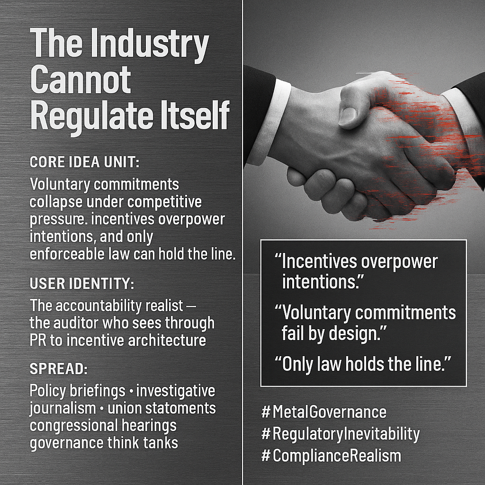

# Only Law Can Regulate Industry Behavior

Created at 2025/11/14 9:24 AM

### 🧩 **Title: The Industry Cannot Regulate Itself**

### 🧠 **Core Idea Unit:**

A structural critique turned inevitability claim: **Voluntary commitments always collapse under competitive pressure.** Intentions are irrelevant; incentives decide outcomes. Therefore: **only enforceable law can hold the line.**

The shift it creates is from “companies should do better” to **“companies *cannot* do better — by design.”**

### 🎭 **Identity Play & Roles:**

Positions the user as the **clear-eyed auditor** — the one who sees past PR to the incentive architecture beneath. Identity becomes: **the accountability realist** who treats safety claims as data to be inspected, not promises to be believed.

It casts corporations as actors locked in a game they cannot escape and policymakers as the only agents with coercive leverage.

### 💥 **Emotional Triggers:**

⚙️ Cynical clarity 📉 Structural inevitability 🔧 Frustration with “safety theater” 📑 Audit-minded skepticism 🧊 Cold, metallic disappointment 🔥 Outrage sharpened into policy demand

Metal emotion: sharp edges, cool anger, evidentiary gravity.

### 📡 **Spread Mechanics:**

**Distribution Vectors:** Policy memos, congressional hearings, antitrust discourse, investigative journalism, union statements, governance think tanks, legal Twitter, LinkedIn compliance circles.

**Propagation Style:** Glitchy corporate iconography · broken handshake imagery · compliance checklists · leaked-email screenshots · “pattern, not anomaly” narratives.

### 🛡️ **Defense Reflexes:**

- Reframes counterarguments as naïve idealism (“intentions don’t beat incentives”).
- Uses repeated corporate backsliding as empirical armor.
- Embeds itself in historical precedent (railroads, tobacco, social media, fintech collapses).
- Any new voluntary pledge becomes additional proof of the meme.

### 🧬 **Memeplex Anchor Points:**

- **Incentive-as-destiny logic**
- **Regulatory inevitability**
- **Voluntary commitment failure research**
- **Safety theater critique**
- **Precautionary governance frameworks**
- **Union-backed worker-protection narratives**
- **Litigation and liability pressure**

The meme fuses with stronger metal-governance clusters: antitrust, cybersecurity compliance, mandatory audits, and SB 1047–style enforcement.

### 🧠 **Sticky Symbols / Quotes:**

**Symbols:** • Corporate handshake dissolving into glitch • Compliance forms tearing down the middle • Redlined safety pledges • Broken contract stamps • Metallic audit checkmarks • Cracked “trust” badges

**Sticky Phrases:** • “Incentives overpower intentions.” • “Voluntary commitments fail by design.” • “Safety theater isn’t safety.” • “Only law holds the line.” • “The industry cannot regulate itself.”

### 🏷️ **Tags:**

#MetalGovernance · #RegulatoryInevitability · #IncentiveLogic · #SafetyTheater · #ComplianceRealism

[Source Advocates](https://app.me.bot/public/T3DEYYCKVYQFFRF6)

## Resources
- https://object.me.bot/front-img/users/send/img/1763141062639_c4zhf/e9092a33-31f9-402f-a6af-0e8e0504d2c5.png

## Insight

* The concept presented in the image challenges the idea that corporations can improve their practices voluntarily, arguing that competitive pressure leads to a systemic failure of self-regulation. This aligns with historical critiques of industries such as tobacco and finance, where market forces consistently undermined voluntary safety measures.

* Identifying as the "accountability realist" positions one to scrutinize corporate intentions against the backdrop of economic incentives. This role is crucial in a landscape where public relations frequently obscure the underlying motives of businesses, emphasizing the need for robust regulatory frameworks.

* The imagery of a handshake rendered glitchy symbolizes the breakdown of trust in corporate commitments. This metaphor reflects the broader theme that reliance on goodwill in business—often termed "safety theater"—is insufficient for genuine accountability.

* Emotional responses such as frustration and disillusionment are targeted effectively through the meme's components. The phrase "Incentives overpower intentions" crystallizes this sentiment, compelling policymakers and citizens alike to push for enforced regulations rather than accepting corporate promises at face value.

* The structure posits that only enforceable laws can ensure corporate responsibility. This mirrors discussions in various sectors, including antitrust and cybersecurity, where voluntary compliance has historically proven ineffective. This underlines the necessity for a legislative backbone to support or enforce ethical corporate behavior.

* This critique isn’t just an abstract issue; it ties into real-world dynamics observed during events like the financial crisis or the environmental disasters linked to corporate negligence, showcasing the urgent need for a paradigm shift in how industries are governed.
