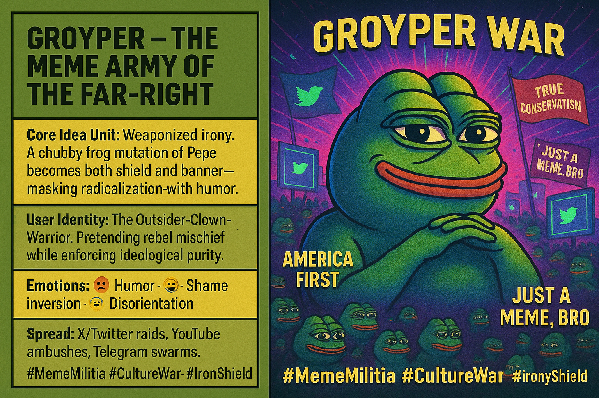

# Groyper Wars: Weaponized Irony and Meme Militia

Created at 2025/09/14 12:49 PM

🧠 **Core Idea Unit:** Groypers embody a weaponized subculture where irony, trolling, and pseudo-ironic Pepe mutations mask ideological radicalization. The “chubby frog” image functions as both shield and banner for a loosely networked digital insurgency.

***

🎭 **Identity Play & Roles:**

- **Role Cast:** The Outsider-Warrior-Clown
- **Positioning:** Frames adherents as “true conservatives” fighting corrupt mainstream institutions. By deploying meme irony, they position themselves as playful rebels while enforcing rigid ideological orthodoxy.

***

💥 **Emotional Triggers:**

- 😡 Outrage at perceived betrayal of conservatism
- 🤪 Humor and irony for cover + bonding
- 😬 Shame inversion—mocking enemies as weak or fake
- 🤯 Disorientation via layered irony and culture-war narratives

***

📡 **Spread Mechanics:**

- **Distribution Vectors:** Twitter/X, Telegram, YouTube ambushes (“Groyper Wars”), meme forums.
- **Propagation Style:** Trolling, coordinated disruption of events, irony-laden propaganda, performative virality.

***

🛡️ **Defense Reflexes:**

- **Irony Shield:** “It’s just a meme” dismisses critique.
- **Purity Frame:** Attack mainstream conservatives as “fake,” redirecting critique outward.
- **Ambiguity:** Groyper mascot provides plausible deniability—just another frog meme.

***

🧬 **Memeplex Anchor Points:**

- 📱 Internet Troll Culture
- 🐸 Pepe the Frog → mutated form
- ⚔️ Culture War / Anti-mainstream Conservatism
- ✝️ Reactionary Religious & Ethno-nationalist politics
- 🤡 Clown-world meta framing

***

🧠 **Sticky Symbols or Quotes:**

- The “chubby frog” Groyper image
- “Groyper War” as event-branding
- Phrases: “America First,” “true conservatism,” “optics debate”
- Visuals of Groypers swarming events or ambushing speakers

***

🏷️ **Tags:** #MemeMilitia · #CultureWar · #AltRightMutation · #IronyShield

## Resources
- https://object.me.bot/front-img/users/send/img/1757879331819_c4zhf/44851f32-5d76-4d65-ae65-afa2ff5795e7.png

## Insight

*  **Weaponized Irony and Radicalization:** The image highlights how the Groyper meme, a mutation of Pepe the Frog, serves as a tool for masking radicalization with humor. This reflects a broader trend where online subcultures use irony and humor to introduce and normalize extremist ideologies. The use of humor acts as a shield, deflecting criticism and allowing these ideas to spread more easily.

*  **The Outsider-Clown-Warrior Identity:** The image describes the Groyper identity as an "Outsider-Clown-Warrior," which embodies a combination of rebellion, mischief, and ideological purity. This identity appeals to individuals who feel alienated from mainstream society and seek a sense of belonging and purpose through online communities. The clown aspect allows them to engage in trolling and disruptive behavior under the guise of humor, while the warrior aspect provides a sense of fighting for a cause.

*  **Emotional Manipulation:** The image points out the use of humor, shame inversion, and disorientation as emotional tools. Humor is used to bond members and normalize extremist ideas, while shame inversion involves mocking enemies to undermine their credibility. Disorientation is achieved through layered irony and culture war narratives, making it difficult for outsiders to understand the group's true intentions.

*  **Spread Mechanics and Online Raids:** The image mentions the use of X/Twitter raids, YouTube ambushes, and Telegram swarms as methods for spreading the Groyper meme and its associated ideology. These tactics involve coordinated online harassment and disruption campaigns targeting individuals or groups perceived as enemies. The use of social media platforms allows these campaigns to reach a wide audience and amplify their impact.

*  **"America First" and "True Conservatism":** The phrases "America First" and "True Conservatism" are prominently displayed in the image, indicating the Groyper movement's alignment with nationalist and conservative ideologies. "America First" is often associated with isolationism and protectionism, while "True Conservatism" implies a rejection of mainstream conservative values in favor of more radical or traditionalist views. These slogans serve as rallying cries for the movement and help to attract individuals who share similar beliefs.

*  **The "Just a Meme, Bro" Defense:** The phrase "Just a Meme, Bro" is used as an irony shield to dismiss criticism and downplay the seriousness of the Groyper movement. This defense mechanism allows members to deflect accusations of extremism or hate speech by claiming that their actions are simply harmless jokes or memes. This tactic is particularly effective in online environments where it can be difficult to distinguish between genuine beliefs and ironic expressions.

