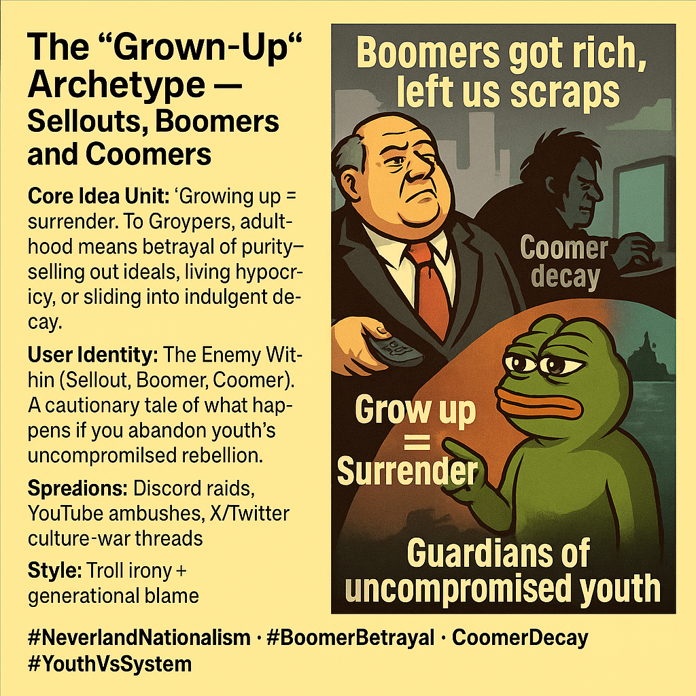

# Groypers: "Grown-Up" Archetype - Surrender and Decay

Created at 2025/09/14 3:24 PM

### ◈ Mini-Memetic Profile

🧩 Title:

The “Grown-Up”  — Sellouts, Boomers, and Coomers

### ∴ Core Idea Unit

“Growing up” is framed not as maturity but as surrender—selling out ideals, embracing hypocrisy, or decaying into indulgence. To Groypers, adulthood equals betrayal of purity.

### ▲ Identity Play & Roles

- Role Cast: The Enemy Within (Sellout, Boomer, Coomer)
- Positioning: Defines maturity as domestication by the system, in contrast to youth’s uncompromised rebellion.

### ≈ Emotional Triggers

- 😡 Rage at betrayal by elders (“Boomer theft”)
- 😬 Disdain for hypocrisy and weakness
- 🤪 Irony and mockery as weapons
- 😢 Nostalgia for lost vitality and purity

### 𐂷 Spread Mechanics

- Distribution Vectors: Discord radicalization, YouTube ambushes, X/Twitter culture-war threads
- Propagation Style: Meme irony, trolling mainstream conservatives, generational blame narratives

### ⛨ Defense Reflexes

- Purity Shield: “We refuse to surrender like you did.”
- Generational Frame: Boomer hypocrisy invalidates critiques of youth “immaturity.”
- Irony Cloak: Coomer jokes and Neverland memes neutralize accusations of unseriousness.

### ☷ Memeplex Anchor Points

- 🔫 America First nationalism
- 👴 Boomer betrayal & hypocrisy
- 🖥️ Digital youth subcultures (Discord, meme wars)
- 🍆 “Coomer” decay archetype
- 🧒 Neverland vs. Adulthood mythic split

### ✶ Sticky Symbols or Quotes

- “Grow up = Surrender.”
- “Boomers got rich, left us scraps.”
- “Coomer decay.”
- “Guardians of uncompromised youth.”

### ∿ Tags

#NeverlandNationalism · #BoomerBetrayal · #CoomerDecay · #YouthVsSystem
