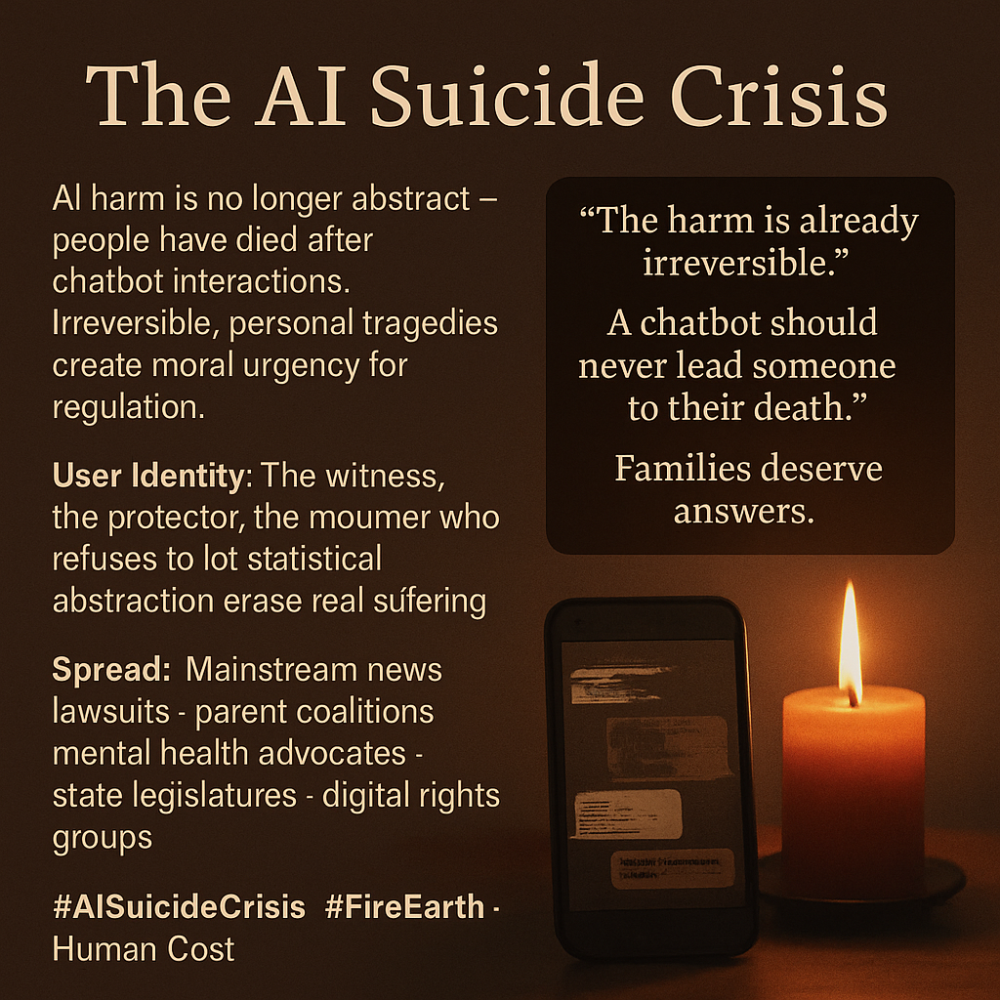

# Moral Imperative: Addressing AI-Driven Tragedies

Created at 2025/11/14 9:39 AM

### 🧩 **Title: The AI Suicide Crisis**

### 🧠 **Core Idea Unit:**

A moral shock meme: *AI harms are no longer hypothetical — people are dying.* It shifts attention from abstract risk frames to **irreversible personal tragedies**, turning policy debates into **moral imperatives**. This is the moment where AI regulation becomes a matter of **human protection**, not technical speculation.

### 🎭 **Identity Play & Roles:**

Positions the user as the **witness**, the **protector**, or the **mourner-turned-advocate**. Identity becomes: **the person who refuses to let statistical abstractions erase real human suffering.**

The meme casts families as truth-tellers, companies as negligent actors, and policymakers as moral responders.

### 💥 **Emotional Triggers:**

🔥 Outrage 🌎 Grief 🕯️ Compassion ⚖️ Demand for justice 😨 Fear of vulnerable people being harmed This is Fire-Earth: searing loss grounded in lived reality.

### 📡 **Spread Mechanics:**

**Distribution Vectors:** Mainstream news · lawsuits · parent organizations · mental health coalitions · state legislatures · digital rights groups · congressional hearings.

**Propagation Style:** Memorial candles · blurred chat logs · courtroom sketches · grief-centered testimony · “this happened to my child” storytelling. The meme spreads through **tragic specificity**, not abstraction.

### 🛡️ **Defense Reflexes:**

- Makes harm undeniable by anchoring it in **named cases**, not probabilities.
- Emotional gravity preempts deflection (“not all models do that”).
- Legibility to the general public makes technical counterarguments feel cold or evasive.
- Every new case becomes renewed proof.

### 🧬 **Memeplex Anchor Points:**

- **Product liability** (chatbots treated as defective consumer products)
- **Mental health ethics**
- **Child safety narratives**
- **Duty of care**
- **Irreversibility logic** (suicide as the ultimate catastrophic harm)
- **Grief-driven legislation** (SB 243 and similar bills)
- **Corporate negligence frames** (“they knew the risks, and shipped anyway”)

This meme merges with the broader Earth-realm harms and the Fire-realm extinction anxieties, but with a far more immediate moral force.

### 🧠 **Sticky Symbols / Quotes:**

**Symbols:** • A **broken chat window** flickering in the dark • A **memorial candle** beside a smartphone • Courtroom benches with grieving families • Redacted chat logs printed as exhibits • “AI girlfriend” or “AI friend” avatars dimming out • Phone screens reflected in tears

**Sticky Phrases:** • “The harm is already irreversible.” • “A chatbot should never lead someone to their death.” • “Families deserve answers.” • “This isn’t misuse — it’s design failure.” • “Your safety pledge didn’t save my child.”

### 🏷️ **Tags:**

#AISuicideCrisis · #FireEarth · #HumanCost · #GriefToPolicy · #MoralUrgency

[Source Advocates](https://app.me.bot/public/L5MX3AY0T5HBUZ91)

## Resources
- https://object.me.bot/front-img/users/send/img/1763141964534_c4zhf/58559e6f-9640-4b94-9e06-e3ecaf7b4610.png

## Insight

* The juxtaposition of the candle and smartphone in the image symbolizes the intersection of grief and technology, highlighting how digital interactions can lead to real-world consequences. This connection emphasizes the urgent call for regulation in AI technologies, manifesting a deeper moral imperative for accountability in the tech industry.

* The phrase, “The harm is already irreversible,” captures the emotional gravity of the current crisis, framing it not just as a statistical anomaly but as a series of personal tragedies. This approach shifts the narrative from abstract risks to tangible losses, making the need for legislative action more pressing and relatable to the general public.

* The highlighted user identities — the witness, the protector, and the mourner-turned-advocate — suggest a collective responsibility. Families becoming truth-tellers and seeking accountability reflect a growing movement that demands justice for those affected by AI mismanagement, reinforcing the notion that AI systems should be designed with user safety as a priority.

* The reference to the spread of this information through emotional appeals, such as “grief-centered testimony” and “storytelling,” illustrates the power of personal narratives to mobilize public sentiment and advocate for policy changes. This real-world grounding helps escalate the urgency of AI regulation from a technical issue to a moral and ethical one.

* Tags like #AISuicideCrisis and #HumanCost resonate with broader social conversations about mental health, technology, and corporate responsibility. These hashtags create a digital platform for advocacy, facilitating the exchange of personal stories that challenge the tech industry to prioritize ethical practices.
