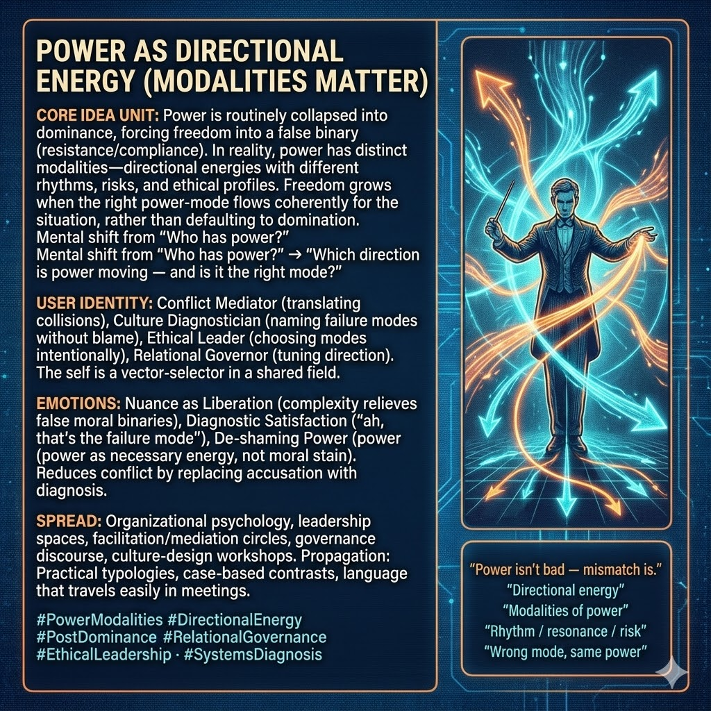

# Navigating Power: Directional Energy and Modes

Created at 2025/12/14 11:06 AM

## **Power as Directional Energy***(Modalities Matter)*

***

### ∴ Core Idea Unit

Power is routinely collapsed into **dominance**, which forces freedom into a false binary: resistance or compliance.In reality, **power has distinct modalities** — directional energies with different rhythms, risks, and ethical profiles.

**Resolution frame:**Freedom grows when the **right power-mode** flows coherently for the situation, rather than defaulting to domination.

**Mental shift provoked:**From *“Who has power?”* → *“Which direction is power moving — and is it the right mode?”*

***

### ▲ Identity Play & Roles

**Cast the viewer as:**

- **Conflict Mediator** — translating power collisions into mode mismatches
- **Culture Diagnostician** — naming failure modes without blame
- **Ethical Leader** — choosing power modes intentionally
- **Relational Governor** — tuning direction, not asserting control

**Repositioning:**The self is no longer “powerful” or “powerless,” but a **vector-selector** in a shared field.

***

## ≈ Emotional Hooks & Cognitive Levers

- 🧠 **Nuance as Liberation** — complexity relieves false moral binaries
- 🔍 **Diagnostic Satisfaction** — *“ah, that’s the failure mode”*
- 🕊️ **De-shaming Power** — power as necessary energy, not moral stain

This meme reduces conflict by **replacing accusation with diagnosis**.

***

### 𐂷 Spread Mechanics

**Distribution Vectors**

- Organizational psychology & leadership spaces
- Facilitation and mediation circles
- Governance and ethics discourse
- Culture-design workshops

### 𐂷 Spread Mechanics

**Style**

- Practical typologies
- Case-based contrasts (same power, wrong mode)
- Language that travels easily in meetings

***

### ⛨ Defense Reflexes

- **Anti-Authoritarian Shield:** Rejects dominance as default mode
- **Anti-Power-Naïveté Guard:** Acknowledges power is unavoidable
- **Anti-Moral Panic Lock:** Ethics framed as *fit*, not purity

Critique must argue that **undifferentiated power performs better than modal power** — rarely true in practice.

***

### ☷ Memeplex Anchor Points

- Post-dominance power theory
- [Pieter de Beer–style modality frameworks](https://second.me/public/CVDYFVREAER5SHJ8)
- Pragmatic ethics
- Relational governance
- Systems and field theory

***

### ✶ Sticky Symbols or Quotes

- ⚡ **Directional energy**
- 🧭 *Modalities of power*
- 🎶 *Rhythm / resonance / risk*
- 🛠️ *Wrong mode, same power*
- 🗣️ **“Power isn’t bad — mismatch is.”**

***

### ∿ Tags

#PowerModalities · #DirectionalEnergy · #PostDominance · #RelationalGovernance · #EthicalLeadership · #SystemsDiagnosis

***

**Reflection anchor:**This meme doesn’t ask you to give up power.It asks **whether the power you’re using is flowing in the right direction — and at the right rhythm — for the field you’re in.**
