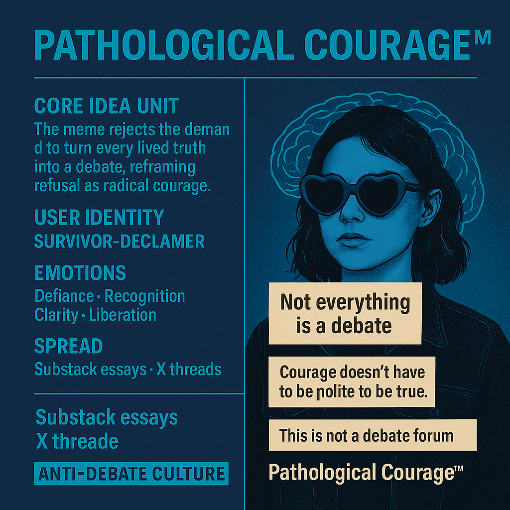

# Pathological Courage™: Truth Beyond Debate

Created at 2025/09/04 11:38 AM

### 🧩 Title

**Pathological Courage™ — Not Everything is a Debate**

***

### ∴ Core Idea Unit

The meme rejects the demand to turn every lived truth into a debate, reframing refusal as radical courage. It insists that some words are declarations, not propositions to be cross-examined.

***

### ▲ Identity Play & Roles

- **Cast as:** Survivor-Declaimer · Noncompliant Truth-Teller
- Role is not debater but **witness** to lived experience.
- Positions self outside the marketplace of ideas, reclaiming sovereignty over speech.

***

### ≈ Emotional Triggers

- 😡 Defiance (against systems of justification)
- 😢 Recognition (shared exhaustion with debate culture)
- 🧠 Clarity (naming the trap of conditional worth)
- 🤯 Liberation (truth as declaration, not performance)

***

### 𐂷 Spread Mechanics

- **Distribution Vectors:** Substack essays, X threads, activist spaces, meme cards with bold quotes.
- **Propagation Style:** Counter-cultural aphorism + anti-capitalist critique of “debate as market logic.”

***

### ⛨ Defense Reflexes

- **Preemptive strike:** “This is not a debate forum” blocks derailment.
- **Irony shield:** Reclaims “polemic” as proof of the point.
- **Moral framing:** Speech as survival, not opinion.

***

### ☷ Memeplex Anchor Points

- 📚 Anti-capitalist critique (worth ≠ performance)
- ⚖️ Debate culture as systemic coercion
- 💬 Speech-as-survival vs. discourse-as-marketplace
- ✊ Existential self-assertion

***

### ✶ Sticky Symbols or Quotes

- “Not everything is a debate.”
- “Courage doesn’t have to be polite to be true.”
- “This is not a debate forum.”
- “Pathological Courage™”

***

### ∿ Tags

#PathologicalCourage · #NotADebate · #LivedTruth · #AntiDebateCulture
