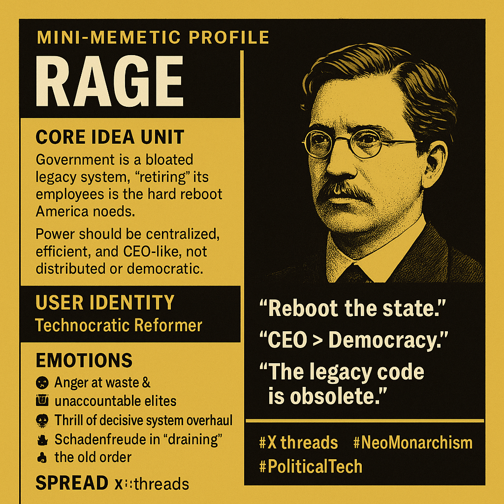

# Rebooting America with RAGE Memeplex

Created at 2025/10/09 2:55 PM

◈ Mini-Memetic Profile  RAGE ⇄ Project 2025  Tagline: From Blog Manifesto to Policy Blueprint — The Dark Enlightenment Goes Live Subtitle: The “Retire All Government Employees” (RAGE) protocol evolves from Curtis Yarvin’s neoreactionary vision into the operational logic behind Project 2025 and the Department of Government Efficiency (DOGE).  ⸻  ∴ Core Idea Unit  Government is a bloated legacy system; “retiring” its employees is the hard reboot America needs. Democracy is a failed OS—to be replaced by a CEO-state where sovereignty equals efficiency. → Reboot the republic as a startup; purge equals progress.  ⸻  ▲ Identity Play & Roles  Performer: Technocratic Reformer / Disillusioned Founder / Decoder of the Cathedral. Framing: Casts believers as pragmatic system engineers saving America from bureaucratic decay. Repositioning: From citizen → operator; from voter → ruler-in-waiting; from critic → debugger of democracy.  ⸻  ≈ Emotional Triggers  😡 Anger at unaccountable elites 🤖 Thrill of decisive system overhaul 💀 Schadenfreude in draining the old order 🔥 Hope in cleansing collapse 😨 Dread of creeping techno-authoritarianism 🤯 Revelation—“It’s all connected”  ⸻  𐂷 Spread Mechanics  Vectors: X threads · Substack essays · tech podcasts · policy memos · Reddit exposés · YouTube explainers. Propagation Style: Investigative collage + ironic policy realism; screenshots linking Yarvin → Thiel → Vance → Heritage. Tone: Apocalyptic tech satire meets bureaucratic thriller. Virality: Peaks during shutdowns, executive orders, or DOGE RIFs (“RAGE in action”).  ⸻  ⛨ Defense Reflexes 	•	Irony Shield: “It’s just a metaphor for efficiency.” 	•	Counter-narrative: Critics are “Cathedral priests.” 	•	Moral Frame: Purge = moral hygiene, not tyranny. 	•	Disavowal Loop: Yarvin denies direct influence while his concepts normalize.  ⸻  ☷ Memeplex Anchor Points  📜 Dark Enlightenment formalism ⚙️ Techno-authoritarian aesthetics 🏛️ Project 2025 / Heritage policy apparatus 🧑‍💼 RAGE / Schedule F / DOGE bureaucratic purge 💻 Silicon Valley sovereignty ethos 📖 “Cathedral” metaphor for liberal institutions  ⸻  💬 Sticky Symbols & Quotes 	•	“Reboot the State.” 	•	“Democracy is a failed OS.” 	•	“CEO > Democracy.” 	•	“The Cathedral must burn.” 	•	“Schedule F = RAGE Protocol.” 	•	“RAGE Lite = Project 2025.”  ⸻  ⚙️ Ecological Dynamics  Mutualistic: Heritage think-tanks ⇄ New Right influencers (exchange of memes for policy power). Commensal: Media capitalizing on controversy. Predatory: Narrative displaces democratic legitimacy with executive efficiency myth. Feedback Loop: Bureaucratic crisis → purge → capacity loss → proof of failure → justifies further purge.  ⸻  ♻️ Narrative Transmutation 	•	Decay: Chaos undermines competence claims. 	•	Composting: “Efficiency” frame absorbed into mainstream reform language. 	•	Reanimation: Each shutdown revives the RAGE logic. 	•	Mutation: RAGE → Schedule F → DOGE → Project 2025 → “post-democratic efficiency.”  ⸻  🧠 Cognitive Profile  Heuristics: Efficiency bias · authority admiration · pattern-recognition thrill · purity vs corruption binary. Cognitive Mode: Detective reasoning + moral panic. Invasiveness: High — easy to decode, hard to dislodge.  ⸻  ∿ Tags  #RAGEProtocol · #DarkEnlightenment · #Project2025 · #CEOState · #Cathedral · #AdministrativePurge · #TechnoAuthoritarianism · #ShutdownPurges 

## Resources
- https://object.me.bot/front-img/note/attachments/img/1760046907156/0D99EC91-367A-44C1-A800-FB4D915680CA.png

## Insight

* The profile vividly encapsulates the RAGE ideology as a rejection of traditional democratic governance, advocating for a technocratic, CEO-like leadership to reboot the state, aligning with Curtis Yarvin’s neoreactionary philosophy. This reflects a broader critique of democracy as an inefficient, outdated "OS," promoting instead a centralized, authoritarian digital age where power resides with a managerial elite, echoing Yarvin’s assertion that "democracy is a failed OS."
* The emphasis on "retiring" government employees as a form of systemic reset is a provocative metaphor for the radical overhaul of bureaucratic institutions. It suggests a view of government as a bloated legacy system—akin to scrapping software to install a leaner, more efficient program—resonating with libertarian and neoreactionary ideas about minimizing state functions.
* The emotional triggers—anger towards elites, thrill of system overhaul, schadenfreude, and a sense of cleansing collapse—highlight a visceral appeal to frustration and disillusionment among certain segments of the political spectrum, fostering a siege mentality and justifying radical purges as moral hygiene, which are common tactics in meme-driven political movements.
* The spread mechanics involving social media, policy memos, and investigative collages show how this ideology propagates through a mixture of irony, irony shields, and conspiratorial linking of figures like Peter Thiel and ideas such as Silicon Valley sovereignty. This aligns with the memeplex strategy of normalizing radical ideas through satirical and viral content, often peaking during political crises or executive actions, illustrating a terrain of digital insurgency.
* The defense reflexes—denial of influence, framing critics as "Cathedral priests," invoking efficiency as metaphor—serve as ideological armor, positioning dissent as moral failure or opposition to progress, which makes counter-arguments increasingly difficult to dislodge, reinforcing the self-referential and invulnerable nature of this worldview.
* The core symbols and quotes—"Reboot the State," "CEO > Democracy," "The Cathedral must burn"—are rallying cries that evoke revolutionary purity and systemic transformation, tying into the dark enlightenment formalism and techno-authoritarian aesthetics, emphasizing an apocalyptic vision of reform that dismisses democratic legitimacy in favor of technologically driven order.
* The ecological dynamics in this memeplex demonstrate a feedback loop where bureaucratic crisis fuels purges, which then increase capacity loss, further validating the need for systemic overhaul. This cycle embodies a self-fulfilling prophecy, common in radical reform narratives, which leverages crisis to justify extreme measures.
* Connecting this imagery and concept to real-world context, it illustrates how fringe ideas—originally rooted in philosophical critique—have evolved into strategic narratives targeted at disillusioned segments of the populace. These ideas have seeped into political discourse, notably influencing certain factions within the U.S. right, emphasizing a shift from traditional governance to a pseudo-technical reconstruction of societal order heavily influenced by Silicon Valley ethos and cybernetic metaphors.
