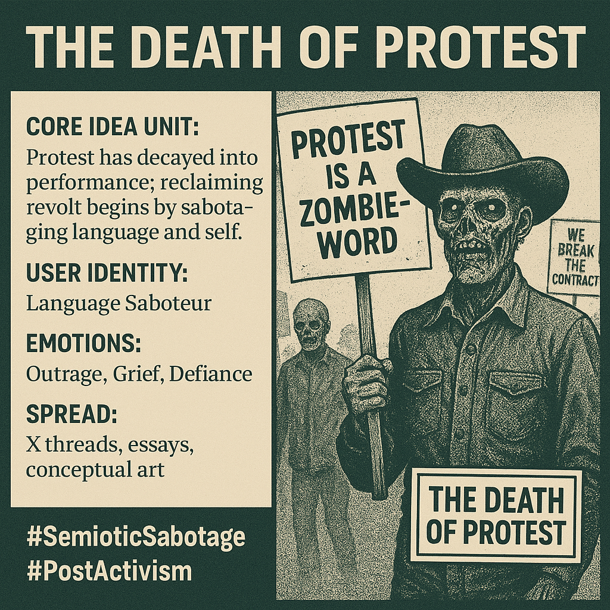

# Reclaiming Dissent: From Performance to Sabotage

Created at 2025/10/18 9:14 AM

### ◈ Mini-Memetic Profile

***

### ∴ Core Idea Unit

“Protest” has decayed into performance — a ritual of visibility without leverage. The meme exposes how activism has been aestheticized, serving algorithms and optics rather than altering power. True revolt begins with linguistic and psychic sabotage.

***

### ▲ Identity Play & Roles

**Role:** The Disillusioned Dissident / Language SaboteurThe meme invites the viewer to step off the stage — to stop performing dissent for spectators and instead destroy the script itself. It repositions the self from *citizen-spectator* to *agent of semantic insurrection*.

***

### ≈ Emotional Triggers

😡 Outrage — at the commodification of rebellion😢 Grief — for the lost potency of collective action🔥 Defiance — reclaiming language and failure as weapons

***

### 𐂷 Spread Mechanics

**Distribution Vectors:** X threads, Substack essays, video essays, conceptual art posts, academic memes.**Propagation Style:** Semiotic nihilism, poetic aphorism, haunting typography. Often paired with archival protest footage over glitch noise or grayscale minimalism.

***

### ⛨ Defense Reflexes

**Irony Shield:** “It’s just critique, not cynicism.”**Counter-narrative Preemption:** By calling protest a *zombie-word*, it immunizes itself from moral guilt — the author already admits complicity.**Aesthetic Sabotage:** Language itself is weaponized, making it hard to co-opt.

***

### ☷ Memeplex Anchor Points

📉 Post-activism discourse · ⚙️ Hyperreality critique · 💀 Semiocapitalism · 🧠 Baudrillardian simulation · 🔥 Situationist détournement · 🕳️ Media ecology collapse

***

### ✶ Sticky Symbols or Quotes

- “Protest is a zombie-word.”
- “The first sabotage is of language.”
- “We break the contract.”
- “Failure as ignition.”**Visuals:** torn banners, flickering screens, masked faces fading into static, glitch halos around megaphones.

***

### ∿ Tags

#PostActivism · #SemioticSabotage · #AestheticResistance · #MediaEcology · #LanguageStrike · #ZombieWords · #HyperrealityCritique · #MemeticCowboy

***

[Deeper view on Memetic Cowboy's Substack](https://substack.com/@memeticcowboy/note/c-167663691?utm_source=notes-share-action&r=5p339w)
